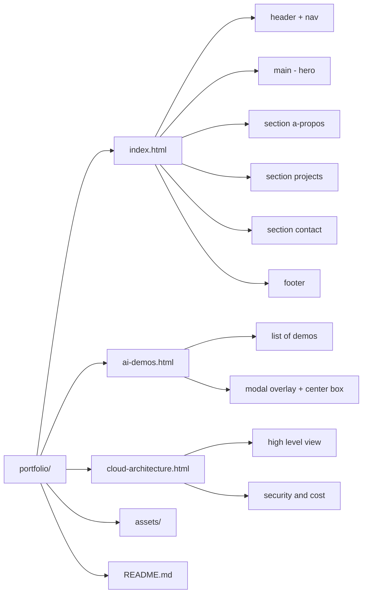
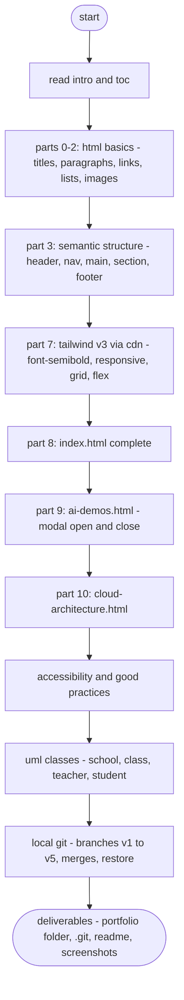
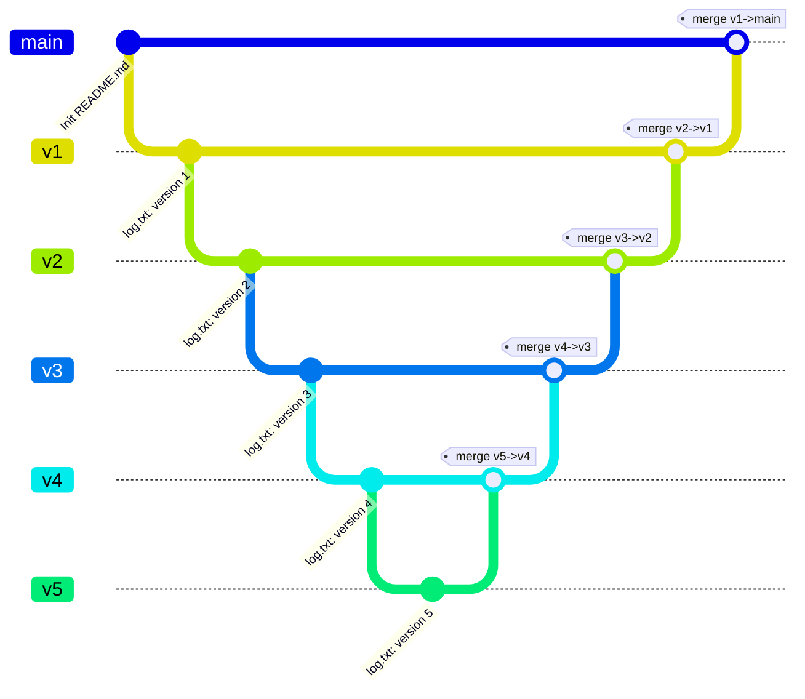
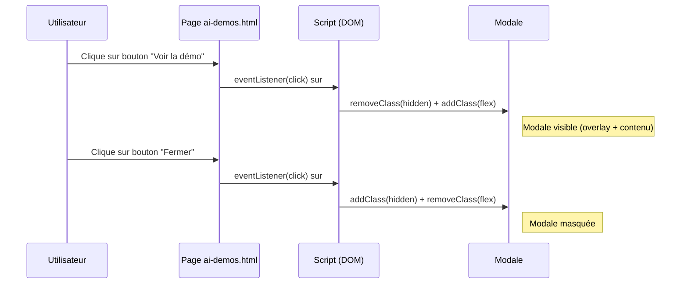
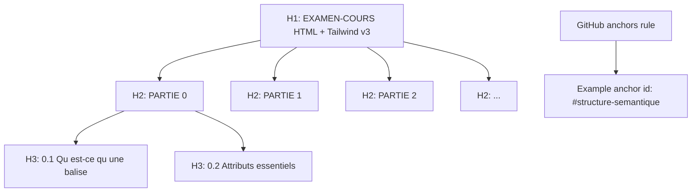

## **Table des matières**

<span id="toc"></span>

* [PARTIE 0 — Principes & lecture d’une balise](#partie-0--principes--lecture-dune-balise)
* [PARTIE 1 — Squelette HTML : ligne par ligne](#partie-1--squelette-html--ligne-par-ligne)
* [PARTIE 2 — Texte & typographie](#partie-2--texte--typographie)
* [PARTIE 3 — Structure sémantique](#partie-3--structure-sémantique)
* [PARTIE 4 — Liens & listes](#partie-4--liens--listes)
* [PARTIE 5 — Médias : images accessibles](#partie-5--médias--images-accessibles)
* [PARTIE 6 — Formulaires](#partie-6--formulaires)
* [PARTIE 7 — Tailwind v3 : classes clés](#partie-7--tailwind-v3--classes-clés)
* [PARTIE 8 — Construire `index.html` (corps complet)](#partie-8--construire-indexhtml-corps-complet)
* [PARTIE 9 — `ai-demos.html` (modale simple)](#partie-9--ai-demoshtml-modale-simple)
* [PARTIE 10 — `cloud-architecture.html`](#partie-10--cloud-architecturehtml)
* [PARTIE 11 — Accessibilité & bonnes pratiques](#partie-11--accessibilité--bonnes-pratiques)
* [PARTIE 12 — Git (local uniquement) — script d’examen](#partie-12--git-local-uniquement--script-dexamen)
* [FICHIERS À REMETTRE](#fichiers-à-remettre)
* [BARÈME (100 points)](#barème-100-points)
* [Résumé pédagogique : `font-semibold`](#résumé-pédagogique--où-mettre-font-semibold-)

<br/><br/>

## **EXAMEN–COURS — HTML + Tailwind v3 pour Portfolio IA & Cloud (débutant absolu)**

[Retour 🔙 à la table des matières](#toc)

**Objectif général.** Comprendre **chaque balise** utilisée dans un vrai site et livrer un **portfolio multi-pages**.
**Technos imposées :** HTML5 + Tailwind v3 (Play CDN).
**Livrables :** `portfolio/` complet + `README.md` + captures d’écran (mobile & desktop).
**Évaluation :** voir barème en fin de document.

<br/><br/>


## **PARTIE 0 — Principes & lecture d’une balise**

[Retour 🔙 à la table des matières](#toc)

### 0.1 — Qu’est-ce qu’une balise ?

* **Syntaxe générique** : `<nomBalise attribut="valeur">contenu</nomBalise>`
* **Balise ouvrante** : `<p>` ; **balise fermante** : `</p>`.
* **Attribut** : info ajoutée dans l’ouvrante, ex. `class="text-slate-700"` (Tailwind).

**Exemple**

```html
<p class="text-slate-700">Bonjour</p>
```

* `<p>` : paragraphe
* `class="text-slate-700"` : couleur de texte (gris foncé)

### 0.2 — Attributs essentiels

* `class="..."` (styles), `id="..."` (identifiant), `href="..."`/`src="..."` (lien/source), `alt="..."` (accessibilité)

**À faire (mini-exercice)**
Créez `portfolio/balises-test.html` et collez :

```html
<!doctype html>
<html lang="fr">
<head>
  <meta charset="utf-8">
  <title>Test balises</title>
  <meta name="viewport" content="width=device-width, initial-scale=1">
  <script src="https://cdn.tailwindcss.com"></script>
</head>
<body class="p-6">
  <h1 class="text-2xl font-semibold">Titre principal (H1)</h1>
  <p>Un paragraphe de test.</p>
  <a href="#ancre" class="text-blue-600 hover:underline">Aller plus bas</a>
  
  <div id="ancre" class="mt-10">Ancre atteinte.</div>
</body>
</html>
```


> Explications des classes Tailwind

## C'est quoi text-slate-700 ?

`text-slate-700` en Tailwind, c’est juste une **classe utilitaire** qui dit :

> “mets la **couleur de texte** `slate` au **niveau 700**”.

> Quelques points rapides :

* **`text-...`** → ça touche **la couleur du texte**.
* **`slate`** → c’est une famille de couleurs grises/bleutées que Tailwind fournit (comme `gray`, `zinc`, `neutral`, etc.).
* **`700`** → c’est le **degré de foncé**. Plus le nombre est haut (100 → 900), plus c’est foncé.

  * `slate-100` = très clair
  * `slate-700` = assez foncé
  * `slate-900` = presque noir

Dans la config Tailwind par défaut, `text-slate-700` correspond à la couleur **#334155** (un gris froid lisible).

> Exemple :

```html
<p class="text-slate-700">
  Ce texte utilise la couleur slate 700 de Tailwind.
</p>
```

Donc : **c’est juste une couleur de texte prête à l’emploi, plus douce que le noir pur (`text-black`) et plus lisible que du gris trop clair.**

<br/>

## C'est quoi p-6 ?

`p-6` en Tailwind, ça veut dire **“padding de 6”** sur **tous les côtés** (haut, bas, gauche, droite).

Un peu plus en détail :

* `p-...` → padding **global** (si tu veux haut seulement c’est `pt-6`, gauche `pl-6`, etc.)
* `6` → c’est une **valeur Tailwind** dans l’échelle de spacing.
* Dans l’échelle par défaut, `6` = **1.5rem** = **24px**.

Donc :

```html
<div class="p-6 bg-slate-100">
  Contenu avec 24px de padding partout.
</div>
```

Si tu vois :

* `p-4` → 16px
* `p-6` → 24px
* `p-8` → 32px


*(Et tu peux combiner : `px-6` = padding horizontal 24px, `py-3` = vertical 12px, etc.)*


<br/>

## C'est quoi text-2xl et font-semibold ?

- `text-2xl` et `font-semibold` sont deux utilitaires Tailwind différents :

1. **`text-2xl`**

   * Ça règle **la taille du texte**.
   * Dans Tailwind par défaut :

     * `text-base` ≈ 16px
     * `text-xl` ≈ 20px
     * **`text-2xl` ≈ 24px** (1.5rem)
   * Donc c’est pour un titre ou un sous-titre un peu gros.

   ```html
   <h2 class="text-2xl">Sous-titre</h2>
   ```

2. **`font-semibold`**

   * Ça règle **l’épaisseur de la police**.
   * `font-normal` → poids 400
   * `font-medium` → 500
   * **`font-semibold` → 600**
   * `font-bold` → 700
   * Donc `font-semibold` = un peu moins gras que `bold`, très utilisé pour les titres ou labels.

   ```html
   <p class="text-2xl font-semibold">
     Titre lisible et un peu gras
   </p>
   ```

Ensemble : **taille + graisse**.


<br/>

### PRATIQUE 1 


| #  | Description (ce que je veux)                                                        | Code à compléter                                              |
| -- | ----------------------------------------------------------------------------------- | ------------------------------------------------------------- |
| 1  | Paragraphe **bleu foncé**                                                           | `<p class="________">Texte ici</p>`                           |
| 2  | Titre **rouge clair (niveau 200)**                                                  | `<h2 class="________">Titre ici</h2>`                         |
| 3  | Paragraphe **grand (2xl)** + **texte slate**                                        | `<p class="________ ________">Texte ici</p>`                  |
| 4  | Paragraphe **vert moyen (500)** + **semi-gras**                                     | `<p class="________ ________">Texte ici</p>`                  |
| 5  | Bloc/bouton avec **fond bleu** + **texte blanc**                                    | `<div class="________ ________">Bouton</div>`                 |
| 6  | Paragraphe avec **padding 6**                                                       | `<p class="________">Texte ici</p>`                           |
| 7  | Titre **très grand** (3xl) + **gras**                                               | `<h1 class="________ ________">Mon titre</h1>`                |
| 8  | Texte **gris clair** (`slate-300`)                                                  | `<p class="________">Texte ici</p>`                           |
| 9  | Texte **centré**                                                                    | `<p class="________">Texte centré</p>`                        |
| 10 | Div avec **fond gris très clair** (`slate-100`) + **padding 4**                     | `<div class="________ ________">Contenu</div>`                |
| 11 | Lien en **bleu** + **souligné au survol**                                           | `<a class="________ hover:________" href="#">Lien</a>`        |
| 12 | Paragraphe **orange (400)** + **taille lg**                                         | `<p class="________ ________">Alerte</p>`                     |
| 13 | Petit texte **12px** (`text-xs`) en **couleur muted (slate-500)**                   | `<p class="________ ________">Note</p>`                       |
| 14 | Div avec **bordure grise** + **arrondis**                                           | `<div class="________ ________">Carte</div>`                  |
| 15 | Bouton avec **fond vert (600)** + **padding horizontal 4** + **padding vertical 2** | `<button class="________ ________ ________">Valider</button>` |
| 16 | Texte **aligné à droite**                                                           | `<p class="________">Total</p>`                               |
| 17 | Paragraphe **violet (500)** + **italic**                                            | `<p class="________ ________">Texte</p>`                      |
| 18 | Div avec **ombre** + **fond blanc**                                                 | `<div class="________ ________">Card</div>`                   |
| 19 | Paragraphe **rouge foncé (700)** pour erreur                                        | `<p class="________">Erreur : ...</p>`                        |
| 20 | Titre **bleu (500)** + **margin-bottom 4**                                          | `<h2 class="________ ________">Section</h2>`                  |


### Réponses pratique 1


| #  | Description                                      | Code complété                                                 |
| -- | ------------------------------------------------ | ------------------------------------------------------------- |
| 1  | Paragraphe **bleu foncé**                        | `<p class="text-blue-800">Texte ici</p>`                      |
| 2  | Titre **rouge clair (niveau 200)**               | `<h2 class="text-red-200">Titre ici</h2>`                     |
| 3  | Paragraphe **grand (2xl)** + **texte slate**     | `<p class="text-2xl text-slate-700">Texte ici</p>`            |
| 4  | Paragraphe **vert moyen (500)** + **semi-gras**  | `<p class="text-green-500 font-semibold">Texte ici</p>`       |
| 5  | Bloc/bouton avec **fond bleu** + **texte blanc** | `<div class="bg-blue-600 text-white">Bouton</div>`            |
| 6  | Paragraphe avec **padding 6**                    | `<p class="p-6">Texte ici</p>`                                |
| 7  | Titre **très grand (3xl)** + **gras**            | `<h1 class="text-3xl font-bold">Mon titre</h1>`               |
| 8  | Texte **gris clair** (`slate-300`)               | `<p class="text-slate-300">Texte ici</p>`                     |
| 9  | Texte **centré**                                 | `<p class="text-center">Texte centré</p>`                     |
| 10 | Div **fond gris très clair** + **padding 4**     | `<div class="bg-slate-100 p-4">Contenu</div>`                 |
| 11 | Lien **bleu** + **souligné au survol**           | `<a class="text-blue-600 hover:underline" href="#">Lien</a>`  |
| 12 | Paragraphe **orange (400)** + **taille lg**      | `<p class="text-orange-400 text-lg">Alerte</p>`               |
| 13 | Petit texte **12px** + **slate-500**             | `<p class="text-xs text-slate-500">Note</p>`                  |
| 14 | Div **bordure grise** + **arrondis**             | `<div class="border border-slate-200 rounded-lg">Carte</div>` |
| 15 | Bouton **fond vert (600)** + **px-4** + **py-2** | `<button class="bg-green-600 px-4 py-2">Valider</button>`     |
| 16 | Texte **aligné à droite**                        | `<p class="text-right">Total</p>`                             |
| 17 | Paragraphe **violet (500)** + **italic**         | `<p class="text-violet-500 italic">Texte</p>`                 |
| 18 | Div avec **ombre** + **fond blanc**              | `<div class="bg-white shadow">Card</div>`                     |
| 19 | Paragraphe **rouge foncé (700)**                 | `<p class="text-red-700">Erreur : ...</p>`                    |
| 20 | Titre **bleu (500)** + **margin-bottom 4**       | `<h2 class="text-blue-500 mb-4">Section</h2>`                 |


<br/><br/>

## **PARTIE 1 — Squelette HTML : ligne par ligne**

[Retour 🔙 à la table des matières](#toc)

**`<!doctype html>`** : signale HTML5 (toujours en 1ʳᵉ ligne).
**`<html lang="fr">`** : racine + langue.
**`<head>`** : métadonnées (charset, titre, description, viewport, CDN Tailwind).
**`<body>`** : contenu visible.

**À faire (création du squelette)**

```html
<!doctype html>
<html lang="fr">
<head>
  <meta charset="utf-8">
  <title>Portfolio – Développeur IA & Cloud</title>
  <meta name="description" content="Portfolio de débutant IA & Cloud : projets, démos IA simulées, architecture Cloud.">
  <meta name="viewport" content="width=device-width, initial-scale=1">
  <script src="https://cdn.tailwindcss.com"></script>
</head>
<body class="antialiased text-slate-800 bg-white">
  Contenu à venir...
</body>
</html>
```


### Explications

### `<!doctype html>`

* **Rôle** : indique au navigateur que le document suit le **standard HTML5**.
* **Obligatoire en première ligne**. Sans lui, le moteur de rendu peut passer en *quirks mode* → comportement CSS incohérent.

**À retenir**

* Pas de balise fermante.
* Pas d’attribut.
* Orthographe exacte `<!doctype html>` (casse indifférente, mais évite `<!DOCTYPE HTML>` pour la cohérence).


### `<html lang="fr"> ... </html>`

* **Rôle** : racine du document. Tout le contenu (sauf `<!doctype>`) doit être à l’intérieur.
* **Attribut `lang`** : **accessibilité + SEO**. Informe lecteurs d’écran, correcteurs orthographiques et moteurs de recherche.
* **Valeurs utiles** : `fr`, `en`, `es`, `ar`, etc. On peut préciser une variante : `fr-CA`, `en-GB`.

**Bonnes pratiques**

* Ne duplique jamais `<html>`.
* Évite d’ajouter des classes ici (réserve-les aux sections visibles).


### `<head> ... </head>`

**Rôle** : métadonnées **non visibles** et ressources (titre de l’onglet, encodage, description, CSS/JS, favicon).

#### a) `<meta charset="utf-8">`

* **Encodage** : gère les accents et caractères spéciaux.
* **Position** : **tout en haut du `<head>`**, idéalement la 1ʳᵉ balise après `<head>` pour éviter les caractères mal lus.

#### b) `<title> ... </title>`

* **Rôle** : Titre de l’onglet + titre cliquable dans les résultats de recherche.
* **Conseil** : rester clair et court (≈ 50–60 caractères).
* **Ex.** `Portfolio — IA & Cloud | [Votre Nom]`.

#### c) `<meta name="description" content="...">`

* **Rôle** : extrait affiché sous le lien dans les moteurs de recherche (snippet).
* **Conseil** : phrase naturelle ≤ 155–160 caractères, mots clés **sans bourrage**.

#### d) `<meta name="viewport" content="width=device-width, initial-scale=1">`

* **Rôle** : responsive mobile. Sans ça, la page “zoome” sur smartphone.
* **À garder** tel quel dans 99% des cas.

#### e) `<script src="https://cdn.tailwindcss.com"></script>`

* **Rôle** : charge **Tailwind v3 via Play CDN** (aucune installation).
* **Usage pédagogique** : parfait pour **débuter, prototyper, évaluer**.
* **Production** : préférez l’installation **npm + purge** pour optimiser la taille CSS (mais on reste en CDN ici, par consigne).

> Astuce : si vous devez configurer Tailwind (thème, couleurs), vous pouvez insérer avant ce script :
>
> ```html
> <script>
>   tailwind.config = { theme: { extend: {} } }
> </script>
> <script src="https://cdn.tailwindcss.com"></script>
> ```


### `<body class="antialiased text-slate-800 bg-white"> ... </body>`

* **Rôle** : **contenu visible**.
* **Classes Tailwind** :

  * `antialiased` : lissage de police.
  * `text-slate-800` : texte gris foncé lisible.
  * `bg-white` : fond blanc.
* **Contenu** : commencez simple (“Contenu à venir...”), puis remplacez par vos sections.

**Pièges fréquents**

* Oublier de fermer `</body>` ou `</html>`.
* Mettre des éléments visibles (`<h1>`, `<p>`) **dans** le `<head>` (erreur).
* Oublier `charset` → caractères “�”.


### Ordre recommandé 

1. `<!doctype html>`
2. `<html lang="fr">`
3. `<head>`

   * `<meta charset="utf-8">`
   * `<title> ... </title>`
   * `<meta name="description" ...>`
   * `<meta name="viewport" ...>`
   * `tailwind.config` (facultatif)
   * `<script src="https://cdn.tailwindcss.com"></script>`
4. `</head>`
5. `<body ...> ... </body>`
6. `</html>`


### QUIZ 1


### Q1. Où doit se trouver `<!doctype html>` ?

* [ ] A. À la fin du fichier
* [ ] B. En première ligne du document
* [ ] C. Après la balise `<head>`
* [ ] D. Juste avant `</html>`

### Q2. Le rôle principal de `<!doctype html>` est de…

* [ ] A. Charger Tailwind
* [ ] B. Indiquer au navigateur d’utiliser le standard HTML5
* [ ] C. Définir l’encodage UTF-8
* [ ] D. Rendre la page responsive sur mobile

### Q3. Dans `<html lang="fr">`, l’attribut `lang` sert *(choix multiples)* :

* [ ] A. À l’accessibilité (lecteurs d’écran)
* [ ] B. À la sélection automatique de polices adaptées
* [ ] C. À l’auto-détection du fuseau horaire
* [ ] D. Au SEO (meilleure indexation linguistique)

### Q4. Où placer **idéalement** `<meta charset="utf-8">` ?

* [ ] A. N’importe où dans `<body>`
* [ ] B. Tout en haut de `<head>`
* [ ] C. Après `<title>`
* [ ] D. En bas de la page

### Q5. Quel élément **appartient** au `<head>` ?

* [ ] A. `<h1>`
* [ ] B. `<p>`
* [ ] C. `<meta name="description" …>`
* [ ] D. `<section>`

### Q6. Le meilleur libellé pour `<title>` d’un portfolio court est :

* [ ] A. `Mon site`
* [ ] B. `Portfolio — IA & Cloud | [Votre Nom]`
* [ ] C. `Bienvenue sur mon super site web personnel de démonstration`
* [ ] D. `Page 1`

### Q7. La meta-description efficace est *(choix multiples)* :

* [ ] A. Une phrase naturelle ≤ 160 caractères
* [ ] B. Une liste de mots-clés séparés par des virgules
* [ ] C. Un paragraphe de 500 caractères
* [ ] D. Un résumé clair du contenu de la page

### Q8. Que fait la meta viewport suivante ?

`<meta name="viewport" content="width=device-width, initial-scale=1">`

* [ ] A. Empêche le zoom utilisateur
* [ ] B. Adapte la largeur au périphérique
* [ ] C. Active le mode sombre
* [ ] D. Définit le zoom initial à 1

### Q9. Pour **prototyper** rapidement Tailwind sans installation, on utilise :

* [ ] A. `<link rel="stylesheet" href="tailwind.css">` local
* [ ] B. `<script src="https://cdn.tailwindcss.com"></script>`
* [ ] C. `npm install tailwindcss` + build
* [ ] D. `<style> @tailwind utilities; </style>` seul

### Q10. En production à trafic élevé, la meilleure approche Tailwind est :

* [ ] A. Play CDN tel quel
* [ ] B. Aucune feuille de style
* [ ] C. Installation via npm + purge/minification
* [ ] D. Tout mettre en inline style

### Q11. Dans `<body class="antialiased text-slate-800 bg-white">`, associe chaque classe à son effet *(choix multiples)* :

* [ ] A. `antialiased` → lissage du rendu typographique
* [ ] B. `text-slate-800` → couleur de texte gris foncé lisible
* [ ] C. `bg-white` → fond blanc
* [ ] D. `antialiased` → active le responsive

### Q12. Différence correcte entre `class` et `id` :

* [ ] A. `class` = réutilisable ; `id` = unique dans la page
* [ ] B. `class` = unique ; `id` = réutilisable
* [ ] C. Les deux sont toujours uniques
* [ ] D. Aucune différence fonctionnelle

### Q13. Quels éléments doivent **obligatoirement** être dans `<body>` *(choix multiples)* ?

* [ ] A. Contenu visible (titres, paragraphes)
* [ ] B. `<meta charset="utf-8">`
* [ ] C. Sections de page (`<main>`, `<section>`)
* [ ] D. `<title>`

### Q14. Quel ordre est le plus approprié ?

* [ ] A. `<body> → <head> → <!doctype html> → </html>`
* [ ] B. `<!doctype html> → <html> → <head> → </head> → <body> → </body> → </html>`
* [ ] C. `<html> → <!doctype html> → <head> → <body> → </html>`
* [ ] D. `<!doctype html> → <head> → <body> → <html>`

### Q15. Quelle affirmation est correcte concernant le **SEO** *(choix multiples)* ?

* [ ] A. Le `<title>` influence l’extrait affiché sous le lien
* [ ] B. La meta-description peut apparaître dans les résultats
* [ ] C. `lang="fr"` peut aider l’indexation linguistique
* [ ] D. `antialiased` améliore le ranking

### Q16. Placer un `<h1>` dans le `<head>` :

* [ ] A. Est valide et recommandé
* [ ] B. Est invalide : contenu visible dans `<body>`
* [ ] C. N’a aucun effet, le navigateur l’ignore
* [ ] D. Est requis pour le responsive

### Q17. Quels risques en l’absence de `<!doctype html>` *(choix multiples)* ?

* [ ] A. Passage en *quirks mode*
* [ ] B. Rendu CSS potentiellement incohérent
* [ ] C. Désactivation de JavaScript
* [ ] D. Encodage invalide garanti

### Q18. Exemple valide d’attribut `lang` spécifique :

* [ ] A. `lang="fr-CA"`
* [ ] B. `lang="french"`
* [ ] C. `lang="fr_CA"`
* [ ] D. `lang="ca-fr"`

### Q19. À propos de la **taille** du CSS avec Play CDN :

* [ ] A. Elle contient beaucoup de classes inutilisées
* [ ] B. Elle est purgée automatiquement au build
* [ ] C. Elle est idéale pour optimiser la perf en prod
* [ ] D. Elle n’existe pas : Tailwind ne charge rien

### Q20. Quels éléments sont des **métadonnées** de page *(choix multiples)* ?

* [ ] A. `<meta name="viewport" …>`
* [ ] B. `<meta name="description" …>`
* [ ] C. `<h1>`
* [ ] D. `<title>`


<br/><br/>

## **PARTIE 2 — Texte & typographie**

[Retour 🔙 à la table des matières](#toc)

**Titres `h1..h6`** : un seul `h1` par page. Tailwind : `text-2xl md:text-3xl`, `font-semibold`.

```html
<h1 class="text-3xl md:text-5xl font-semibold">Portfolio Développeur IA & Cloud</h1>
```

**Paragraphe `p`**

```html
<p class="text-slate-700">Texte courant lisible.</p>
```

**Emphase `em` & importance `strong`**

```html
<p>Un <em>mot important</em> et un <strong>autre très important</strong>.</p>
```

**Inline `span` & saut de ligne `br`**

```html
<p>Un texte <span class="font-semibold">semi-gras</span> ici.<br>Nouvelle ligne.</p>
```

**À faire**

```html
<h1 class="text-3xl md:text-5xl font-semibold">[Votre Nom] — Dev IA & Cloud</h1>
<p class="mt-3 text-slate-700">Je construis des projets IA (LLM, RAG) et des déploiements Cloud.</p>
```

­

­> Explications : 

En Tailwind, `md:` c’est un **préfixe responsive**. Ça veut dire :

> “À partir de l’écran **medium** (md), applique cette classe.”

Concrètement :

* Tailwind a des **breakpoints** par défaut :

  * `sm` → ≥ 640px
  * **`md` → ≥ 768px**
  * `lg` → ≥ 1024px
  * `xl` → ≥ 1280px
  * `2xl` → ≥ 1536px

Donc si tu écris :

```html
<p class="text-sm md:text-lg">
  Texte
</p>
```

Ça veut dire :

* sur mobile (moins de 768px) → `text-sm`
* sur écran moyen et plus (≥ 768px) → `text-lg`

Autre exemple :

```html
<div class="p-4 md:p-8 lg:p-12">
  ...
</div>
```

→ petit écran : padding 16px
→ écran moyen : 32px
→ grand écran : 48px

Donc `md:` = “à partir de 768px, je change le style”.


<br/>


### QUIZ 2 – Responsive design (HTML + Tailwind)

### Q1. Qu’est-ce qu’on appelle “responsive design” ?

* [ ] A. Un site qui s’affiche seulement sur desktop
* [ ] B. Un site qui **s’adapte à la taille de l’écran** (mobile, tablette, desktop)
* [ ] C. Un site qui utilise forcément Bootstrap
* [ ] D. Un site sans CSS

### Q2. Le responsive moderne est généralement conçu selon l’approche…

* [ ] A. Desktop-first
* [ ] B. Mobile-first (on commence petit puis on élargit)
* [ ] C. Tablette-first
* [ ] D. Imprimante-first

### Q3. À quoi sert cette ligne ?

```html
<meta name="viewport" content="width=device-width, initial-scale=1">
```

* [ ] A. Dire au navigateur d’utiliser HTML5
* [ ] B. Permettre au site de s’afficher à la **largeur du mobile**
* [ ] C. Empêcher les images de s’afficher
* [ ] D. Définir la langue du site

### Q4. Dans Tailwind, le préfixe `md:` veut dire…

* [ ] A. “Applique cette classe sous 768px”
* [ ] B. “Applique cette classe à partir de **768px**”
* [ ] C. “Applique cette classe seulement en mode sombre”
* [ ] D. “Applique cette classe sur mobile uniquement”

### Q5. Complète la phrase : “Tailwind est **mobile-first**” signifie que…

* [ ] A. Les classes sans préfixe s’appliquent **sur mobile d’abord**
* [ ] B. Les classes sans préfixe s’appliquent **à partir du desktop**
* [ ] C. On doit toujours écrire `md:` même pour mobile
* [ ] D. Tailwind ne fonctionne pas sur desktop

### Q6. Quel est l’ordre **par défaut** des breakpoints Tailwind ?

* [ ] A. `md` → `sm` → `lg` → `xl`
* [ ] B. `sm` → `md` → `lg` → `xl` → `2xl`
* [ ] C. `2xl` → `xl` → `lg` → `md` → `sm`
* [ ] D. Il n’y a pas d’ordre

### Q7. Quelle classe affiche **rien sur mobile**, mais affiche le bloc **à partir de `md`** ?

* [ ] A. `hidden md:block`
* [ ] B. `block md:hidden`
* [ ] C. `flex md:hidden`
* [ ] D. `md:hidden`

### Q8. Quelle classe rend un bouton plus large sur mobile et plus petit sur grand écran ?

* [ ] A. `w-96 md:w-full`
* [ ] B. `w-full md:w-1/2`
* [ ] C. `md:w-full w-1/2`
* [ ] D. `w-auto md:w-auto`

### Q9. Dans Tailwind, `lg:` correspond (par défaut) à quelle largeur minimale ?

* [ ] A. 480px
* [ ] B. 640px
* [ ] C. 768px
* [ ] D. 1024px

### Q10. Quel est le rôle d’une **media query** en CSS traditionnel ?

* [ ] A. Changer le HTML selon la langue
* [ ] B. Appliquer du CSS **seulement si une condition d’écran est vraie** (ex : min-width: 768px)
* [ ] C. Charger un fichier JS externe
* [ ] D. Bloquer le zoom

### Q11. Laquelle décrit le mieux ce comportement Tailwind ?

```html
<div class="text-sm md:text-base lg:text-xl">...</div>
```

* [ ] A. Le texte garde toujours la même taille
* [ ] B. Le texte **grandit** quand l’écran devient plus large
* [ ] C. Le texte **rétrécit** sur grand écran
* [ ] D. Le texte s’affiche seulement sur `lg`

### Q12. Pour faire un layout en 1 colonne sur mobile et 3 colonnes sur grand écran, on peut écrire :

* [ ] A. `grid grid-cols-3`
* [ ] B. `grid grid-cols-1 md:grid-cols-3`
* [ ] C. `grid-cols-1-only`
* [ ] D. `flex md:grid-cols-3`

### Q13. Si on écrit `container mx-auto px-4`, le rôle de `mx-auto` est de…

* [ ] A. Colorer le fond
* [ ] B. Centrer le container horizontalement
* [ ] C. Ajouter du padding vertical
* [ ] D. Activer le responsive

### Q14. Quel est le **problème** si on oublie la meta viewport sur mobile ?

* [ ] A. Le site ne se charge pas
* [ ] B. Le site s’affiche **trop petit** (zoomé-out) et l’utilisateur doit zoomer lui-même
* [ ] C. Les images disparaissent
* [ ] D. Tailwind ne marche plus

### Q15. En responsive, pourquoi fait-on souvent “mobile d’abord” ?

* [ ] A. Parce que c’est plus simple de **partir de petit** et d’ajouter des règles
* [ ] B. Parce que le desktop est interdit
* [ ] C. Parce que Tailwind l’impose techniquement
* [ ] D. Parce que ça évite de faire du HTML

### Q16. Quelle combinaison permet de **cacher sur desktop mais montrer sur mobile** ?

* [ ] A. `hidden md:block`
* [ ] B. `block md:hidden`
* [ ] C. `md:block`
* [ ] D. `lg:hidden md:block`

### Q17. Dans un layout responsive, pourquoi utiliser des unités relatives (%, rem, vw) plutôt que des px partout ?

* [ ] A. Pour que le code soit plus court
* [ ] B. Pour que le design **s’adapte mieux** aux différentes tailles d’écran
* [ ] C. Pour désactiver le cache
* [ ] D. Pour que JavaScript fonctionne

### Q18. Quel est l’intérêt de `aspect-video` ou `aspect-square` en Tailwind ?

* [ ] A. Forcer une **proportion** d’élément même en responsive
* [ ] B. Charger une vidéo
* [ ] C. Créer un carrousel automatique
* [ ] D. Masquer le contenu

### Q19. Pour éviter qu’une image déborde sur mobile, on utilise souvent…

* [ ] A. `w-screen`
* [ ] B. `max-w-full h-auto`
* [ ] C. `fixed`
* [ ] D. `overflow-hidden h-screen`

### Q20. Quelle phrase est correcte à propos de Tailwind et du responsive ?

* [ ] A. Le responsive se fait obligatoirement en écrivant du CSS à la main
* [ ] B. Le responsive se fait **directement dans les classes** avec les préfixes (`sm:`, `md:`, `lg:`, …)
* [ ] C. Tailwind ne gère pas le responsive
* [ ] D. On doit toujours créer un fichier `responsive.css` à part


<br/>

### PRATIQUE 2 

Nous allons prendre les valeurs **par défaut** de Tailwind 3.x :

* `text-xs` = **0.75rem** = **12px**
* `text-sm` = **0.875rem** = **14px**
* `text-base` = **1rem** = **16px**
* `text-lg` = **1.125rem** = **18px**
* `text-xl` = **1.25rem** = **20px**
* `text-2xl` = **1.5rem** = **24px**
* `text-3xl` = **1.875rem** = **30px**
* `text-4xl` = **2.25rem** = **36px**

Breakpoints par défaut :

* `sm:` → **min-width: 640px**
* `md:` → **min-width: 768px**
* `lg:` → **min-width: 1024px**
* `xl:` → **min-width: 1280px**

Spacing :

* `p-4` = **1rem = 16px**
* `p-6` = **1.5rem = 24px**
* `px-4` = **16px horizontal**
* `py-2` = **8px vertical**
* `py-3` = **12px vertical**


| #  | Description (ce que je veux, avec specs exactes)                                                                                                      | Code à compléter                                                         |
| -- | ----------------------------------------------------------------------------------------------------------------------------------------------------- | ------------------------------------------------------------------------ |
| 1  | Texte **14px (text-sm)** sur mobile, qui devient **16px (text-base)** dès **768px (md)**                                                              | `<p class="________ ________">Texte</p>`                                 |
| 2  | Titre **24px (text-2xl)** par défaut, qui devient **30px (text-3xl)** dès **768px (md)**                                                              | `<h2 class="________ ________">Titre</h2>`                               |
| 3  | Paragraphe en **text-slate-700 (#334155)**, aligné **centre seulement à partir de 768px (md)**                                                        | `<p class="text-slate-700 ________">Texte</p>`                           |
| 4  | Grille **1 colonne** sur mobile, **2 colonnes** quand largeur ≥ **768px (md)**                                                                        | `<div class="grid ________">...</div>`                                   |
| 5  | Bouton **largeur 100% (w-full)** sur mobile, puis **largeur auto** dès **md (768px)**                                                                 | `<button class="w-full ________">Valider</button>`                       |
| 6  | Image responsive : **max-width: 100%**, **hauteur auto**, **centrée**                                                                                 | ``                            |
| 7  | Texte **caché en dessous de 768px**, **affiché à partir de 768px (md)**                                                                               | `<p class="________ ________">Visible sur md</p>`                        |
| 8  | Carte avec **padding 16px (p-4)** sur mobile, **padding 32px (p-8)** à partir de **768px (md)**, fond blanc, ombre de base                            | `<div class="p-4 ________ bg-white shadow">Contenu</div>`                |
| 9  | Titre bleu (`text-blue-600`) avec **margin-bottom 8px (mb-2)** sur mobile, mais **16px (mb-4)** dès **md**                                            | `<h3 class="text-blue-600 mb-2 ________">Section</h3>`                   |
| 10 | Texte **aligné à gauche** par défaut, **aligné à droite** dès **md (768px)**                                                                          | `<p class="text-left ________">Total</p>`                                |
| 11 | Flex en **colonne** sur mobile, **ligne (row)** dès **md (768px)**                                                                                    | `<div class="flex flex-col ________">...</div>`                          |
| 12 | Paragraphe **16px (text-base)** par défaut, **18px (text-lg)** quand écran ≥ **1024px (lg)**                                                          | `<p class="text-base ________">Texte</p>`                                |
| 13 | Bloc avec **fond gris très clair (bg-slate-100)** et **coins arrondis seulement à partir de 768px**                                                   | `<div class="bg-slate-100 ________">Bloc</div>`                          |
| 14 | Bouton vert avec **padding vertical 8px (py-2)** sur mobile, **padding vertical 12px (py-3)** dès **768px (md)** + **padding horizontal 16px (px-4)** | `<button class="bg-green-600 text-white py-2 ________ px-4">OK</button>` |
| 15 | Texte **12px (text-xs)** sur mobile, **14px (text-sm)** dès **640px (sm)**, et **16px (text-base)** dès **768px (md)**                                | `<p class="text-xs ________ ________">Texte</p>`                         |
| 16 | Bloc **visible seulement sur mobile** (en dessous de **768px**), donc **caché (hidden)** dès **md**                                                   | `<div class="________">Mobile only</div>`                                |
| 17 | Paragraphe **orange (text-orange-500)** sur mobile, qui devient **rouge plus foncé (text-red-600)** dès **768px (md)**                                | `<p class="text-orange-500 ________">Alerte</p>`                         |
| 18 | Grille responsive : **1 colonne** mobile, **2 colonnes** dès **768px (md)**, **4 colonnes** dès **1024px (lg)**, avec **gap 16px (gap-4)**            | `<div class="grid grid-cols-1 ________ ________ gap-4">...</div>`        |
| 19 | Paragraphe **centré**, **largeur max 48rem (max-w-xl)**, et **centré horizontalement (mx-auto)** seulement dès **768px (md)**                         | `<p class="text-center max-w-xl ________">Texte</p>`                     |
| 20 | Titre **30px (text-3xl)** sur mobile, mais **36px (text-4xl)** dès **1024px (lg)**, avec **gras (font-bold)**                                         | `<h1 class="text-3xl ________ font-bold">Titre</h1>`                     |


<br/>

### Réponses pratique 2 (version précise)

| #  | Description                      | Code complété                                                                 |
| -- | -------------------------------- | ----------------------------------------------------------------------------- |
| 1  | 14px → 16px à 768px              | `<p class="text-sm md:text-base">Texte</p>`                                   |
| 2  | 24px → 30px à 768px              | `<h2 class="text-2xl md:text-3xl">Titre</h2>`                                 |
| 3  | Couleur + align center à 768px   | `<p class="text-slate-700 md:text-center">Texte</p>`                          |
| 4  | 1 col → 2 col à 768px            | `<div class="grid md:grid-cols-2">...</div>`                                  |
| 5  | w-full → w-auto à 768px          | `<button class="w-full md:w-auto">Valider</button>`                           |
| 6  | Image responsive + centrée       | ``                         |
| 7  | Caché mobile → visible à 768px   | `<p class="hidden md:block">Visible sur md</p>`                               |
| 8  | p-4 (16px) → p-8 (32px)          | `<div class="p-4 md:p-8 bg-white shadow">Contenu</div>`                       |
| 9  | mb-2 (8px) → mb-4 (16px)         | `<h3 class="text-blue-600 mb-2 md:mb-4">Section</h3>`                         |
| 10 | left → right à 768px             | `<p class="text-left md:text-right">Total</p>`                                |
| 11 | col → row à 768px                | `<div class="flex flex-col md:flex-row">...</div>`                            |
| 12 | 16px → 18px à 1024px             | `<p class="text-base lg:text-lg">Texte</p>`                                   |
| 13 | arrondi seulement à 768px        | `<div class="bg-slate-100 md:rounded-lg">Bloc</div>`                          |
| 14 | py-2 (8px) → py-3 (12px) à 768px | `<button class="bg-green-600 text-white py-2 md:py-3 px-4">OK</button>`       |
| 15 | 12px → 14px → 16px               | `<p class="text-xs sm:text-sm md:text-base">Texte</p>`                        |
| 16 | visible mobile, caché à 768px    | `<div class="md:hidden">Mobile only</div>`                                    |
| 17 | orange → rouge à 768px           | `<p class="text-orange-500 md:text-red-600">Alerte</p>`                       |
| 18 | 1 → 2 → 4 colonnes               | `<div class="grid grid-cols-1 md:grid-cols-2 lg:grid-cols-4 gap-4">...</div>` |
| 19 | centré + mx-auto à 768px         | `<p class="text-center max-w-xl md:mx-auto">Texte</p>`                        |
| 20 | 30px → 36px à 1024px + gras      | `<h1 class="text-3xl lg:text-4xl font-bold">Titre</h1>`                       |


<br/><br/>

## **PARTIE 3 — Structure sémantique**


[Retour 🔙 à la table des matières](#toc)

**Balises :** `header`, `nav`, `main`, `section`, `article`, `aside`, `footer`, `div`.
**Tailwind utiles :** `mx-auto max-w-6xl px-4`, `py-12`, `border`, `rounded-lg`, `shadow-sm`.

**Objectif de la partie.** À la fin de cette section, l’étudiant doit être capable de :

1. Distinguer les balises purement structurelles (`div`) des balises sémantiques (`header`, `main`, `section`, `footer`).
2. Construire un layout de page de portfolio avec un **header collant** (sticky) + une **barre de navigation responsive** (mobile → desktop).
3. Utiliser les classes Tailwind appropriées pour centrer le contenu (`mx-auto max-w-6xl px-4`), gérer les espacements (`py-12`, `md:py-16`) et les effets visuels (`border-b`, `backdrop-blur`, `bg-white/90`).


**À faire (remplacer “Contenu à venir…”)**

```html
<header class="sticky top-0 bg-white/90 backdrop-blur border-b">
  <nav class="mx-auto max-w-6xl px-4 py-3 flex items-center justify-between">
    <a href="index.html" class="font-semibold text-lg">[Votre Nom] — Dev IA & Cloud</a>
    <button id="menuBtn" class="md:hidden p-2 border rounded">Menu</button>
    <ul id="menu" class="hidden md:flex gap-6">
      <li><a class="hover:text-blue-600 font-semibold" href="#projects">Projets</a></li>
      <li><a class="hover:text-blue-600 font-semibold" href="ai-demos.html">Démos IA</a></li>
      <li><a class="hover:text-blue-600 font-semibold" href="cloud-architecture.html">Architecture Cloud</a></li>
      <li><a class="hover:text-blue-600 font-semibold" href="#contact">Contact</a></li>
    </ul>
  </nav>
</header>

<main>
  <section class="relative overflow-hidden border-b">
    <div class="absolute inset-0 bg-gradient-to-br from-blue-500/10 via-purple-500/10 to-cyan-500/10"></div>
    <div class="relative mx-auto max-w-6xl px-4 py-16 md:py-24">
      <h1 class="text-3xl md:text-5xl font-semibold">Développeur IA & Cloud</h1>
      <p class="mt-3 max-w-2xl text-slate-700">LLM, RAG, pipelines de données, MLOps, déploiements scalables.</p>
      <a href="#projects" class="mt-6 inline-block px-5 py-3 bg-blue-600 text-white rounded-lg hover:bg-blue-500 font-semibold">Voir mes projets</a>
    </div>
  </section>

  <section class="mx-auto max-w-6xl px-4 py-12 md:py-16">
    <h2 class="text-2xl md:text-3xl font-semibold">À propos</h2>
    <p class="mt-3 text-slate-700">[Votre texte de présentation]</p>
  </section>
</main>

<footer class="border-t">
  <div class="mx-auto max-w-6xl px-4 py-8 text-sm text-slate-500">
    © <span id="year"></span> [Votre Nom]. Tous droits réservés.
  </div>
</footer>

<script>
  const btn = document.getElementById('menuBtn');
  const menu = document.getElementById('menu');
  btn?.addEventListener('click', () => menu.classList.toggle('hidden'));
  document.getElementById('year').textContent = new Date().getFullYear();
</script>
```

### Code complet à tester


```html
<!doctype html>
<html lang="fr">

<head>
    <meta charset="utf-8">
    <title>Test balises</title>
    <meta name="viewport" content="width=device-width, initial-scale=1">
    <script src="https://cdn.tailwindcss.com"></script>
</head>

<body class="bg-slate-50 text-slate-800">

    <header class="sticky top-0 bg-white/90 backdrop-blur border-b">
        <nav class="mx-auto max-w-6xl px-4 py-3 flex items-center justify-between">
            <a href="index.html" class="font-semibold text-lg">[Votre Nom] — Dev IA & Cloud</a>
            <button id="menuBtn" class="md:hidden p-2 border rounded">Menu</button>
            <ul id="menu" class="hidden md:flex gap-6">
                <li><a class="hover:text-blue-600 font-semibold" href="#projects">Projets</a></li>
                <li><a class="hover:text-blue-600 font-semibold" href="ai-demos.html">Démos IA</a></li>
                <li><a class="hover:text-blue-600 font-semibold" href="cloud-architecture.html">Architecture Cloud</a>
                </li>
                <li><a class="hover:text-blue-600 font-semibold" href="#contact">Contact</a></li>
            </ul>
        </nav>
    </header>

    <main>
        <section class="relative overflow-hidden border-b">
            <div class="absolute inset-0 bg-gradient-to-br from-blue-500/10 via-purple-500/10 to-cyan-500/10"></div>
            <div class="relative mx-auto max-w-6xl px-4 py-16 md:py-24">
                <h1 class="text-3xl md:text-5xl font-semibold">Développeur IA & Cloud</h1>
                <p class="mt-3 max-w-2xl text-slate-700">LLM, RAG, pipelines de données, MLOps, déploiements scalables.
                </p>
                <a href="#projects"
                    class="mt-6 inline-block px-5 py-3 bg-blue-600 text-white rounded-lg hover:bg-blue-500 font-semibold">Voir
                    mes projets</a>
            </div>
        </section>

        <section class="mx-auto max-w-6xl px-4 py-12 md:py-16">
            <h2 class="text-2xl md:text-3xl font-semibold">À propos</h2>
            <p class="mt-3 text-slate-700">[Votre texte de présentation]</p>
        </section>
    </main>

    <footer class="border-t">
        <div class="mx-auto max-w-6xl px-4 py-8 text-sm text-slate-500">
            © <span id="year"></span> [Votre Nom]. Tous droits réservés.
        </div>
    </footer>

    <script>
        const btn = document.getElementById('menuBtn');
        const menu = document.getElementById('menu');
        btn?.addEventListener('click', () => menu.classList.toggle('hidden'));
        document.getElementById('year').textContent = new Date().getFullYear();
    </script>

</body>

</html>
```


<br/><br/>


### Pourquoi des balises sémantiques ?

Dans un vrai site (portfolio, blog, documentation), on retrouve souvent les mêmes zones :

* **`<header>`** : haut de page, logo, titre, navigation.
* **`<nav>`** : zone qui contient les liens de navigation (menu principal).
* **`<main>`** : contenu principal unique de la page (ce pour quoi la page existe).
* **`<section>`** : bloc de contenu logique (À propos, Projets, Services, Contact).
* **`<article>`** : contenu indépendant, publiable seul (article de blog, fiche projet).
* **`<aside>`** : contenu lié mais secondaire (infos latérales, tags, liens).
* **`<footer>`** : bas de page, mentions, contact, copyright.

**Pourquoi ne pas tout faire en `<div>` ?**
Parce que :

* les lecteurs d’écran et moteurs de recherche **comprennent mieux la structure** quand les balises sont sémantiques,
* on isole le **contenu principal** (`<main>`) du reste,
* on prépare le site pour une **accessibilité minimale**.


### Tailwind à utiliser pour une page sémantique

On garde un socle commun :

* `mx-auto max-w-6xl` → largeur maximale de lecture (~1152px) centrée.
* `px-4` → padding horizontal 16px sur mobile.
* `py-12` → padding vertical 48px.
* `md:py-16` → padding vertical 64px dès 768px.
* `border-b` / `border-t` → séparer visuellement les zones.
* `bg-white` / `bg-slate-50` → fonds neutres.
* `shadow-sm` → légères cartes pour projets.

**Rappel des valeurs :**

* `px-4` = 1rem = **16px** horizontal
* `py-3` = 0.75rem = **12px** vertical
* `py-12` = 3rem = **48px**
* `md:py-16` = 4rem = **64px**
* `max-w-6xl` = **72rem** = **1152px**
* `gap-6` = 1.5rem = **24px**


### Header sticky + nav responsive

Objectif : avoir un **header fixe en haut**, avec un **bouton Menu** sur mobile et une **liste horizontale** sur desktop.

Exigences :

1. **Sticky** : visible même quand on scrolle
   → `class="sticky top-0"`
2. **Transparence légère + flou** pour ne pas masquer complètement le contenu
   → `bg-white/90 backdrop-blur`
3. **Ligne de séparation**
   → `border-b`
4. **Contenu centré**
   → `mx-auto max-w-6xl px-4`
5. **Menu mobile caché par défaut**
   → `class="hidden md:flex ..."`


### Code amélioré 

```html
<header class="sticky top-0 z-50 bg-white/90 backdrop-blur border-b">
  <nav class="mx-auto max-w-6xl px-4 py-3 flex items-center justify-between">
    <!-- Logo / nom -->
    <a href="index.html" class="text-lg font-semibold tracking-tight">
      [Votre Nom] — Dev IA & Cloud
    </a>

    <!-- Bouton menu (visible seulement en dessous de 768px) -->
    <button id="menuBtn" class="md:hidden inline-flex items-center gap-2 px-3 py-2 border rounded-lg text-sm text-slate-700">
      Menu
    </button>

    <!-- Menu desktop (affiché à partir de 768px) -->
    <ul id="menu" class="hidden md:flex items-center gap-6 text-sm">
      <li><a class="hover:text-blue-600 font-semibold" href="#projects">Projets</a></li>
      <li><a class="hover:text-blue-600 font-semibold" href="ai-demos.html">Démos IA</a></li>
      <li><a class="hover:text-blue-600 font-semibold" href="cloud-architecture.html">Architecture Cloud</a></li>
      <li><a class="hover:text-blue-600 font-semibold" href="#contact">Contact</a></li>
    </ul>
  </nav>

  <!-- Menu mobile déroulant -->
  <div id="mobileMenu" class="md:hidden hidden border-t bg-white">
    <ul class="px-4 py-3 space-y-2 text-sm">
      <li><a class="block py-1 hover:text-blue-600" href="#projects">Projets</a></li>
      <li><a class="block py-1 hover:text-blue-600" href="ai-demos.html">Démos IA</a></li>
      <li><a class="block py-1 hover:text-blue-600" href="cloud-architecture.html">Architecture Cloud</a></li>
      <li><a class="block py-1 hover:text-blue-600" href="#contact">Contact</a></li>
    </ul>
  </div>
</header>
```

**Remarques importantes :**

* `z-50` : on passe le header au-dessus des sections qui ont des backgrounds.
* On sépare **vraiment** le menu desktop (`<ul id="menu" ...>`) du menu mobile (`<div id="mobileMenu" ...>`), donc pas d’ambiguïté pour les étudiants.
* On utilise `space-y-2` pour espacer verticalement les liens mobile.


### Section “hero” sémantique

Objectif : première section visible, située dans `<main>`, avec un fond décoratif, un titre, un texte court, un CTA.

```html
<main>
  <section class="relative overflow-hidden border-b">
    <!-- décor -->
    <div class="pointer-events-none absolute inset-0 bg-gradient-to-br from-blue-500/10 via-purple-500/10 to-cyan-500/10"></div>

    <!-- contenu -->
    <div class="relative mx-auto max-w-6xl px-4 py-16 md:py-24">
      <h1 class="text-3xl md:text-5xl font-semibold tracking-tight">
        Développeur IA & Cloud
      </h1>
      <p class="mt-3 max-w-2xl text-slate-700">
        LLM, RAG, pipelines de données, MLOps, déploiements scalables.
      </p>
      <a href="#projects"
         class="mt-6 inline-block px-5 py-3 bg-blue-600 text-white rounded-lg hover:bg-blue-500 font-semibold">
        Voir mes projets
      </a>
    </div>
  </section>

  <!-- section à propos -->
  <section class="mx-auto max-w-6xl px-4 py-12 md:py-16" id="about">
    <h2 class="text-2xl md:text-3xl font-semibold">À propos</h2>
    <p class="mt-3 text-slate-700 leading-relaxed">
      [Votre texte de présentation]
    </p>
  </section>
</main>
```

**Points pédagogiques :**

* `relative` sur la section + `absolute inset-0` sur le décor → permet de superposer un décor sans casser le flux.
* `pointer-events-none` évite que le décor ne bloque les clics.
* `max-w-2xl` (~672px) sur le paragraphe → meilleure lisibilité.


### Footer simple mais sémantique

```html
<footer class="border-t bg-white">
  <div class="mx-auto max-w-6xl px-4 py-8 text-sm text-slate-500 flex flex-col md:flex-row items-center justify-between gap-4">
    <p>© <span id="year"></span> [Votre Nom]. Tous droits réservés.</p>
    <p class="text-slate-400">Portfolio IA & Cloud — Montréal</p>
  </div>
</footer>
```

* `flex flex-col md:flex-row` → en colonne sur mobile, en ligne sur desktop.
* `text-sm` → 14px, assez discret.
* `border-t` → séparation visuelle claire.


### Script minimal (menu + année)

On garde le JS minimal

```html
<script>
  const btn = document.getElementById('menuBtn');
  const mobileMenu = document.getElementById('mobileMenu');

  btn?.addEventListener('click', () => {
    mobileMenu.classList.toggle('hidden');
  });

  // année dynamique
  document.getElementById('year').textContent = new Date().getFullYear();
</script>
```

* `?.` pour éviter une erreur si le bouton n’existe pas.
* `classList.toggle('hidden')` : très simple à expliquer à des débutants.


### Code complet (amélioré)

```html
<!doctype html>
<html lang="fr">
<head>
  <meta charset="utf-8">
  <title>Portfolio — IA & Cloud</title>
  <meta name="viewport" content="width=device-width, initial-scale=1">
  <script src="https://cdn.tailwindcss.com"></script>
</head>
<body class="bg-slate-50 text-slate-800 antialiased">

  <!-- HEADER -->
  <header class="sticky top-0 z-50 bg-white/90 backdrop-blur border-b">
    <nav class="mx-auto max-w-6xl px-4 py-3 flex items-center justify-between">
      <a href="index.html" class="text-lg font-semibold tracking-tight">
        [Votre Nom] — Dev IA & Cloud
      </a>
      <button id="menuBtn" class="md:hidden inline-flex items-center gap-2 px-3 py-2 border rounded-lg text-sm">
        Menu
      </button>
      <ul id="menu" class="hidden md:flex items-center gap-6 text-sm">
        <li><a class="hover:text-blue-600 font-semibold" href="#projects">Projets</a></li>
        <li><a class="hover:text-blue-600 font-semibold" href="ai-demos.html">Démos IA</a></li>
        <li><a class="hover:text-blue-600 font-semibold" href="cloud-architecture.html">Architecture Cloud</a></li>
        <li><a class="hover:text-blue-600 font-semibold" href="#contact">Contact</a></li>
      </ul>
    </nav>
    <!-- menu mobile -->
    <div id="mobileMenu" class="md:hidden hidden border-t bg-white">
      <ul class="px-4 py-3 space-y-2 text-sm">
        <li><a class="block py-1 hover:text-blue-600" href="#projects">Projets</a></li>
        <li><a class="block py-1 hover:text-blue-600" href="ai-demos.html">Démos IA</a></li>
        <li><a class="block py-1 hover:text-blue-600" href="cloud-architecture.html">Architecture Cloud</a></li>
        <li><a class="block py-1 hover:text-blue-600" href="#contact">Contact</a></li>
      </ul>
    </div>
  </header>

  <!-- CONTENU PRINCIPAL -->
  <main>
    <!-- hero -->
    <section class="relative overflow-hidden border-b">
      <div class="pointer-events-none absolute inset-0 bg-gradient-to-br from-blue-500/10 via-purple-500/10 to-cyan-500/10"></div>
      <div class="relative mx-auto max-w-6xl px-4 py-16 md:py-24">
        <h1 class="text-3xl md:text-5xl font-semibold tracking-tight">
          Développeur IA & Cloud
        </h1>
        <p class="mt-3 max-w-2xl text-slate-700">
          LLM, RAG, pipelines de données, MLOps, déploiements scalables.
        </p>
        <a href="#projects"
           class="mt-6 inline-block px-5 py-3 bg-blue-600 text-white rounded-lg hover:bg-blue-500 font-semibold">
          Voir mes projets
        </a>
      </div>
    </section>

    <!-- à propos -->
    <section class="mx-auto max-w-6xl px-4 py-12 md:py-16" id="about">
      <h2 class="text-2xl md:text-3xl font-semibold">À propos</h2>
      <p class="mt-3 text-slate-700 leading-relaxed">
        [Votre texte de présentation]
      </p>
    </section>
  </main>

  <!-- FOOTER -->
  <footer class="border-t bg-white">
    <div class="mx-auto max-w-6xl px-4 py-8 text-sm text-slate-500 flex flex-col md:flex-row items-center justify-between gap-4">
      <p>© <span id="year"></span> [Votre Nom]. Tous droits réservés.</p>
      <p class="text-slate-400">Portfolio IA & Cloud — Montréal</p>
    </div>
  </footer>

  <script>
    const btn = document.getElementById('menuBtn');
    const mobileMenu = document.getElementById('mobileMenu');
    btn?.addEventListener('click', () => {
      mobileMenu.classList.toggle('hidden');
    });
    document.getElementById('year').textContent = new Date().getFullYear();
  </script>
</body>
</html>
```


<br/>


### **QUIZ 3 – Responsive design (HTML + Tailwind)**

### Q1. Qu’est-ce qu’on appelle “responsive design” ?

* [ ] A. Un site qui s’affiche seulement sur desktop
* [ ] B. Un site qui **s’adapte à la taille de l’écran** (mobile, tablette, desktop)
* [ ] C. Un site qui utilise forcément Bootstrap
* [ ] D. Un site sans CSS

### Q2. Le responsive moderne est généralement conçu selon l’approche…

* [ ] A. Desktop-first
* [ ] B. Mobile-first (on commence petit puis on élargit)
* [ ] C. Tablette-first
* [ ] D. Imprimante-first

### Q3. À quoi sert cette ligne ?

```html
<meta name="viewport" content="width=device-width, initial-scale=1">
```

* [ ] A. Dire au navigateur d’utiliser HTML5
* [ ] B. Permettre au site de s’afficher à la **largeur du mobile**
* [ ] C. Empêcher les images de s’afficher
* [ ] D. Définir la langue du site

### Q4. Dans Tailwind, le préfixe `md:` veut dire…

* [ ] A. “Applique cette classe sous 768px”
* [ ] B. “Applique cette classe à partir de **768px**”
* [ ] C. “Applique cette classe seulement en mode sombre”
* [ ] D. “Applique cette classe sur mobile uniquement”

### Q5. Complète la phrase : “Tailwind est **mobile-first**” signifie que…

* [ ] A. Les classes sans préfixe s’appliquent **sur mobile d’abord**
* [ ] B. Les classes sans préfixe s’appliquent **à partir du desktop**
* [ ] C. On doit toujours écrire `md:` même pour mobile
* [ ] D. Tailwind ne fonctionne pas sur desktop

### Q6. Quel est l’ordre **par défaut** des breakpoints Tailwind ?

* [ ] A. `md` → `sm` → `lg` → `xl`
* [ ] B. `sm` → `md` → `lg` → `xl` → `2xl`
* [ ] C. `2xl` → `xl` → `lg` → `md` → `sm`
* [ ] D. Il n’y a pas d’ordre

### Q7. Quelle classe affiche **rien sur mobile**, mais affiche le bloc **à partir de `md`** ?

* [ ] A. `hidden md:block`
* [ ] B. `block md:hidden`
* [ ] C. `flex md:hidden`
* [ ] D. `md:hidden`

### Q8. Quelle classe rend un bouton plus large sur mobile et plus petit sur grand écran ?

* [ ] A. `w-96 md:w-full`
* [ ] B. `w-full md:w-1/2`
* [ ] C. `md:w-full w-1/2`
* [ ] D. `w-auto md:w-auto`

### Q9. Dans Tailwind, `lg:` correspond (par défaut) à quelle largeur minimale ?

* [ ] A. 480px
* [ ] B. 640px
* [ ] C. 768px
* [ ] D. 1024px

### Q10. Quel est le rôle d’une **media query** en CSS traditionnel ?

* [ ] A. Changer le HTML selon la langue
* [ ] B. Appliquer du CSS **seulement si une condition d’écran est vraie** (ex : min-width: 768px)
* [ ] C. Charger un fichier JS externe
* [ ] D. Bloquer le zoom

### Q11. Laquelle décrit le mieux ce comportement Tailwind ?

```html
<div class="text-sm md:text-base lg:text-xl">...</div>
```

* [ ] A. Le texte garde toujours la même taille
* [ ] B. Le texte **grandit** quand l’écran devient plus large
* [ ] C. Le texte **rétrécit** sur grand écran
* [ ] D. Le texte s’affiche seulement sur `lg`

### Q12. Pour faire un layout en 1 colonne sur mobile et 3 colonnes sur grand écran, on peut écrire :

* [ ] A. `grid grid-cols-3`
* [ ] B. `grid grid-cols-1 md:grid-cols-3`
* [ ] C. `grid-cols-1-only`
* [ ] D. `flex md:grid-cols-3`

### Q13. Si on écrit `container mx-auto px-4`, le rôle de `mx-auto` est de…

* [ ] A. Colorer le fond
* [ ] B. Centrer le container horizontalement
* [ ] C. Ajouter du padding vertical
* [ ] D. Activer le responsive

### Q14. Quel est le **problème** si on oublie la meta viewport sur mobile ?

* [ ] A. Le site ne se charge pas
* [ ] B. Le site s’affiche **trop petit** (zoomé-out) et l’utilisateur doit zoomer lui-même
* [ ] C. Les images disparaissent
* [ ] D. Tailwind ne marche plus

### Q15. En responsive, pourquoi fait-on souvent “mobile d’abord” ?

* [ ] A. Parce que c’est plus simple de **partir de petit** et d’ajouter des règles
* [ ] B. Parce que le desktop est interdit
* [ ] C. Parce que Tailwind l’impose techniquement
* [ ] D. Parce que ça évite de faire du HTML

### Q16. Quelle combinaison permet de **cacher sur desktop mais montrer sur mobile** ?

* [ ] A. `hidden md:block`
* [ ] B. `block md:hidden`
* [ ] C. `md:block`
* [ ] D. `lg:hidden md:block`

### Q17. Dans un layout responsive, pourquoi utiliser des unités relatives (%, rem, vw) plutôt que des px partout ?

* [ ] A. Pour que le code soit plus court
* [ ] B. Pour que le design **s’adapte mieux** aux différentes tailles d’écran
* [ ] C. Pour désactiver le cache
* [ ] D. Pour que JavaScript fonctionne

### Q18. Quel est l’intérêt de `aspect-video` ou `aspect-square` en Tailwind ?

* [ ] A. Forcer une **proportion** d’élément même en responsive
* [ ] B. Charger une vidéo
* [ ] C. Créer un carrousel automatique
* [ ] D. Masquer le contenu

### Q19. Pour éviter qu’une image déborde sur mobile, on utilise souvent…

* [ ] A. `w-screen`
* [ ] B. `max-w-full h-auto`
* [ ] C. `fixed`
* [ ] D. `overflow-hidden h-screen`

### Q20. Quelle phrase est correcte à propos de Tailwind et du responsive ?

* [ ] A. Le responsive se fait obligatoirement en écrivant du CSS à la main
* [ ] B. Le responsive se fait **directement dans les classes** avec les préfixes (`sm:`, `md:`, `lg:`, …)
* [ ] C. Tailwind ne gère pas le responsive
* [ ] D. On doit toujours créer un fichier `responsive.css` à part


<br/>

### PRATIQUE 3 — Compléter la structure sémantique

| #  | Description (ce que je veux)                                                            | Code à compléter                                             |
| -- | --------------------------------------------------------------------------------------- | ------------------------------------------------------------ |
| 1  | Un header collant en haut, fond blanc transparent, bordure en bas                       | `<header class="________ ________ ________">...</header>`    |
| 2  | Une nav centrée avec largeur max 1152px, padding horizontal 16px, padding vertical 12px | `<nav class="________ ________ ________ ________">...</nav>` |
| 3  | Un menu desktop affiché seulement à partir de 768px                                     | `<ul class="________ ________">...</ul>`                     |
| 4  | Un bouton de menu visible seulement en dessous de 768px                                 | `<button class="________ ________">Menu</button>`            |
| 5  | Une section hero avec padding vertical 64px dès md                                      | `<section class="px-4 py-16 ________">...</section>`         |
| 6  | Un titre hero 30px mobile, 48px md                                                      | `<h1 class="________ ________">Titre</h1>`                   |
| 7  | Un paragraphe lisible largeur max 672px                                                 | `<p class="________">Texte</p>`                              |
| 8  | Un footer avec bordure en haut et texte petit gris                                      | `<footer class="________">...</footer>`                      |
| 9  | Une section principale marquée sémantiquement                                           | `<main class="________">...</main>`                          |
| 10 | Un conteneur centré réutilisable                                                        | `<div class="mx-auto ________ ________">...</div>`           |

**Solutions attendues**

1. `class="sticky top-0 bg-white/90 backdrop-blur border-b"`
2. `class="mx-auto max-w-6xl px-4 py-3"`
3. `class="hidden md:flex"`
4. `class="md:hidden p-2"` (ou version plus complète)
5. `class="px-4 py-16 md:py-24"`
6. `class="text-3xl md:text-5xl"`
7. `class="max-w-2xl text-slate-700"`
8. `class="border-t text-sm text-slate-500"`
9. `class=""` (souvent pas obligatoire, mais on peut mettre `class="bg-white"`)
10. `class="mx-auto max-w-6xl px-4"`


## **PARTIE 4 — Liens & listes**

[Retour 🔙 à la table des matières](#toc)


### **4.1 — Rappel sémantique**

* **`<a>`** : lien hypertexte (interne ou externe).
* **`<ul>`** : liste non ordonnée (puces).
* **`<ol>`** : liste ordonnée (numéros).
* **`<li>`** : élément de liste (obligatoire dans `ul`/`ol`).
* On garde **la même logique sémantique** que dans la partie 3 : on ne met pas 10 `<br/>` pour faire une liste.


### **4.2 — Liens (`<a>`)**

* **`href` est obligatoire** → sinon le lien ne mène nulle part.
* **NOUVEL ONGLET** → ajouter `target="_blank"` **et** `rel="noopener"`.
* **Lien interne** → `href="#contact"`.
* **Lien externe** → `href="https://..."`.
* **Mail / téléphone** → `href="mailto:..."`, `href="tel:..."`.

**Exemples**

```html
<a href="#projects" class="text-blue-600 hover:underline">Voir mes projets</a>

<a href="https://tailwindcss.com" target="_blank" rel="noopener" class="text-slate-700 hover:text-blue-600">
  Documentation Tailwind
</a>

<a href="mailto:contact@monsite.ca" class="text-slate-700 hover:text-blue-600">
  Me contacter
</a>
```

**Pourquoi `rel="noopener"` ?**
Pour éviter que l’onglet ouvert ait accès à la page d’origine (sécurité minimale).


### **4.3 — Listes (`<ul>`, `<ol>`, `<li>`)**

* **`<ul>`** → quand l’ordre n’a pas d’importance (compétences, techno, ressources).
* **`<ol>`** → quand l’ordre compte (tutoriel, étapes d’un TP).
* **1 élément = 1 `<li>`** → pas de texte en vrac dans le `<ul>`.

**Exemple (liste à puces)**

```html
<ul class="list-disc ml-6 text-slate-700">
  <li class="font-semibold">Python</li>
  <li>Scikit-learn</li>
  <li>RAG / LLM</li>
</ul>
```

**Exemple (liste numérotée)**

```html
<ol class="list-decimal ml-6 text-slate-700">
  <li>Cloner le dépôt</li>
  <li>Installer les dépendances</li>
  <li>Lancer l’application</li>
</ol>
```


### **4.4 — Tailwind à utiliser pour les listes**

On reste sur le socle commun :

* `list-disc` → puces
* `list-decimal` → numéros
* `ml-6` → décaler la liste vers la droite
* `text-slate-700` → lisible
* `space-y-2` → espacer les items
* `md:columns-2` → 2 colonnes sur écran moyen/grand

**Exemple (2 colonnes)**

```html
<ul class="list-disc ml-6 text-slate-700 md:columns-2 space-y-1">
  <li>Python</li>
  <li>FastAPI</li>
  <li>Flutter</li>
  <li>Next.js</li>
  <li>AWS Glue</li>
  <li>LLM / RAG</li>
</ul>
```


### **4.5 — Liens dans une navigation (`<nav>`)**

On ne met pas 4 liens flottants en vrac. On les met **dans un `<ul>` à l’intérieur d’un `<nav>`**. Ça reste cohérent avec le header sticky de la partie 3.

```html
<nav class="mx-auto max-w-6xl px-4 py-3">
  <ul class="flex gap-6 text-sm">
    <li><a class="hover:text-blue-600 font-semibold" href="#projects">Projets</a></li>
    <li><a class="hover:text-blue-600 font-semibold" href="#about">À propos</a></li>
    <li><a class="hover:text-blue-600 font-semibold" href="#contact">Contact</a></li>
  </ul>
</nav>
```

Pourquoi ?
Parce que les lecteurs d’écran comprennent : “ceci est un menu”, et parce qu’on garde le même pattern que le header.


### **4.6 — Liens internes (ancrages)**

1. On **donne un id** à la section.
2. On **fait un lien vers cet id**.

```html
<section id="contact" class="mx-auto max-w-6xl px-4 py-12 md:py-16">
  <h2 class="text-2xl md:text-3xl font-semibold">Contact</h2>
  <p class="mt-3 text-slate-700">Écrivez-moi pour vos projets IA & Cloud.</p>
</section>
```

```html
<a href="#contact" class="text-blue-600 hover:underline">Aller au contact</a>
```


### **4.7 — Erreurs fréquentes à éviter**

* ❌ `<a>Contact</a>` sans `href`
* ❌ faire une pseudo-liste avec 5 `<br/>`
* ❌ mettre tous les liens dans des `<div>` alors qu’on peut faire un `<nav><ul>...</ul></nav>`
* ❌ ouvrir dans un nouvel onglet sans `rel="noopener"`


### **4.8 — QUIZ 4 – Liens & listes (HTML + Tailwind)**

**Q1.** Quel attribut est obligatoire sur un lien ?

* [ ] A. `class`
* [ ] B. `href`
* [ ] C. `id`
* [ ] D. `title`

**Q2.** On ouvre un lien externe dans un nouvel onglet avec…

* [ ] A. `target="_blank"` seulement
* [ ] B. `target="_blank"` + `rel="noopener"`
* [ ] C. `rel="noreferrer"` uniquement
* [ ] D. `open="_blank"`

**Q3.** Pour lister des compétences sans ordre particulier, on utilise…

* [ ] A. `<ol>`
* [ ] B. `<ul>`
* [ ] C. `<dl>`
* [ ] D. `<menu>`

**Q4.** Le couple correct pour afficher une liste à puces avec Tailwind est…

* [ ] A. `<ul class="flex-row">`
* [ ] B. `<ul class="list-disc ml-6">`
* [ ] C. `<ul class="bg-blue-500">`
* [ ] D. `<ul class="grid-cols-3">`

**Q5.** Quel est l’intérêt principal d’une liste sémantique ?

* [ ] A. Faire joli
* [ ] B. Être compris par les lecteurs d’écran et garder une structure
* [ ] C. Charger Tailwind plus vite
* [ ] D. Changer le thème

**Q6.** Quel code crée un lien vers la section “about” de la même page ?

* [ ] A. `<a href="/about">À propos</a>`
* [ ] B. `<a href="about.html">À propos</a>`
* [ ] C. `<a href="#about">À propos</a>`
* [ ] D. `<a id="about">À propos</a>`

**Q7.** Pour espacer verticalement les éléments d’une liste en Tailwind, on peut utiliser…

* [ ] A. `space-y-2`
* [ ] B. `mt-auto`
* [ ] C. `gap-x-4`
* [ ] D. `py-0`

**Q8.** Dans un menu de navigation, pourquoi on met souvent les liens dans un `<ul>` ?

* [ ] A. Pour le SEO et l’accessibilité
* [ ] B. Parce que `<div>` est interdit
* [ ] C. Pour que le JavaScript fonctionne
* [ ] D. Pour obliger Tailwind à compiler

**Q9.** Quel est le rôle de `ml-6` dans :

```html
<ul class="list-disc ml-6">
```

* [ ] A. Ajouter un margin en bas
* [ ] B. Décaler la liste à gauche
* [ ] C. Décaler la liste à droite (margin-left)
* [ ] D. Ajouter du padding en haut

**Q10.** Que manque-t-il ici pour être 100 % correct ?

```html
<a href="https://github.com" target="_blank" class="text-blue-600">GitHub</a>
```

* [ ] A. `rel="noopener"`
* [ ] B. `id="github"`
* [ ] C. `title="GitHub"`
* [ ] D. Rien


### **4.9 — PRATIQUE 4 — Compléter les liens & listes**

| #      | Description (ce que je veux)                               | Code à compléter                                                          |
| ------ | ---------------------------------------------------------- | ------------------------------------------------------------------------- |
| 4.9.1  | Un lien externe ouvrant dans un nouvel onglet, en sécurité | `<a href="https://..." ______="__" ______="________">Site</a>`            |
| 4.9.2  | Une liste à puces avec marge gauche 24px                   | `<ul class="________ ________">...</ul>`                                  |
| 4.9.3  | Une liste numérotée pour un TP                             | `<ol class="________ ________">...</ol>`                                  |
| 4.9.4  | Un lien interne vers la section “about”                    | `<a href="________">À propos</a>`                                         |
| 4.9.5  | Une liste de liens de nav en ligne                         | `<ul class="flex ________ text-sm">...</ul>`                              |
| 4.9.6  | Un item de liste plus visible                              | `<li class="font-semibold ________">Backend</li>`                         |
| 4.9.7  | Une liste en 2 colonnes sur desktop                        | `<ul class="list-disc ml-6 ________">...</ul>`                            |
| 4.9.8  | Un lien mailto                                             | `<a href="________:contact@monsite.ca">Écrivez-moi</a>`                   |
| 4.9.9  | Un bouton-lien vers la section projets                     | `<a href="#projects" class="________ ________ ________">Voir projets</a>` |
| 4.9.10 | Une liste qui espace verticalement chaque élément          | `<ul class="list-disc ml-6 ________">...</ul>`                            |

**Solutions attendues**

1. `href="https://..." target="_blank" rel="noopener"`
2. `class="list-disc ml-6"`
3. `class="list-decimal ml-6"`
4. `href="#about"`
5. `gap-6`
6. `text-slate-700`
7. `md:columns-2`
8. `mailto`
9. `inline-block px-5 py-3`
10. `space-y-2`


<br/><br/>

## **PARTIE 5 — Médias : images accessibles**

[Retour 🔙 à la table des matières](#toc)


### **5.1 — Rappel sémantique**

* **``** : pour afficher une image de contenu (logo, projet, photo de profil).
* **`<figure>`** : groupe image + légende.
* **`<figcaption>`** : légende de l’image.
* **Toujours un `alt`** sur les images de contenu → accessibilité + SEO.
* On ne met pas d’image “décorative” sans réfléchir : soit `alt=""`, soit CSS.


### **5.2 — L’attribut `alt` (obligatoire)**

Pourquoi on le met ?

* pour les **lecteurs d’écran** (étudiants non voyants, audit WCAG),
* pour les **images qui ne chargent pas**,
* pour le **SEO**.

Règles rapides :

* image **de contenu** → `alt="Aperçu du projet de classification d’images"`
* image **décorative** → `alt=""` (vide)
* image **qui contient du texte** → le texte doit être dans le `alt`
* image **avatar** → `alt="Photo de [Nom]"`

**Exemples**

```html

```

```html
<!-- décor purement visuel -->

```


### **5.3 — Tailwind à utiliser pour les images**

* `w-full` → image prend toute la largeur dispo
* `h-40`, `h-48`, `h-60` → hauteur fixe pratique pour les cards
* `object-cover` → remplit le cadre **sans déformer**
* `rounded-lg` / `rounded-xl` → coins arrondis
* `shadow-sm` → carte propre
* `overflow-hidden` sur le parent → évite que l’image dépasse

**Exemple minimal**

```html

```


### **5.4 — `figure` + `figcaption`**

Quand l’image **a besoin d’un contexte** (capture d’écran, schéma, résultat de dashboard), on l’enveloppe dans un `figure`.

```html
<figure class="mx-auto max-w-3xl">
  
  <figcaption class="mt-2 text-sm text-slate-500">
    Figure 1 — Tableau de bord de suivi MLOps (précision, rappel, latence).
  </figcaption>
</figure>
```

Avantage : les étudiants comprennent que c’est un **bloc média** et pas juste “une image au hasard”.


### **5.5 — Card projet (version accessible)**

```html
<article class="border rounded-xl overflow-hidden shadow-sm bg-white">
  
  <div class="p-4">
    <h3 class="font-semibold text-slate-900">Classifier d’images (CNN)</h3>
    <p class="mt-2 text-sm text-slate-600">
      Entraînement local, export ONNX, déploiement statique + API simulée.
    </p>
    <a href="#"
       class="inline-block mt-3 text-sm text-blue-600 hover:underline">
      Voir le projet →
    </a>
  </div>
</article>
```

Points à remarquer :

* l’**image est avant le texte** → logique de lecture
* `alt` est précis
* `article` = contenu autonome (peut vivre seul)
* `overflow-hidden` + `rounded-xl` → l’image ne dépasse pas


### **5.6 — Images décoratives (important pour vous prof)**

Parfois on met des vagues, des gradients, des formes SVG pour faire “beau”.
Ces images **ne doivent pas être lues** par les lecteurs d’écran → donc :

```html

```

* `alt=""` → on dit “ignore cette image”
* `pointer-events-none` → on ne bloque pas les clics

Si c’est juste un décor, **préférez un background** (`bg-[url(...)]`) plutôt qu’un ``.


### **5.7 — Images responsives**

But : que l’image **ne déborde pas** sur mobile.

* `max-w-full` → largeur max = 100%
* `h-auto` → garde le ratio
* à mettre souvent dans les contenus de cours

```html

```

Pour un layout en grille :

```html
<section class="mx-auto max-w-6xl px-4 py-12 md:py-16 grid gap-6 md:grid-cols-3">
  <!-- 3 cards projet avec image -->
</section>
```


### **5.8 — QUIZ 5 – Médias & accessibilité**

**Q1.** Quel attribut est **obligatoire** sur une image de contenu ?

* [ ] A. `title`
* [ ] B. `alt`
* [ ] C. `class`
* [ ] D. `loading="lazy"`

**Q2.** Quel `alt` est le meilleur pour une capture d’écran d’un dashboard MLOps ?

* [ ] A. `alt="image"`
* [ ] B. `alt="dashboard"`
* [ ] C. `alt="Dashboard de suivi des performances du modèle (accuracy, recall, latence)"`
* [ ] D. `alt=""`

**Q3.** Dans une card Tailwind, quelle combinaison garde une image cadrée proprement ?

* [ ] A. `w-full h-40 object-cover`
* [ ] B. `w-10 h-10`
* [ ] C. `flex-1`
* [ ] D. `overflow-x-scroll`

**Q4.** Quand utiliser `alt=""` (vide) ?

* [ ] A. Toujours
* [ ] B. Jamais
* [ ] C. Quand l’image est **décorative seulement**
* [ ] D. Quand l’image est très grande

**Q5.** Pourquoi utiliser `<figure>` + `<figcaption>` ?

* [ ] A. Pour forcer le responsive
* [ ] B. Pour grouper l’image avec sa légende de façon sémantique
* [ ] C. Pour charger plus vite
* [ ] D. Pour faire du JavaScript

**Q6.** Quelle classe Tailwind empêche une image de déborder sur mobile ?

* [ ] A. `w-screen`
* [ ] B. `max-w-full h-auto`
* [ ] C. `h-screen`
* [ ] D. `fixed`

**Q7.** Pourquoi mettre l’image **en haut** dans une card projet ?

* [ ] A. C’est plus joli
* [ ] B. C’est la convention UI + lecture linéaire logique
* [ ] C. Parce que Tailwind l’impose
* [ ] D. Pour éviter les erreurs JS

**Q8.** Quel est le problème de ce code :

```html

```

* [ ] A. Il manque `class`
* [ ] B. Il manque `alt`
* [ ] C. Il manque `id`
* [ ] D. Il manque `target="_blank"`

**Q9.** Pour faire une grille de cartes avec images, on utilise souvent…

* [ ] A. `grid gap-6 md:grid-cols-3`
* [ ] B. `flex-col-reverse`
* [ ] C. `sticky top-0`
* [ ] D. `overflow-y-scroll`

**Q10.** Quelle phrase est correcte ?

* [ ] A. Une image purement décorative doit avoir un `alt` très long
* [ ] B. Une image de contenu doit décrire l’information qu’elle porte
* [ ] C. On peut enlever tous les `alt` si on met Tailwind
* [ ] D. On doit toujours mettre l’image en background


### **5.9 — PRATIQUE 5 — Compléter les médias**

| #      | Description (ce que je veux)                              | Code à compléter                                                                                                                                                         |
| ------ | --------------------------------------------------------- | ------------------------------------------------------------------------------------------------------------------------------------------------------------------------ |
| 5.9.1  | Une image de projet avec hauteur fixe et recadrage propre | ``                                                                                                     |
| 5.9.2  | Une image décorative qu’on veut ignorer en accessibilité  | ``                                                                                               |
| 5.9.3  | Une figure avec légende                                   | `<figure>  <________ class="mt-2 text-sm">Texte</________> </figure>`                                                                           |
| 5.9.4  | Une card projet complète (image + titre + texte)          | `<article class="border rounded-xl overflow-hidden"> ______ </article>`                                                                                                  |
| 5.9.5  | Une image qui ne dépasse jamais sur mobile                | ``                                                                                                                      |
| 5.9.6  | Une grille de 3 cartes avec images                        | `<section class="grid gap-6 ______">...</section>`                                                                                                                       |
| 5.9.7  | Une image avatar ronde                                    | ``                                                                                           |
| 5.9.8  | Une image avec coins arrondis et petit contour            | ``                                                                                                             |
| 5.9.9  | Une image qu’on ne veut pas bloquer les clics (décor)     | ``                                                                                                              |
| 5.9.10 | Une image de formation avec légende utile pour étudiants  | `<figure class="max-w-lg">  <figcaption class="mt-2 text-sm text-slate-500">________</figcaption> </figure>` |

**Solutions attendues (référence)**

1. `alt="Aperçu du projet"`, `h-40`, `object-cover`
2. `alt=""`
3. `figcaption`
4. ` <div class="p-4">...</div>`
5. `max-w-full h-auto`
6. `md:grid-cols-3`
7. `rounded-full object-cover`
8. `border shadow-sm`
9. `absolute inset-0`
10. alt = “Schéma du pipeline ETL AWS Glue”, figcaption = “Figure — Pipeline ETL AWS Glue (version cours)”


<br/><br/>


## **PARTIE 6 — Formulaires**

[Retour 🔙 à la table des matières](#toc)


### **6.1 — Rappel sémantique**

* **`<form>`** : conteneur du formulaire, définit l’action et la méthode.
* **`<label>`** : étiquette lisible liée à un champ.
* **`<input>`** : champ de saisie (texte, email, tel, date, etc.).
* **`<textarea>`** : zone de texte multiligne.
* **`<select>` / `<option>`** : liste déroulante.
* **`<button>`** : bouton d’envoi ou d’action.

**Règle clé** : chaque champ doit avoir un **label lié** → `for="email"` côté label et `id="email"` côté input.
C’est ça qui rend le formulaire **accessible** (lecteurs d’écran, clic sur le label, formulaires pédagogiques).


### **6.2 — Structure de base d’un formulaire**

```html
<form action="#" method="post">
  <!-- champs -->
  <button type="submit">Envoyer</button>
</form>
```

Dans notre cours on **simule** l’envoi, donc on met souvent :

```html
onsubmit="event.preventDefault(); /* faire une action */"
```


### **6.3 — Formulaire de contact**

```html
<section id="contact" class="mx-auto max-w-6xl px-4 py-12 md:py-16 border-t bg-white">
  <h2 class="text-2xl md:text-3xl font-semibold">Contact</h2>
  <p class="mt-2 text-slate-600">Laissez-moi un message, je vous réponds rapidement.</p>

  <form
    class="mt-6 max-w-xl space-y-4"
    onsubmit="event.preventDefault(); alert('Simulation d’envoi réussie');"
  >
    <!-- Nom -->
    <div>
      <label class="block text-sm font-semibold text-slate-700" for="nom">Nom complet</label>
      <input
        id="nom"
        name="nom"
        type="text"
        required
        placeholder="Votre nom"
        class="mt-1 w-full border rounded-lg px-3 py-2 focus:outline-none focus:ring-2 focus:ring-blue-500"
      >
    </div>

    <!-- Email -->
    <div>
      <label class="block text-sm font-semibold text-slate-700" for="email">Email</label>
      <input
        id="email"
        name="email"
        type="email"
        required
        placeholder="vous@example.com"
        class="mt-1 w-full border rounded-lg px-3 py-2 focus:outline-none focus:ring-2 focus:ring-blue-500"
      >
    </div>

    <!-- Sujet (select) -->
    <div>
      <label class="block text-sm font-semibold text-slate-700" for="sujet">Sujet</label>
      <select
        id="sujet"
        name="sujet"
        class="mt-1 w-full border rounded-lg px-3 py-2 bg-white focus:outline-none focus:ring-2 focus:ring-blue-500"
      >
        <option>Collaboration IA</option>
        <option>Dev Cloud / Docker</option>
        <option>Formation pour étudiants</option>
        <option>Autre demande</option>
      </select>
    </div>

    <!-- Message -->
    <div>
      <label class="block text-sm font-semibold text-slate-700" for="message">Message</label>
      <textarea
        id="message"
        name="message"
        rows="5"
        required
        placeholder="Décrivez votre besoin..."
        class="mt-1 w-full border rounded-lg px-3 py-2 focus:outline-none focus:ring-2 focus:ring-blue-500"
      ></textarea>
    </div>

    <!-- Bouton -->
    <button
      type="submit"
      class="inline-flex items-center gap-2 px-5 py-3 bg-blue-600 text-white rounded-lg font-semibold hover:bg-blue-500"
    >
      Envoyer
    </button>
  </form>
</section>
```

Points à remarquer :

* `space-y-4` → aligne verticalement les champs.
* `block` sur les labels → chaque champ sur une nouvelle ligne.
* `focus:ring-2 focus:ring-blue-500` → feedback visuel propre.
* `required` → très simple à expliquer aux débutants.


### **6.4 — Tailwind utile pour les formulaires**

* `w-full` → champ prend toute la largeur
* `border rounded-lg` → champ lisible, moderne
* `px-3 py-2` → 12px verticaux, 16px horizontaux
* `focus:outline-none focus:ring-2 focus:ring-blue-500` → accessibilité visuelle au focus
* `max-w-xl` → on évite les formulaires sur toute la largeur, on **contrôle** la lisibilité
* `space-y-4` → espacer les blocs de champs
* `bg-white` → sur fond gris (`bg-slate-50`), le formulaire ressort mieux


### **6.5 — Labels liés aux inputs (accessibilité)**

**Mauvais :**

```html
<input type="email" placeholder="Email">
```

**Bon :**

```html
<label for="email" class="block text-sm font-semibold">Email</label>
<input id="email" name="email" type="email" class="w-full border rounded px-3 py-2" required>
```

Pourquoi ?

* clic sur le label → focus sur le champ
* lecteurs d’écran → savent ce qu’on remplit
* validation + message d’erreur → plus clair


### **6.6 — Champs courants**

**Input texte**

```html
<input type="text" class="w-full border rounded px-3 py-2" placeholder="Votre nom">
```

**Input email**

```html
<input type="email" class="w-full border rounded px-3 py-2" placeholder="vous@example.com" required>
```

**Textarea**

```html
<textarea class="w-full border rounded px-3 py-2" rows="4"></textarea>
```

**Select**

```html
<select class="w-full border rounded px-3 py-2 bg-white">
  <option>Canada</option>
  <option>France</option>
  <option>Maroc</option>
</select>
```

**Bouton**

```html
<button type="submit" class="px-5 py-3 bg-blue-600 text-white rounded-lg font-semibold">
  Envoyer
</button>
```


### **6.7 — Organisation responsive**

Objectif : sur **mobile** → 1 colonne, sur **desktop** → 2 colonnes.

```html
<form class="mt-6 grid gap-4 md:grid-cols-2">
  <div class="md:col-span-1">
    <label for="prenom" class="block text-sm font-semibold">Prénom</label>
    <input id="prenom" class="mt-1 w-full border rounded px-3 py-2" type="text">
  </div>
  <div class="md:col-span-1">
    <label for="nom" class="block text-sm font-semibold">Nom</label>
    <input id="nom" class="mt-1 w-full border rounded px-3 py-2" type="text">
  </div>
  <div class="md:col-span-2">
    <label for="message" class="block text-sm font-semibold">Message</label>
    <textarea id="message" rows="4" class="mt-1 w-full border rounded px-3 py-2"></textarea>
  </div>
</form>
```

* `grid gap-4` → espacement propre
* `md:grid-cols-2` → deux colonnes dès 768px
* `md:col-span-2` → certains champs restent en pleine largeur


### **6.8 — Validation côté navigateur (rapide)**

Pour les débutants on peut rester sur la validation native du navigateur :

* `required`
* `type="email"`
* `minlength="3"`
* `pattern="..."`

Exemple :

```html
<input
  type="tel"
  name="tel"
  id="tel"
  required
  pattern="[0-9]{10}"
  class="w-full border rounded px-3 py-2"
  placeholder="Numéro sur 10 chiffres">
```


### **6.9 — QUIZ 6 – Formulaires HTML + Tailwind**

**Q1.** Pourquoi doit-on lier `label` et `input` ?

* [ ] A. Pour afficher l’image
* [ ] B. Pour que le clic sur le label sélectionne le champ
* [ ] C. Pour charger Tailwind
* [ ] D. Pour faire du JavaScript

**Q2.** Quel attribut rend un champ obligatoire ?

* [ ] A. `obligatoire`
* [ ] B. `required`
* [ ] C. `force`
* [ ] D. `need`

**Q3.** Quel type d’input utiliser pour forcer un email valide côté navigateur ?

* [ ] A. `<input type="text">`
* [ ] B. `<input type="email">`
* [ ] C. `<input type="mail">`
* [ ] D. `<input type="string">`

**Q4.** Dans Tailwind, quelle classe fait que le champ prend toute la largeur dispo ?

* [ ] A. `full-w`
* [ ] B. `w-full`
* [ ] C. `max`
* [ ] D. `flex-1-only`

**Q5.** Pourquoi mettre `onsubmit="event.preventDefault()"` dans l’exemple ?

* [ ] A. Pour empêcher l’accès au site
* [ ] B. Pour **simuler** l’envoi sans quitter la page
* [ ] C. Pour effacer Tailwind
* [ ] D. Pour changer la langue

**Q6.** Quelle classe améliore la lisibilité du champ au focus ?

* [ ] A. `hover:ring-2`
* [ ] B. `focus:ring-2 focus:ring-blue-500`
* [ ] C. `ring-red-500 always`
* [ ] D. `flex-col`

**Q7.** Quel est le problème de ce code ?

```html
<label>Email</label>
<input type="email" id="email">
```

* [ ] A. Rien, c’est bon
* [ ] B. Le label n’est pas lié au champ (`for="email"` manque)
* [ ] C. Il manque `class`
* [ ] D. On ne peut pas mettre `email`

**Q8.** Pour mettre deux champs sur une même ligne dès 768px, on peut écrire…

* [ ] A. `grid md:grid-cols-2 gap-4`
* [ ] B. `flex-col-only`
* [ ] C. `hidden md:block`
* [ ] D. `overflow-x-auto`

**Q9.** Quel élément est le plus adapté pour un champ “Votre message” ?

* [ ] A. `<input type="text">`
* [ ] B. `<textarea>`
* [ ] C. `<select>`
* [ ] D. `<article>`

**Q10.** Pourquoi limiter la largeur du formulaire (`max-w-xl`) ?

* [ ] A. Pour empêcher Tailwind de charger
* [ ] B. Pour garder une **bonne lisibilité**, surtout sur grand écran
* [ ] C. Parce que HTML l’impose
* [ ] D. Pour supprimer les labels


### **6.10 — PRATIQUE 6 — Compléter le formulaire**

| #       | Description (ce que je veux)         | Code à compléter                                                                   |
| ------- | ------------------------------------ | ---------------------------------------------------------------------------------- |
| 6.10.1  | Formulaire centré, largeur max 600px | `<form class="mx-auto ________ ________">...</form>`                               |
| 6.10.2  | Champ email obligatoirement rempli   | `<input type="email" id="email" ________ class="w-full border rounded px-3 py-2">` |
| 6.10.3  | Label lié au champ “message”         | `<label for="message" class="block text-sm font-semibold">________</label>`        |
| 6.10.4  | Bouton bleu arrondi                  | `<button class="px-5 py-3 bg-blue-600 text-white ________">Envoyer</button>`       |
| 6.10.5  | Formulaire en 2 colonnes dès 768px   | `<form class="grid gap-4 ______">...</form>`                                       |
| 6.10.6  | Zone de texte 5 lignes               | `<textarea class="w-full border rounded px-3 py-2" ______>...</textarea>`          |
| 6.10.7  | Select avec fond blanc               | `<select class="w-full border rounded px-3 py-2 ______">...</select>`              |
| 6.10.8  | Empêcher l’envoi réel                | `<form onsubmit="________">...</form>`                                             |
| 6.10.9  | Input avec focus bleu                | `<input class="w-full border rounded px-3 py-2 ______ ______" ...>`                |
| 6.10.10 | Section contact séparée visuellement | `<section class="mx-auto max-w-6xl px-4 py-12 ______">...</section>`               |

**Solutions attendues (référence)**

1. `max-w-xl px-4`
2. `required`
3. `Message`
4. `rounded-lg hover:bg-blue-500`
5. `md:grid-cols-2`
6. `rows="5"`
7. `bg-white`
8. `event.preventDefault();`
9. `focus:outline-none focus:ring-2 focus:ring-blue-500`
10. `border-t`


<br/><br/>


## **PARTIE 7 — Tailwind v3 : classes clés**

[Retour 🔙 à la table des matières](#toc)


### **7.1 — Idée générale**

Tailwind v3, on l’utilise pour :

* poser **rapidement** la mise en page (flex, grid),
* contrôler **espacements** et **typographie** directement dans le HTML,
* gérer le **responsive** avec les préfixes (`sm:`, `md:`, `lg:`),
* gérer les **états** (`hover:`, `focus:`, `active:`).

Objectif: **reconnaître** les classes de base et savoir les combiner sans aller dans le `tailwind.config.js`.


### **7.2 — Typographie (les 4 que tu dois connaître)**

* **`text-sm`** → petit texte (14px)
* **`text-base`** → texte normal (16px)
* **`text-2xl`** → sous-titre (24px)
* **`text-3xl`** / **`md:text-4xl`** → gros titre / hero

**Poids :**

* **`font-semibold`** → pour les titres de section, les labels, les CTA
* **`font-medium`** → pour du texte important mais pas un titre

**Exemple :**

```html
<h2 class="text-2xl md:text-3xl font-semibold text-slate-900">
  Mes projets récents
</h2>
<p class="mt-2 text-slate-600">
  IA, automatisation, intégrations cloud.
</p>
```


**`font-semibold`** : semi-gras (titres, CTA, labels, titres de cards).
**Tailles/couleurs/espaces** : `text-2xl`, `md:text-3xl`, `text-slate-700`, `bg-white`, `px-5 py-3`, `mt-6`, `gap-6`.
**Layout** : `flex items-center justify-between`, `grid sm:grid-cols-2 lg:grid-cols-3`.
**Variants** : `hover:bg-blue-500`, `md:`, `hidden md:flex`.


### **7.3 — Couleurs “safe” (palette Slate + Blue)**

* **Texte** : `text-slate-700`, `text-slate-600`, `text-slate-500`
* **Fond** : `bg-white`, `bg-slate-50`
* **Bordure** : `border`, `border-slate-200`
* **CTA** : `bg-blue-600 text-white hover:bg-blue-500`

Pourquoi ?
Parce que ça donne un **style pro** sans chercher une palette.


### **7.4 — Espacements récurrents**

* `px-4` → padding horizontal 16px (mobile)
* `py-12` → padding vertical 48px (section)
* `md:py-16` → même section mais plus haute sur desktop
* `mt-6` → marge au-dessus d’un CTA
* `gap-6` → espace dans un flex/grid

**Exemple (bloc de section) :**

```html
<section class="mx-auto max-w-6xl px-4 py-12 md:py-16 border-b bg-white">
  <h2 class="text-2xl font-semibold">Section</h2>
  <p class="mt-3 text-slate-600">Contenu...</p>
</section>
```


### **7.5 — Layout de base**

**Flex horizontal (header, toolbar)**

```html
<div class="flex items-center justify-between">
  <span class="font-semibold">Titre</span>
  <a href="#" class="text-sm text-blue-600">Voir plus</a>
</div>
```

* `flex` → on passe en flexbox
* `items-center` → verticalement aligné
* `justify-between` → un à gauche, un à droite

**Grid responsive (cards)**

```html
<div class="grid gap-6 sm:grid-cols-2 lg:grid-cols-3">
  <!-- 3 cards -->
</div>
```

* 1 colonne sur mobile
* 2 colonnes à partir de 640px
* 3 colonnes à partir de 1024px


### **7.6 — Variants responsives (`sm:`, `md:`, `lg:`)**

Rappel : Tailwind est **mobile-first** → la classe **sans préfixe** = mobile.

* `text-base md:text-lg lg:text-xl`
* `block md:flex`
* `w-full md:w-1/2`

**Exemple :**

```html
<p class="text-sm md:text-base lg:text-lg">
  Texte qui grossit selon la largeur.
</p>
```


### **7.7 — États (`hover:`, `focus:`)**

* `hover:bg-blue-500` → au survol
* `hover:text-blue-600` → au survol d’un lien
* `focus:ring-2 focus:ring-blue-500` → accessibilité sur input

**Exemple bouton :**

```html
<button class="px-5 py-3 bg-blue-600 text-white rounded-lg font-semibold hover:bg-blue-500">
  Envoyer
</button>
```


### **7.8 — Mini-card propre (pattern réutilisable)**

```html
<article class="border rounded-xl bg-white shadow-sm p-5 flex flex-col gap-3">
  <h3 class="text-lg font-semibold text-slate-900">Démo RAG</h3>
  <p class="text-sm text-slate-600">Pipeline d’ingestion + recherche hybride + UI minimaliste.</p>
  <a href="#" class="text-sm font-semibold text-blue-600 hover:text-blue-500">
    Voir le projet →
  </a>
</article>
```

Ce pattern + la grille `grid sm:grid-cols-2 lg:grid-cols-3` = 80% de tes pages.


### **7.9 — QUIZ 7 – Classes Tailwind de base**

**Q1.** Quelle classe rend le texte un peu plus gras (mais pas bold complet) ?

* [ ] A. `font-light`
* [ ] B. `font-semibold`
* [ ] C. `font-huge`
* [ ] D. `font-over`

**Q2.** Quelle combinaison aligne deux éléments sur la même ligne et les espace aux extrémités ?

* [ ] A. `flex items-center justify-between`
* [ ] B. `block mx-auto`
* [ ] C. `grid grid-cols-4`
* [ ] D. `flex-col justify-center`

**Q3.** Quelle classe est typiquement utilisée pour un conteneur de page ?

* [ ] A. `mx-auto max-w-6xl px-4`
* [ ] B. `w-screen h-screen`
* [ ] C. `fixed top-0 left-0`
* [ ] D. `overflow-hidden`

**Q4.** Pour avoir 1 colonne sur mobile, 2 sur petit écran et 3 sur grand écran :

* [ ] A. `grid-cols-3`
* [ ] B. `grid gap-6 sm:grid-cols-2 lg:grid-cols-3`
* [ ] C. `flex md:grid-cols-3`
* [ ] D. `hidden md:block`

**Q5.** Quelle classe applique un style seulement à partir de 768px ?

* [ ] A. `hover:`
* [ ] B. `md:`
* [ ] C. `lg:`
* [ ] D. `sm:`

**Q6.** Quelle classe donne une carte “propre” avec fond blanc et bordure ?

* [ ] A. `border bg-white rounded-lg shadow-sm`
* [ ] B. `bg-black text-white`
* [ ] C. `fixed top-0`
* [ ] D. `overflow-auto`

**Q7.** Quelle classe est la plus adaptée pour espacer des éléments dans un `grid` ?

* [ ] A. `mx-6`
* [ ] B. `gap-6`
* [ ] C. `pl-6`
* [ ] D. `text-slate-600`

**Q8.** Pourquoi écrire `hover:bg-blue-500` ?

* [ ] A. Pour changer la taille du texte
* [ ] B. Pour changer la couleur de fond au survol
* [ ] C. Pour enlever Tailwind
* [ ] D. Pour activer le dark mode

**Q9.** Quelle classe donne un CTA cohérent avec ce cours ?

* [ ] A. `px-5 py-3 bg-blue-600 text-white rounded-lg hover:bg-blue-500`
* [ ] B. `text-red-500`
* [ ] C. `w-screen h-screen`
* [ ] D. `border-dashed`

**Q10.** Dans un layout Tailwind “pro”, pourquoi on met souvent `bg-slate-50` sur le `<body>` ?

* [ ] A. Pour que le site soit responsive
* [ ] B. Pour avoir un fond gris très léger qui fait ressortir les sections blanches
* [ ] C. Pour désactiver le JS
* [ ] D. Pour cacher le footer


### **7.10 — PRATIQUE 7 — Compléter les classes**

| #       | Description (ce que je veux)             | Code à compléter                                                    |
| ------- | ---------------------------------------- | ------------------------------------------------------------------- |
| 7.10.1  | Titre de section lisible                 | `<h2 class="text-2xl ______ ______">Titre</h2>`                     |
| 7.10.2  | Grille 1 → 2 → 3 colonnes                | `<div class="grid ______ ______">...</div>`                         |
| 7.10.3  | Bouton CTA bleu avec hover               | `<a class="px-5 py-3 bg-blue-600 text-white ______ ______">...</a>` |
| 7.10.4  | Carte avec bordure, fond blanc, arrondi  | `<article class="______ ______ ______ ______">...</article>`        |
| 7.10.5  | Conteneur de page                        | `<div class="mx-auto ______ ______">...</div>`                      |
| 7.10.6  | Flex aligné verticalement + espace entre | `<div class="flex ______ ______">...</div>`                         |
| 7.10.7  | Texte qui grandit selon l’écran          | `<p class="text-sm ______ ______">Texte</p>`                        |
| 7.10.8  | Espacement entre les cards               | `<div class="grid ______">...</div>`                                |
| 7.10.9  | Lien discret dans un footer              | `<a class="text-sm text-slate-500 ______" href="#">...</a>`         |
| 7.10.10 | Section avec padding haut/bas cohérent   | `<section class="px-4 py-12 ______">...</section>`                  |

**Solutions attendues (référence)**

1. `text-slate-900 font-semibold`
2. `gap-6 sm:grid-cols-2 lg:grid-cols-3`
3. `rounded-lg hover:bg-blue-500`
4. `border bg-white rounded-xl shadow-sm`
5. `max-w-6xl px-4`
6. `items-center justify-between`
7. `md:text-base lg:text-lg`
8. `gap-6`
9. `hover:text-slate-700`
10. `md:py-16`


<br/><br/>


## **PARTIE 8 — Construire `index.html` (corps complet)**

[Retour 🔙 à la table des matières](#toc)


### **8.1 — Objectif**

On assemble **tout ce qu’on a vu** dans les parties 3 → 7 :

* structure sémantique (`header`, `main`, `section`, `footer`),
* nav responsive (menu desktop + bouton mobile),
* sections cohérentes (`hero`, `À propos`, `Projets`, `Contact`),
* formulaires propres,
* cartes projets avec images accessibles,
* petit script JS minimal.

Résultat attendu : **un vrai `index.html` de portfolio IA & Cloud**, copiable tel quel dans VS Code.


### **8.2 — Rappel de la structure sémantique**

* **`<header>`** → barre du haut, navigation.
* **`<main>`** → contenu principal unique de la page.
* **`<section>`** → chaque bloc (hero, about, projets, contact).
* **`<article>`** → une unité de contenu (une card projet).
* **`<footer>`** → bas de page, copyright.
* **JS minimal** → toggle du menu + année auto.

On garde **toujours** le conteneur commun :
`class="mx-auto max-w-6xl px-4 py-12 md:py-16"`.


### **8.3 — Le `<body>` complet à coller**

```html
<body class="antialiased text-slate-800 bg-white">
  <header class="sticky top-0 bg-white/90 backdrop-blur border-b">
    <nav class="mx-auto max-w-6xl px-4 py-3 flex items-center justify-between">
      <a href="index.html" class="font-semibold text-lg">[Votre Nom] — Dev IA & Cloud</a>
      <button id="menuBtn" class="md:hidden p-2 border rounded">Menu</button>
      <ul id="menu" class="hidden md:flex gap-6">
        <li><a class="hover:text-blue-600 font-semibold" href="#projects">Projets</a></li>
        <li><a class="hover:text-blue-600 font-semibold" href="ai-demos.html">Démos IA</a></li>
        <li><a class="hover:text-blue-600 font-semibold" href="cloud-architecture.html">Architecture Cloud</a></li>
        <li><a class="hover:text-blue-600 font-semibold" href="#contact">Contact</a></li>
      </ul>
    </nav>
  </header>

  <main>
    <!-- HERO -->
    <section class="relative overflow-hidden border-b">
      <div class="absolute inset-0 bg-gradient-to-br from-blue-500/10 via-purple-500/10 to-cyan-500/10"></div>
      <div class="relative mx-auto max-w-6xl px-4 py-16 md:py-24">
        <h1 class="text-3xl md:text-5xl font-semibold">Développeur IA & Cloud</h1>
        <p class="mt-3 max-w-2xl text-slate-700">LLM, RAG, pipelines de données, MLOps, déploiements scalables.</p>
        <a href="#projects" class="mt-6 inline-block px-5 py-3 bg-blue-600 text-white rounded-lg hover:bg-blue-500 font-semibold">
          Voir mes projets
        </a>
      </div>
    </section>

    <!-- A PROPOS -->
    <section class="mx-auto max-w-6xl px-4 py-12 md:py-16">
      <h2 class="text-2xl md:text-3xl font-semibold">À propos</h2>
      <p class="mt-3 text-slate-700">[Votre texte de présentation.]</p>
    </section>

    <!-- PROJETS -->
    <section id="projects" class="mx-auto max-w-6xl px-4 py-12 md:py-16 border-t">
      <h2 class="text-2xl font-semibold">Projets</h2>
      <div class="mt-6 grid sm:grid-cols-2 lg:grid-cols-3 gap-6">
        <article class="border rounded-xl overflow-hidden shadow-sm">
          
          <div class="p-4">
            <h3 class="font-semibold">Classifier d’images (CNN)</h3>
            <p class="mt-2 text-sm text-slate-600">Entraînement local, export ONNX, déploiement statique + API simulée.</p>
          </div>
        </article>

        <article class="border rounded-xl overflow-hidden shadow-sm">
          
          <div class="p-4">
            <h3 class="font-semibold">RAG basique (simulé)</h3>
            <p class="mt-2 text-sm text-slate-600">Recherche contextuelle + synthèse (simulation sans backend).</p>
          </div>
        </article>

        <article class="border rounded-xl overflow-hidden shadow-sm">
          
            <div class="p-4">
              <h3 class="font-semibold">Pipeline de données</h3>
              <p class="mt-2 text-sm text-slate-600">ETL simple, validation schéma, exposition via endpoint simulé.</p>
            </div>
        </article>
      </div>
    </section>

    <!-- CONTACT -->
    <section id="contact" class="mx-auto max-w-6xl px-4 py-12 md:py-16 border-t">
      <h2 class="text-2xl font-semibold">Contact</h2>
      <form class="mt-6 max-w-xl space-y-4" onsubmit="event.preventDefault(); alert('Simulation d’envoi réussie');">
        <label class="font-semibold" for="nom">Nom</label>
        <input id="nom" class="w-full border rounded p-3" type="text" placeholder="Votre nom" required>

        <label class="font-semibold" for="email">Email</label>
        <input id="email" class="w-full border rounded p-3" type="email" placeholder="Votre email" required>

        <label class="font-semibold" for="message">Message</label>
        <textarea id="message" class="w-full border rounded p-3" rows="5" placeholder="Votre message" required></textarea>

        <button class="px-5 py-3 bg-blue-600 text-white rounded hover:bg-blue-500 font-semibold">Envoyer</button>
      </form>
    </section>
  </main>

  <footer class="border-t">
    <div class="mx-auto max-w-6xl px-4 py-8 text-sm text-slate-500">
      © <span id="year"></span> [Votre Nom]. Tous droits réservés.
    </div>
  </footer>

  <script>
    const btn = document.getElementById('menuBtn');
    const menu = document.getElementById('menu');
    btn?.addEventListener('click', () => menu.classList.toggle('hidden'));
    document.getElementById('year').textContent = new Date().getFullYear();
  </script>
</body>
```


### **8.4 — Ce que les étudiants doivent voir**

* le **header** reste collé en haut (`sticky top-0`)
* le **menu mobile** s’ouvre/ferme (toggle `hidden`)
* les **cards projets** sont en 1 colonne sur mobile, 2 → 3 sur écran large (grille)
* le **formulaire** bloque l’envoi réel (`onsubmit="event.preventDefault()"`)
* le **footer** affiche l’année courante automatiquement


### **8.5 — Points à corriger souvent**

* “Projets” doit avoir `id="projects"` sinon le lien du menu ne scroll pas.
* images : **toujours** un `alt="..."`.
* éviter `class="container"` de Bootstrap : on est en Tailwind.
* ne pas oublier la **meta viewport** dans le `<head>` (sinon le responsive est faux).


### **8.6 — QUIZ 8 – Page complète**

**Q1.** Où doit-on mettre la section “Projets” pour que le lien du menu fonctionne ?

* [ ] A. Dans le footer
* [ ] B. Dans `<main>` avec `id="projects"`
* [ ] C. Dans `<aside>`
* [ ] D. N’importe où, sans id

**Q2.** À quoi sert `border-t` sur les sections “Projets” et “Contact” ?

* [ ] A. À faire du responsive
* [ ] B. À séparer visuellement les blocs
* [ ] C. À rendre le texte en gras
* [ ] D. À activer le JS

**Q3.** Pourquoi met-on `event.preventDefault()` sur le formulaire ?

* [ ] A. Pour casser le HTML
* [ ] B. Pour empêcher l’envoi réel et **rester en mode démo**
* [ ] C. Pour changer la couleur du bouton
* [ ] D. Pour faire du SEO

**Q4.** Quel est le rôle de `class="hidden md:flex"` sur le menu ?

* [ ] A. Afficher le menu sur mobile
* [ ] B. **Cacher sur mobile, montrer à partir de 768px**
* [ ] C. Cacher sur desktop
* [ ] D. Forcer le dark mode

**Q5.** Pourquoi on met `document.getElementById('year').textContent = new Date().getFullYear();` ?

* [ ] A. Pour faire du ML
* [ ] B. Pour afficher automatiquement l’année dans le footer
* [ ] C. Pour activer Tailwind
* [ ] D. Pour compiler le CSS


### **8.7 — PRATIQUE 8 — Compléter le squelette**

| #     | Ce que je veux                                      | Code à compléter                                                    |
| ----- | --------------------------------------------------- | ------------------------------------------------------------------- |
| 8.7.1 | Un body lisible, fond blanc, antialiasing           | `<body class="________ ________ ________">`                         |
| 8.7.2 | Un header sticky avec fond blanc transparent + blur | `<header class="________ ________ ________ ________">...</header>`  |
| 8.7.3 | Une nav centrée largeur max 1152 + padding          | `<nav class="mx-auto ________ ________ ________">...</nav>`         |
| 8.7.4 | Une grille projets responsive                       | `<div class="mt-6 grid ______ ______">...</div>`                    |
| 8.7.5 | Un article projet avec image pleine largeur         | `<article class="border rounded-xl overflow-hidden shadow-sm"> ...` |
| 8.7.6 | Un formulaire avec largeur max 600px                | `<form class="mt-6 ______ ______" ...>...</form>`                   |
| 8.7.7 | Un footer fin, texte petit gris                     | `<footer class="________">...</footer>`                             |
| 8.7.8 | Script qui toggle le menu                           | `menu.classList.toggle('________')`                                 |

**Solutions (référence)**

1. `antialiased text-slate-800 bg-white`
2. `sticky top-0 bg-white/90 backdrop-blur border-b`
3. `max-w-6xl px-4 py-3`
4. `sm:grid-cols-2 lg:grid-cols-3 gap-6`
5. (déjà bon)
6. `max-w-xl space-y-4`
7. `border-t`
8. `hidden`


<br/><br/>

## **PARTIE 9 — `ai-demos.html` (modale simple)**

[Retour 🔙 à la table des matières](#toc)


### **9.1 — Objectif**

On crée une **deuxième page** de ton mini-portfolio : `ai-demos.html`.

* même header que la page principale (mais plus simple),
* une grille de **démos IA simulées** (pas de vrai backend),
* un **bouton** qui ouvre une **modale**,
* la modale affiche une **entrée → sortie → commentaire**,
* fermeture de la modale au clic sur “Fermer”.

C’est le même style que la page `index.html`, donc tes étudiants voient comment **réutiliser les patterns** (header, grille, boutons, Tailwind).


### **9.2 — Rappel sémantique**

* **`<header>`** : haut de page, ici avec un lien “Retour à l’accueil”.
* **`<main>`** : zone centrale qui présente les démos.
* **`<article>`** : chaque démo IA = un article autonome.
* **`<button>`** : action d’ouverture de la modale.
* **`<div>` overlay** : fond sombre qui couvre tout l’écran.
* **Modale** : bloc central avec le détail de la démo.

---

### **9.3 — Principe de la modale**

Une modale = **2 couches** :

1. **overlay plein écran**
   `class="fixed inset-0 bg-black/50 ..."`, caché au départ (`hidden`)
2. **boîte centrale**
   `class="bg-white rounded-xl p-6 ..."`, centrée avec `flex items-center justify-center`

On **ne recrée pas** de page → on **affiche / masque** le même bloc en JS.


### **9.4 — Le HTML complet**

```html
<!doctype html>
<html lang="fr">
<head>
  <meta charset="utf-8">
  <title>Démos IA — Portfolio IA & Cloud</title>
  <meta name="viewport" content="width=device-width, initial-scale=1">
  <script src="https://cdn.tailwindcss.com"></script>
</head>
<body class="antialiased text-slate-800 bg-white">
  <!-- 9.4.1 HEADER -->
  <header class="sticky top-0 bg-white/90 backdrop-blur border-b">
    <nav class="mx-auto max-w-6xl px-4 py-3 flex items-center justify-between">
      <a href="index.html" class="font-semibold text-lg">Dev IA & Cloud</a>
      <a class="text-sm hover:text-blue-600 font-semibold" href="index.html">Retour à l’accueil</a>
    </nav>
  </header>

  <!-- 9.4.2 CONTENU PRINCIPAL -->
  <main class="mx-auto max-w-6xl px-4 py-12 md:py-16">
    <h1 class="text-2xl md:text-3xl font-semibold">Démos IA (simulées)</h1>
    <p class="mt-3 text-slate-700">
      Exemples pédagogiques : entrée → sortie attendue, limites, biais.  
      On montre le **comportement attendu** sans coder le vrai modèle.
    </p>

    <div class="mt-8 grid sm:grid-cols-2 lg:grid-cols-3 gap-6">
      <!-- Démo 1 -->
      <article class="border rounded-xl p-4 bg-white shadow-sm">
        <h2 class="font-semibold">Analyse de sentiment</h2>
        <p class="mt-2 text-sm text-slate-600">
          Entrée texte → score ∈ [-1, 1]. Limites : ironie, contexte, langue mixte.
        </p>
        <button id="openModal" class="mt-4 px-3 py-2 bg-blue-600 text-white rounded font-semibold hover:bg-blue-500">
          Voir la démo
        </button>
      </article>

      <!-- Démo 2 (exemple supplémentaire) -->
      <article class="border rounded-xl p-4 bg-white shadow-sm">
        <h2 class="font-semibold">Extraction d’entités</h2>
        <p class="mt-2 text-sm text-slate-600">
          Entrée texte → personnes, lieux, orgs. Limites : fautes d’orthographe.
        </p>
        <button class="mt-4 px-3 py-2 border rounded font-semibold text-slate-700 hover:bg-slate-50">
          (à compléter)
        </button>
      </article>

      <!-- Démo 3 (placeholder) -->
      <article class="border rounded-xl p-4 bg-white shadow-sm">
        <h2 class="font-semibold">Classification d’e-mails</h2>
        <p class="mt-2 text-sm text-slate-600">
          Spam / non-spam. Échantillon simulé pour la classe.
        </p>
        <button class="mt-4 px-3 py-2 border rounded font-semibold text-slate-700 hover:bg-slate-50">
          (à compléter)
        </button>
      </article>
    </div>
  </main>

  <!-- 9.4.3 MODALE -->
  <div id="modal" class="fixed inset-0 bg-black/50 hidden items-center justify-center">
    <div class="bg-white rounded-xl p-6 w-[90%] max-w-md shadow-lg">
      <h3 class="font-semibold text-lg">Simulation — Analyse de sentiment</h3>
      <p class="mt-3 text-sm text-slate-700">
        Entrée : “J’adore ce cours, mais les exercices sont exigeants.”<br>
        Sortie simulée : <strong>score = 0.62</strong> (positif modéré).<br>
        Commentaire : on détecte du positif, mais le modèle est **sensible au contexte**.
      </p>
      <button id="closeModal" class="mt-4 px-3 py-2 border rounded font-semibold hover:bg-slate-50">
        Fermer
      </button>
    </div>
  </div>

  <!-- 9.4.4 SCRIPT -->
  <script>
    const modal = document.getElementById('modal');
    const openBtn = document.getElementById('openModal');
    const closeBtn = document.getElementById('closeModal');

    openBtn?.addEventListener('click', () => {
      modal.classList.remove('hidden');
      modal.classList.add('flex');
    });

    closeBtn?.addEventListener('click', () => {
      modal.classList.add('hidden');
      modal.classList.remove('flex');
    });

    // optionnel : fermer si on clique en dehors
    modal?.addEventListener('click', (e) => {
      if (e.target === modal) {
        modal.classList.add('hidden');
        modal.classList.remove('flex');
      }
    });
  </script>
</body>
</html>
```


### **9.5 — Points pédagogiques**

* la modale est **cachée par défaut** → `hidden`
* pour l’afficher : on remplace `hidden` par `flex`
* on met `fixed inset-0` pour couvrir tout l’écran
* on **centre** la boîte avec `items-center justify-center`
* on garde le même **header** que sur `index.html` pour que l’étudiant voie la cohérence


### **9.6 — Variantes**

* changer le texte d’entrée
* ajouter un champ `<textarea>` dans la modale
* ajouter un bouton “Copier le JSON”
* dupliquer la card pour faire **3 démos IA** dans la même grille


### **9.7 — QUIZ 9 — Modale**

**Q1.** Pourquoi on met `fixed inset-0` sur la modale ?

* [ ] A. Pour qu’elle scrolle avec la page
* [ ] B. Pour qu’elle **couvre tout l’écran**
* [ ] C. Pour activer le responsive
* [ ] D. Pour importer Tailwind

**Q2.** Quelle classe permet de **cacher** la modale au départ ?

* [ ] A. `opacity-0`
* [ ] B. `hidden`
* [ ] C. `invisible-only`
* [ ] D. `none`

**Q3.** Pourquoi on ajoute `modal.classList.add('flex')` à l’ouverture ?

* [ ] A. Pour forcer le dark mode
* [ ] B. Pour **afficher** le conteneur et centrer le contenu
* [ ] C. Pour supprimer le header
* [ ] D. Pour activer le formulaire

**Q4.** Que fait ce code ?

```js
if (e.target === modal) {
  modal.classList.add('hidden');
}
```

* [ ] A. Il empêche la modale de s’ouvrir
* [ ] B. Il **ferme la modale si on clique sur le fond noir**
* [ ] C. Il change la langue
* [ ] D. Il supprime Tailwind

**Q5.** Pourquoi on met `max-w-md` dans la boîte ?

* [ ] A. Pour qu’elle soit lisible sur mobile
* [ ] B. Pour l’étirer sur tout l’écran
* [ ] C. Pour charger les images
* [ ] D. Pour faire du SEO


<br/>

### **9.8 — PRATIQUE 9 — Compléter la modale**

| #  | Description (ce que je veux)                                          | Code à compléter                                                            |
| -- | --------------------------------------------------------------------- | --------------------------------------------------------------------------- |
| 1  | Un overlay plein écran, noir transparent, caché par défaut            | `<div id="modal" class="________ ________ ________ ________">...</div>`     |
| 2  | Le conteneur de la modale doit être blanc, arrondi, avec padding      | `<div class="________ ________ ________ ________">...</div>`                |
| 3  | Bouton qui ouvre la modale                                            | `<button id="openModal" class="________ ________ ________">Ouvrir</button>` |
| 4  | Bouton qui ferme la modale                                            | `<button id="closeModal" class="________ ________">Fermer</button>`         |
| 5  | Dans le JS : enlever `hidden` et ajouter `flex`                       | `modal.classList.remove('________'); modal.classList.add('________');`      |
| 6  | Dans le JS : remettre la modale en mode caché                         | `modal.classList.add('________'); modal.classList.remove('________');`      |
| 7  | Empêcher l’envoi réel du formulaire (si tu en mets un dans la modale) | `onsubmit="________"`                                                       |
| 8  | Centrer le texte du titre de la modale                                | `<h3 class="________ ________">Simulation — Analyse de sentiment</h3>`      |
| 9  | Rendre le fond noir cliquable pour fermer                             | `if (e.target === ________) { /* fermer */ }`                               |
| 10 | Limiter la largeur de la boîte modale à 420px env.                    | `class="w-[90%] ________"`                                                  |

**Solutions attendues**

1. `class="fixed inset-0 bg-black/50 hidden items-center justify-center"`
2. `class="bg-white rounded-xl p-6 w-[90%] max-w-md"`
3. `class="mt-4 px-3 py-2 bg-blue-600 text-white rounded font-semibold hover:bg-blue-500"`
4. `class="mt-4 px-3 py-2 border rounded font-semibold hover:bg-slate-50"`
5. `modal.classList.remove('hidden'); modal.classList.add('flex');`
6. `modal.classList.add('hidden'); modal.classList.remove('flex');`
7. `onsubmit="event.preventDefault();"`
8. `class="font-semibold text-lg"`
9. `if (e.target === modal) { ... }`
10. `class="w-[90%] max-w-md"`


### **9.9 — PRATIQUE 9 (niveau 2) — Plusieurs démos qui ouvrent la même modale**

**But :** tu as 3 cards (“Analyse de sentiment”, “Extraction d’entités”, “Classification d’e-mails”), et tu veux que **chaque bouton** ouvre la même modale.

1. Donne à chaque bouton la classe commune `open-demo`.
2. En JS, récupère **tous** les boutons.
3. Boucle dessus → ouvre la modale.

```html
<button class="open-demo ...">Voir</button>
<button class="open-demo ...">Voir</button>
<button class="open-demo ...">Voir</button>
```

```js
const modal = document.getElementById('modal');
const openButtons = document.querySelectorAll('.open-demo');

openButtons.forEach(btn => {
  btn.addEventListener('click', () => {
    modal.classList.remove('hidden');
    modal.classList.add('flex');
  });
});
```

À faire faire aux étudiants :

* changer le **contenu** de la modale selon le bouton (innerText / dataset)
* ajouter un bouton “Fermer” **et** fermer en cliquant dehors
* mettre une transition `transition-all` + `duration-200`


### **9.10 — PRATIQUE 9 (compléter le JS)**

Demander aux étudiants de **réécrire** ce JS avec commentaires :

```js
// 1. Récupérer les éléments
const modal = document.getElementById('modal');
const openBtn = document.getElementById('openModal');
const closeBtn = document.getElementById('closeModal');

// 2. Ouvrir
openBtn?.addEventListener('click', () => {
  modal.classList.remove('hidden');
  modal.classList.add('flex');
});

// 3. Fermer
closeBtn?.addEventListener('click', () => {
  modal.classList.add('hidden');
  modal.classList.remove('flex');
});

// 4. Fermer en cliquant sur le fond
modal?.addEventListener('click', (e) => {
  if (e.target === modal) {
    modal.classList.add('hidden');
    modal.classList.remove('flex');
  }
});
```

Objectif pédagogique :

* comprendre **toggle visuel** sans framework
* réutiliser `classList.add/remove`
* comprendre qu’on ne recrée pas de page → on **affiche / masque**


<br/><br/>

## **PARTIE 11 — Accessibilité & bonnes pratiques**

[Retour 🔙 à la table des matières](#toc)


### 11.1 Rappel de principe

L’accessibilité, c’est faire en sorte que **ton HTML soit compréhensible sans la mise en page**, sans la souris, et parfois même sans l’image. C’est aussi ce qui permet à un lecteur d’écran (NVDA, JAWS, VoiceOver) de lire correctement ta page.


### 11.2 Règles minimales à appliquer

* **Toujours un `alt` sur les images**

  * Image décorative → `alt=""` (vide)
  * Image de contenu → `alt="Aperçu du projet de classification d’images"`
  * Image de profil → `alt="Photo de [Votre Nom]"`
* **Un seul `h1` par page**

  * Le reste descend: `h2` pour sections, `h3` pour sous-parties.
  * Évite de sauter de `h2` à `h4` sans raison.
* **Contraste lisible**

  * Texte → `text-slate-700` ou `text-slate-800`
  * Fond → `bg-white`, `bg-slate-50`
  * Évite texte gris clair sur fond gris clair.
* **Liens descriptifs**

  * ✔️ “Voir mes projets”
  * ✔️ “Consulter la démo IA”
  * ❌ “Clique ici”
  * ❌ “Plus”
* **Navigation clavier**

  * Les `button`, `a`, `input`, `textarea`, `select` sont **focusables** par défaut → ne pas les remplacer par de simples `<div>`.
  * Ne pas supprimer les outlines avec `outline-none` sans alternative.

---

### 11.3 Exemple correct

```html
<article class="border rounded-xl overflow-hidden shadow-sm">
  
  <div class="p-4">
    <h2 class="text-lg font-semibold">Classifier d’images (CNN)</h2>
    <p class="mt-2 text-sm text-slate-600">
      Modèle entraîné localement, exporté en ONNX, déployé sur un endpoint simulé.
    </p>
    <a href="projet-classif.html"
       class="inline-block mt-4 px-4 py-2 bg-blue-600 text-white rounded hover:bg-blue-500">
       Voir le projet
    </a>
  </div>
</article>
```

**Ce qui est bien ici :**

* `alt` parlant
* `h2` dans un article (pas de saut de niveau)
* lien descriptif
* bouton clavier-friendly (`a` avec classes Tailwind)

---

### 11.4 Ce qu’il faut éviter

* ❌ Mettre **plusieurs** `h1` dans la même page
* ❌ Mettre un lien “ici” sans le contexte
* ❌ Mettre une image sans `alt`
* ❌ Construire un bouton avec `<div onclick="...">` sans rôle ni focus
* ❌ Enlever tous les `outline` sans mettre `focus:ring-2 focus:ring-blue-500`

---

### 11.5 Tailwind utiles pour l’accessibilité

* `sr-only` → texte pour lecteurs d’écran
* `focus:outline-none focus:ring-2 focus:ring-blue-500` → focus visible
* `aria-*` (à expliquer plus tard)
* `text-slate-700` / `bg-white` → bon contraste de base

Exemple d’icône avec texte écran seulement :

```html
<button class="p-2 rounded hover:bg-slate-100 focus:outline-none focus:ring-2 focus:ring-blue-500">
  <!-- icône -->
  <svg class="w-5 h-5" ...></svg>
  <span class="sr-only">Ouvrir le menu de navigation</span>
</button>
```


### 11.6 — PRATIQUE 11 — Rendre le composant accessible

| #  | Description (ce que je veux)                                    | Correction attendue / rappel                              |
| -- | --------------------------------------------------------------- | --------------------------------------------------------- |
| 1  | Une image décorative (background) → pas lue par lecteur d’écran | `alt=""`                                                  |
| 2  | Une image de projet → doit être lue                             | `alt="Aperçu du projet …"`                                |
| 3  | Un seul titre principal dans la page                            | `<h1>Mon portfolio</h1>`                                  |
| 4  | Un bouton visible au clavier                                    | pas de `outline-none` seul → ajouter `focus:ring-2 ...`   |
| 5  | Un lien clair                                                   | ❌ “ici” → ✔️ “Voir les démos IA”                          |
| 6  | Un formulaire avec label                                        | `<label for="email">Email</label> <input id="email" ...>` |
| 7  | Un texte un peu trop pâle                                       | passer de `text-slate-400` à `text-slate-600`             |
| 8  | Une modale fermable au clavier                                  | bouton “Fermer” = `<button>Fermer</button>`               |
| 9  | Une card cliquable entièrement                                  | garder un `<a ...>` dedans, pas seulement du JS           |
| 10 | Un champ obligatoire                                            | ajouter `required`                                        |


### 11.7 — Tableau de correction

| #   | Bonne réponse | Pourquoi                                            |
| --- | ------------- | --------------------------------------------------- |
| Q1  | B             | `alt` = lecture correcte par lecteur d’écran        |
| Q2  | A             | 1 seul `h1` par page                                |
| Q3  | C             | Lien descriptif = accessible                        |
| Q4  | A             | Le focus ne doit pas disparaître                    |
| Q5  | B             | On enlève l’outline mais on remet un focus visible  |
| Q6  | C             | Image décorative → `alt=""`                         |
| Q7  | B             | Label lié à l’input = clic + accessibilité          |
| Q8  | C             | Bon contraste                                       |
| Q9  | B             | Bouton “Fermer” focusable                           |
| Q10 | B             | Les liens vagues sont illisibles au lecteur d’écran |


### 11.8 — QUIZ 11 (sans réponses)

**Q1.** Pourquoi doit-on mettre un attribut `alt` sur une image de contenu (projet, profil) ?

* [ ] A. Pour le SEO uniquement
* [ ] B. Pour que les lecteurs d’écran sachent ce qu’elle montre
* [ ] C. Pour changer la couleur
* [ ] D. Ce n’est pas nécessaire

**Q2.** Combien de balises `h1` doit-on mettre dans une page web correctement structurée ?

* [ ] A. 1
* [ ] B. 2
* [ ] C. Autant qu’on veut
* [ ] D. 0

**Q3.** Quel lien est le plus accessible ?

* [ ] A. “ici”
* [ ] B. “plus”
* [ ] C. “Voir mes projets IA”
* [ ] D. “...”

**Q4.** Quel est le problème si on met `outline-none` seul sur tous les boutons ?

* [ ] A. On ne voit plus où est le focus clavier
* [ ] B. Ça enlève le padding
* [ ] C. Ça enlève le hover
* [ ] D. Ça casse la page

**Q5.** Quel combo Tailwind est le plus correct pour garder un focus visible ?

* [ ] A. `outline-none`
* [ ] B. `outline-none focus:ring-2 focus:ring-blue-500`
* [ ] C. `hover:bg-blue-500`
* [ ] D. `text-center`

**Q6.** Une image purement décorative (fond, vague, motif) doit avoir…

* [ ] A. `alt="image"`
* [ ] B. `alt="décor"`
* [ ] C. `alt=""`
* [ ] D. Pas de `alt`

**Q7.** Dans un formulaire, pourquoi lier le label à l’input ?

* [ ] A. Pour que le CSS fonctionne
* [ ] B. Pour que le clic sur le label place le focus dans l’input
* [ ] C. Pour styliser le champ
* [ ] D. Ce n’est pas utile

**Q8.** Quelle couleur de texte est la plus lisible sur fond blanc ?

* [ ] A. `text-slate-200`
* [ ] B. `text-slate-400`
* [ ] C. `text-slate-700`
* [ ] D. `text-white`

**Q9.** Dans une modale, que doit-on prévoir **au minimum** pour l’accessibilité ?

* [ ] A. Un fond dégradé
* [ ] B. Un bouton “Fermer” focusable
* [ ] C. Une image
* [ ] D. Un scroll horizontal

**Q10.** Pourquoi éviter les liens “lire plus”, “voir plus”, “ici” sans contexte ?

* [ ] A. Parce que c’est moche
* [ ] B. Parce que les lecteurs d’écran vont lire plusieurs “ici” sans savoir de quoi il s’agit
* [ ] C. Parce que Tailwind l’interdit
* [ ] D. Parce que HTML5 l’interdit


### 11.9 — QUIZ 11 — Réponse

**Q1.** Pourquoi mettre `alt` sur une image de projet ?

* [ ] A. Pour le SEO uniquement
* [x] B. Pour que les lecteurs d’écran sachent ce qu’elle montre
* [ ] C. Pour changer la couleur
* [ ] D. Ce n’est pas nécessaire

**Q2.** Combien de `h1` par page ?

* [x] A. 1
* [ ] B. 2
* [ ] C. Autant qu’on veut
* [ ] D. 0

**Q3.** Quel lien est le plus accessible ?

* [ ] A. “ici”
* [ ] B. “plus”
* [x] C. “Voir mes projets IA”
* [ ] D. “...”

**Q4.** Quel est le problème de `outline-none` sans rien d’autre ?

* [x] A. On ne voit plus où est le focus clavier
* [ ] B. Ça enlève le padding
* [ ] C. Ça enlève le hover
* [ ] D. Ça casse la page

**Q5.** Quel combo Tailwind est OK pour le focus ?

* [ ] A. `outline-none`
* [x] B. `outline-none focus:ring-2 focus:ring-blue-500`
* [ ] C. `hover:bg-blue-500`
* [ ] D. `text-center`


- **Q1.** ✅ B
- **Explication** : le `alt` sert d’abord aux lecteurs d’écran, ensuite au SEO.

- **Q2.** ✅ A
- **Explication** : 1 seul `h1` par page, le reste en `h2` / `h3`.

- **Q3.** ✅ C
- **Explication** : le lien doit être compréhensible **hors contexte**.

- **Q4.** ✅ A
- **Explication** : sans focus visible, un utilisateur clavier est perdu.

- **Q5.** ✅ B
- **Explication** : on peut enlever l’outline natif **si** on remet un focus Tailwind.

- **Q6.** ✅ C
- **Explication** : décor → `alt=""` pour ne pas polluer la lecture.

- **Q7.** ✅ B
- **Explication** : `<label for="email">` + `<input id="email">` = accessibilité de base.

- **Q8.** ✅ C
- **Explication** : `text-slate-700` sur `bg-white` = contraste OK.

- **Q9.** ✅ B
- **Explication** : il faut pouvoir **sortir** de la modale au clavier.

- **Q10.** ✅ B
- **Explication** : plusieurs “ici” → incompréhensible pour un lecteur d’écran.


### 11.10 — À retenir 

* “Une page web doit rester **compréhensible en texte pur**.”
* “Si tu enlèves tout le CSS, **on doit encore comprendre la structure**.”
* “Si tu remplaces un `<button>` par un `<div>`, **tu as perdu de l’accessibilité**.”
* “Un formulaire sans `<label>` est **beaucoup plus difficile** pour un lecteur d’écran.”
  

| Règle à appliquer                                     | Pourquoi                                          |
| ----------------------------------------------------- | ------------------------------------------------- |
| Mettre `alt` sur **toutes** les images                | Permet aux lecteurs d’écran de comprendre l’image |
| 1 seul `h1` par page                                  | Structure claire, meilleure sémantique            |
| Titres hiérarchiques (`h1` → `h2` → `h3`)             | Navigation facilitée, pas de saut de niveau       |
| Liens descriptifs (“Voir mes projets”)                | Plus clair que “ici” pour les aides techniques    |
| Contraste suffisant (`text-slate-700` sur `bg-white`) | Lisibilité pour tous                              |
| Boutons & liens “vrais” (`<button>`, `<a>`)           | Focus clavier automatique                         |
| Formulaires avec `<label for="...">`                  | Accessibles aux lecteurs d’écran                  |
| Ne pas supprimer le focus sans alternative            | Les utilisateurs clavier doivent voir où ils sont |
| Images décoratives → `alt=""`                         | On évite de polluer la lecture                    |
| Modale fermable au clavier                            | Accessibilité minimale                            |


* `alt` sur toutes les images
* Une seule hiérarchie de titres (1 `h1` par page)
* Contraste lisible (`text-slate-700` sur fond clair)
* Liens descriptifs (“Voir mes projets”)
* Focus clavier par défaut sur les boutons/inputs

<br/><br/>

## **PARTIE 12 — Git (local uniquement) — script d’examen**

[Retour 🔙 à la table des matières](#toc)

Conservez l’énoncé **Commandes 1→79** (branches v1→v5, fusions successives, restauration, suppression/récupération).
Outils utiles : `mkdir`, `cd`, `git init`, `git add`, `git commit -m`, `git switch -c`, `git merge`, `git branch -d`,
`git restore`, `git checkout <commit> -- fichier`, `git reflog`, `git log --oneline --graph --decorate --all`.
Chaque commande recopiée dans **`git_commands.txt`**.


### Correction

> **Objectif pédagogique.** Faire manipuler **tout le cycle Git en local** (initialisation, commits successifs, branches `v1` → `v5`, fusions, conflit volontaire, restauration de fichier, suppression/récupération) **sans aucun remote**.
>
> **Contraintes obligatoires :**
>
> 1. **Aucune commande vers un dépôt distant** (`git remote add`, `git push`, `git clone` interdits).
> 2. **Chaque commande réellement exécutée doit être recopiée immédiatement** dans un fichier texte appelé **`git_commands.txt`**.
> 3. Le correcteur doit pouvoir **rejouer l’examen à partir de ce seul fichier**.


### 12.1 Rappel de principe

Git en local, c’est simplement :

1. **Un dossier** (le projet),
2. **Un historique** (ce que l’on a committé),
3. **Des branches** (ce qu’on veut tester),
4. **Des retours en arrière** (ce qu’on veut corriger).

Tout ce qui suit se fait **sur la machine locale**. Rien n’est envoyé sur GitHub, rien n’est partagé.
Un bon examen Git local doit vérifier au minimum que la personne évaluée sait :

* **initialiser** un dépôt (`git init`),
* **committer** clairement,
* **créer et changer de branche** (`git switch -c`, `git switch main`),
* **fusionner** (`git merge …`),
* **gérer un conflit** (modifier le même fichier à deux endroits),
* **restaurer** un fichier supprimé (`git restore`),
* **lire l’historique** (`git log …`, `git reflog`),
* **supprimer** une branche devenue inutile.

Dans cette version, on le fait de façon **guidée** avec **79 commandes numérotées**.


### 12.2 Règles minimales à appliquer

* **Rester 100 % en local**

  * Interdiction de : `git remote add`, `git push`, `git clone`.
  * On travaille dans **un seul dossier** prévu pour l’examen.
* **Documenter TOUT dans `git_commands.txt`**

  * Après **chaque** commande, ajouter la ligne correspondante dans `git_commands.txt`.
  * Même les commandes de contrôle (`ls`, `git status`) doivent être consignées.
* **Toujours committer avant de changer de branche**

  * On évite ainsi l’état “worktree sale”.
* **Nommer les branches clairement**

  * On impose : `v1`, `v2`, `v3`, `v4`, `v5`, puis une branche de conflit (ex. `conflit/header`).
* **Ne pas forcer un merge**

  * L’objectif est justement de voir la résolution de conflit.
* **Travailler dans un dossier dédié à l’examen**

  * Pas dans un dossier de TP existant, pas dans un repo déjà initialisé.


### 12.3 Préparation de l’environnement

Dans l’énoncé d’examen, on indique clairement :

1. **Ouvrir** un terminal Linux / macOS / WSL.
2. **Aller** dans le dossier de travail prévu pour les évaluations (par ex. `~/examens-git`, `~/corrections`, etc.).
3. **Exécuter toutes les commandes dans le même terminal** (on ne perd pas le contexte).
4. **Recopier chaque commande dans `git_commands.txt`**, avec le numéro.
5. **Conserver les noms indiqués** (ne pas renommer `main` en `master`, ne pas renommer `v2` en `feature2`).

---

### 12.4 Script d’examen — **Commandes 1 → 79**

> **Important pour la correction**
> Après avoir exécuté la commande **n**, consigner immédiatement la commande dans le fichier :
>
> ```bash
> echo "n. <la commande tapée>" >> git_commands.txt
> ```
>
> Ce petit `echo` sert uniquement à **garder la trace**, il ne remplace pas la vraie commande.


#### 12.4.1 Créer le dossier d’examen

On commence par un espace de travail propre.

```bash
mkdir exam-git
```

Puis on y entre :

```bash
cd exam-git
```

Ensuite on crée tout de suite le fichier de traçabilité :

```bash
echo "1. mkdir exam-git" > git_commands.txt
echo "2. cd exam-git" >> git_commands.txt
```

À partir de maintenant, **toute commande** sera ajoutée à ce fichier.


#### 12.4.2 Initialiser le dépôt

3. Initialiser Git dans ce dossier :

```bash
git init
echo "3. git init" >> git_commands.txt
```

4. Vérifier l’état initial :

```bash
git status
echo "4. git status" >> git_commands.txt
```

5. Créer le fichier de suivi de commandes (si ce n’est pas déjà fait) :

```bash
touch git_commands.txt
echo "5. touch git_commands.txt" >> git_commands.txt
```

6. Créer un premier fichier de description :

```bash
echo "# Examen Git local" > README.md
echo "6. echo \"# Examen Git local\" > README.md" >> git_commands.txt
```

7. Ajouter ce fichier :

```bash
git add README.md
echo "7. git add README.md" >> git_commands.txt
```

8. Commiter l’initialisation :

```bash
git commit -m "chore: init examen git"
echo "8. git commit -m \"chore: init examen git\"" >> git_commands.txt
```

9. Voir l’historique rapide :

```bash
git log --oneline
echo "9. git log --oneline" >> git_commands.txt
```


#### 12.4.3 Construire la base applicative

10. Créer un fichier applicatif :

```bash
echo "version 1 de l'application" > app.txt
echo "10. echo \"version 1 de l'application\" > app.txt" >> git_commands.txt
```

11. L’ajouter :

```bash
git add app.txt
echo "11. git add app.txt" >> git_commands.txt
```

12. Commiter :

```bash
git commit -m "feat: base app v1"
echo "12. git commit -m \"feat: base app v1\"" >> git_commands.txt
```


#### 12.4.4 Branches de travail v1 → v5

**Branche v1**

13. Créer et basculer sur `v1` :

```bash
git switch -c v1
echo "13. git switch -c v1" >> git_commands.txt
```

14. Modifier l’app :

```bash
echo "v1 - ajout fonctionnalite A" >> app.txt
echo "14. echo \"v1 - ajout fonctionnalite A\" >> app.txt" >> git_commands.txt
```

15. Stage :

```bash
git add app.txt
echo "15. git add app.txt" >> git_commands.txt
```

16. Commit :

```bash
git commit -m "feat: v1 ajout fonctionnalite A"
echo "16. git commit -m \"feat: v1 ajout fonctionnalite A\"" >> git_commands.txt
```

17. Deuxième modif :

```bash
echo "v1 - ajout fonctionnalite B" >> app.txt
echo "17. echo \"v1 - ajout fonctionnalite B\" >> app.txt" >> git_commands.txt
```

18. Stage :

```bash
git add app.txt
echo "18. git add app.txt" >> git_commands.txt
```

19. Commit :

```bash
git commit -m "feat: v1 ajout fonctionnalite B"
echo "19. git commit -m \"feat: v1 ajout fonctionnalite B\"" >> git_commands.txt
```

20. Revenir sur la branche principale :

```bash
git switch main
echo "20. git switch main" >> git_commands.txt
```

21. Fusionner `v1` → `main` :

```bash
git merge v1 --no-ff -m "merge: integration v1"
echo "21. git merge v1 --no-ff -m \"merge: integration v1\"" >> git_commands.txt
```

22. Supprimer `v1` :

```bash
git branch -d v1
echo "22. git branch -d v1" >> git_commands.txt
```


**Branche v2**

23. Créer `v2` :

```bash
git switch -c v2
echo "23. git switch -c v2" >> git_commands.txt
```

24. Modifier l’app :

```bash
echo "v2 - ajout reporting" >> app.txt
echo "24. echo \"v2 - ajout reporting\" >> app.txt" >> git_commands.txt
```

25. Créer config :

```bash
echo "ENV=local" > config.env
echo "25. echo \"ENV=local\" > config.env" >> git_commands.txt
```

26. Stage :

```bash
git add app.txt config.env
echo "26. git add app.txt config.env" >> git_commands.txt
```

27. Commit :

```bash
git commit -m "feat: v2 reporting + config locale"
echo "27. git commit -m \"feat: v2 reporting + config locale\"" >> git_commands.txt
```

28. Retourner sur `main` :

```bash
git switch main
echo "28. git switch main" >> git_commands.txt
```

29. Fusionner v2 :

```bash
git merge v2 --no-ff -m "merge: integration v2"
echo "29. git merge v2 --no-ff -m \"merge: integration v2\"" >> git_commands.txt
```

30. Supprimer v2 :

```bash
git branch -d v2
echo "30. git branch -d v2" >> git_commands.txt
```


**Branche v3**

31. Créer `v3` :

```bash
git switch -c v3
echo "31. git switch -c v3" >> git_commands.txt
```

32. Ajouter une doc :

```bash
echo "Documentation version 3" > DOC.md
echo "32. echo \"Documentation version 3\" > DOC.md" >> git_commands.txt
```

33. Commit doc :

```bash
git add DOC.md && git commit -m "docs: ajout doc v3"
echo "33. git add DOC.md && git commit -m \"docs: ajout doc v3\"" >> git_commands.txt
```

34. Modifier app :

```bash
echo "v3 - optimisation performance" >> app.txt
echo "34. echo \"v3 - optimisation performance\" >> app.txt" >> git_commands.txt
```

35. Commit modif app :

```bash
git add app.txt && git commit -m "feat: v3 optimisation app"
echo "35. git add app.txt && git commit -m \"feat: v3 optimisation app\"" >> git_commands.txt
```

36. Retour sur main :

```bash
git switch main
echo "36. git switch main" >> git_commands.txt
```

37. Fusionner v3 :

```bash
git merge v3 --no-ff -m "merge: integration v3"
echo "37. git merge v3 --no-ff -m \"merge: integration v3\"" >> git_commands.txt
```

38. Supprimer v3 :

```bash
git branch -d v3
echo "38. git branch -d v3" >> git_commands.txt
```


**Branche v4**

39. Créer `v4` :

```bash
git switch -c v4
echo "39. git switch -c v4" >> git_commands.txt
```

40. Correctif applicatif :

```bash
echo "fix: correction bug saisie" >> app.txt
echo "40. echo \"fix: correction bug saisie\" >> app.txt" >> git_commands.txt
```

41. Commit :

```bash
git add app.txt && git commit -m "fix: correction bug saisie"
echo "41. git add app.txt && git commit -m \"fix: correction bug saisie\"" >> git_commands.txt
```

42. Fichier de tests :

```bash
echo "tests unitaires v4" > tests.txt
echo "42. echo \"tests unitaires v4\" > tests.txt" >> git_commands.txt
```

43. Commit tests :

```bash
git add tests.txt && git commit -m "test: ajout tests pour v4"
echo "43. git add tests.txt && git commit -m \"test: ajout tests pour v4\"" >> git_commands.txt
```

44. Retour sur main :

```bash
git switch main
echo "44. git switch main" >> git_commands.txt
```

45. Fusionner v4 :

```bash
git merge v4 --no-ff -m "merge: integration v4"
echo "45. git merge v4 --no-ff -m \"merge: integration v4\"" >> git_commands.txt
```

46. Supprimer v4 :

```bash
git branch -d v4
echo "46. git branch -d v4" >> git_commands.txt
```


**Branche v5**

47. Créer `v5` :

```bash
git switch -c v5
echo "47. git switch -c v5" >> git_commands.txt
```

48. Modifier app :

```bash
echo "v5 - securisation donnees" >> app.txt
echo "48. echo \"v5 - securisation donnees\" >> app.txt" >> git_commands.txt
```

49. Créer `.gitignore` :

```bash
echo "notes-locales/" > .gitignore
echo "49. echo \"notes-locales/\" > .gitignore" >> git_commands.txt
```

50. Créer le dossier ignoré :

```bash
mkdir -p notes-locales
echo "50. mkdir -p notes-locales" >> git_commands.txt
```

51. Commit v5 :

```bash
git add app.txt .gitignore && git commit -m "feat: v5 securisation + gitignore"
echo "51. git add app.txt .gitignore && git commit -m \"feat: v5 securisation + gitignore\"" >> git_commands.txt
```

52. Retour sur main :

```bash
git switch main
echo "52. git switch main" >> git_commands.txt
```

53. Fusionner v5 :

```bash
git merge v5 --no-ff -m "merge: integration v5"
echo "53. git merge v5 --no-ff -m \"merge: integration v5\"" >> git_commands.txt
```

54. Supprimer v5 :

```bash
git branch -d v5
echo "54. git branch -d v5" >> git_commands.txt
```


#### 12.4.5 Créer et résoudre un conflit

55. Créer une branche spécifique au conflit :

```bash
git switch -c conflit/header
echo "55. git switch -c conflit/header" >> git_commands.txt
```

56. Modifier la même zone :

```bash
echo "SECTION-HEADER: version conflit" >> app.txt
echo "56. echo \"SECTION-HEADER: version conflit\" >> app.txt" >> git_commands.txt
```

57. Commit :

```bash
git add app.txt && git commit -m "feat: header en conflit"
echo "57. git add app.txt && git commit -m \"feat: header en conflit\"" >> git_commands.txt
```

58. Revenir sur main :

```bash
git switch main
echo "58. git switch main" >> git_commands.txt
```

59. Modifier la même partie dans main :

```bash
echo "SECTION-HEADER: version principale" >> app.txt
echo "59. echo \"SECTION-HEADER: version principale\" >> app.txt" >> git_commands.txt
```

60. Commit côté main :

```bash
git add app.txt && git commit -m "feat: header cote main"
echo "60. git add app.txt && git commit -m \"feat: header cote main\"" >> git_commands.txt
```

61. Tenter la fusion → **conflit attendu** :

```bash
git merge conflit/header
echo "61. git merge conflit/header" >> git_commands.txt
```

62. Vérifier le fichier en conflit :

```bash
cat app.txt
echo "62. cat app.txt" >> git_commands.txt
```

63. **Résoudre le conflit dans l’éditeur**
    Instruction à mettre dans l’énoncé :

> “Garder la version principale puis ajouter la mention `(fusion-ok)` à la fin du bloc.”

64. Valider la résolution :

```bash
git add app.txt
echo "64. git add app.txt" >> git_commands.txt
```

65. Terminer le merge :

```bash
git commit -m "merge: resolution conflit header"
echo "65. git commit -m \"merge: resolution conflit header\"" >> git_commands.txt
```

66. Lister les branches :

```bash
git branch
echo "66. git branch" >> git_commands.txt
```

67. Supprimer la branche de conflit :

```bash
git branch -d conflit/header
echo "67. git branch -d conflit/header" >> git_commands.txt
```


#### 12.4.6 Restaurations, reflog, tags

68. Afficher l’historique graphique :

```bash
git log --oneline --graph --decorate --all
echo "68. git log --oneline --graph --decorate --all" >> git_commands.txt
```

69. Simuler une suppression de fichier :

```bash
rm tests.txt
echo "69. rm tests.txt" >> git_commands.txt
```

70. Vérifier l’état :

```bash
git status
echo "70. git status" >> git_commands.txt
```

71. Restaurer le fichier :

```bash
git restore tests.txt
echo "71. git restore tests.txt" >> git_commands.txt
```

72. Revérifier :

```bash
git status
echo "72. git status" >> git_commands.txt
```

73. Afficher le reflog :

```bash
git reflog
echo "73. git reflog" >> git_commands.txt
```

74. Récupérer un fichier depuis un commit précédent :

```bash
git checkout HEAD~2 -- DOC.md
echo "74. git checkout HEAD~2 -- DOC.md" >> git_commands.txt
```

75. Recommiter la doc restaurée :

```bash
git add DOC.md && git commit -m "docs: restauration depuis commit precedent"
echo "75. git add DOC.md && git commit -m \"docs: restauration depuis commit precedent\"" >> git_commands.txt
```

76. Taguer l’état final :

```bash
git tag -a v-local-final -m "etat final examen local"
echo "76. git tag -a v-local-final -m \"etat final examen local\"" >> git_commands.txt
```

77. Afficher le tag :

```bash
git show v-local-final
echo "77. git show v-local-final" >> git_commands.txt
```

78. Ajouter une note locale :

```bash
echo "Examen termine en local, sans remote." > NOTES.md
echo "78. echo \"Examen termine en local, sans remote.\" > NOTES.md" >> git_commands.txt
```

79. Commit final :

```bash
git add NOTES.md && git commit -m "docs: note finale examen local"
echo "79. git add NOTES.md && git commit -m \"docs: note finale examen local\"" >> git_commands.txt
```

> **À ce stade :**
>
> * `main` contient bien **v1 → v5** fusionnés,
> * un **conflit** a été créé puis résolu,
> * un **fichier supprimé** a été restauré,
> * l’historique est **exploitables** (`log`, `reflog`),
> * tout est **100 % local**.


### 12.5 Erreurs fréquentes à signaler

* Lancer `git push` alors que le sujet dit “local uniquement” → **hors sujet**.
* Oublier de faire `cd exam-git` avant `git init` → dépôt créé dans le mauvais dossier.
* Changer de branche sans committer → Git refuse ou crée une situation confuse.
* Supprimer une branche non fusionnée avec `git branch -d` → Git signale l’erreur (c’est voulu).
* Résoudre le conflit dans l’éditeur mais **ne pas faire** `git add app.txt` → le merge ne se termine pas.
* Oublier de remplir `git_commands.txt` → impossible de corriger / de rejouer.


### 12.6 — PRATIQUE 12 — Compléter les commandes

| #  | Objectif (ce que je veux)                                              | Commande attendue (à compléter)                 |
| -- | ---------------------------------------------------------------------- | ----------------------------------------------- |
| 1  | Initialiser un dépôt dans le dossier courant                           | `git ______`                                    |
| 2  | Créer et aller sur une nouvelle branche `v2`                           | `git switch -c ______`                          |
| 3  | Ajouter le fichier `app.txt` à l’index                                 | `git ______ app.txt`                            |
| 4  | Commiter avec le message “feat: ajout app”                             | `git commit -m "________"`                      |
| 5  | Revenir sur la branche principale                                      | `git switch ______`                             |
| 6  | Fusionner la branche `v2` dans la branche courante                     | `git merge ______`                              |
| 7  | Supprimer la branche `v2` devenue inutile                              | `git branch ______ v2`                          |
| 8  | Voir l’historique sous forme de graphe                                 | `git log --oneline --graph --decorate --______` |
| 9  | Restaurer un fichier supprimé avant commit                             | `git ______ fichier.txt`                        |
| 10 | Voir toutes les actions récentes (même celles qui ne sont plus en log) | `git ______`                                    |

---

### 12.7 — Tableau de correction

| #  | Bonne réponse                                | Pourquoi                                               |
| -- | -------------------------------------------- | ------------------------------------------------------ |
| 1  | `git init`                                   | crée le dépôt local                                    |
| 2  | `git switch -c v2`                           | crée puis bascule sur la branche                       |
| 3  | `git add app.txt`                            | envoie le fichier dans l’index                         |
| 4  | `git commit -m "feat: ajout app"`            | commit lisible, verbe d’action                         |
| 5  | `git switch main`                            | retour à la branche de référence                       |
| 6  | `git merge v2`                               | fusion simple de la branche `v2`                       |
| 7  | `git branch -d v2`                           | supprime la branche fusionnée                          |
| 8  | `git log --oneline --graph --decorate --all` | vue complète de l’historique                           |
| 9  | `git restore fichier.txt`                    | récupère un fichier supprimé mais non committé         |
| 10 | `git reflog`                                 | montre tous les déplacements de HEAD (utile en examen) |


### 12.8 — QUIZ 12 (sans réponses)

**Q1.** Quelle commande crée un dépôt Git dans le dossier courant ?

* [ ] A. `git create`
* [ ] B. `git init`
* [ ] C. `git repo`
* [ ] D. `git start`

**Q2.** Quelle commande permet de créer **et** de basculer sur une branche ?

* [ ] A. `git branch`
* [ ] B. `git switch -c nom-branche`
* [ ] C. `git checkout --all`
* [ ] D. `git new`

**Q3.** Quelle commande affiche l’historique de manière compacte avec les branches ?

* [ ] A. `git history`
* [ ] B. `git log`
* [ ] C. `git log --oneline --graph --decorate --all`
* [ ] D. `git show --all`

**Q4.** Quel est l’intérêt de `git reflog` dans un examen ?

* [ ] A. Voir les fichiers supprimés
* [ ] B. Voir tous les HEAD précédents pour revenir en arrière
* [ ] C. Pousser sur GitHub
* [ ] D. Créer un tag

**Q5.** Après un merge avec conflit, que faut-il faire AVANT de faire le commit de merge ?

* [ ] A. Supprimer le dépôt
* [ ] B. Résoudre le conflit puis `git add` le fichier
* [ ] C. Faire `git push`
* [ ] D. Refaire `git init`

**Q6.** Pourquoi ne pas utiliser `git push` dans cet examen ?

* [ ] A. Parce que GitHub est interdit
* [ ] B. Parce que l’examen est **local uniquement**
* [ ] C. Parce que `push` supprime les commits
* [ ] D. Parce que `push` crée un conflit

**Q7.** Quelle commande supprime une branche fusionnée ?

* [ ] A. `git branch -d nom`
* [ ] B. `git delete nom`
* [ ] C. `git rm nom`
* [ ] D. `git branch --rm nom`

**Q8.** Quelle commande restaure un fichier supprimé non committé ?

* [ ] A. `git revert`
* [ ] B. `git restore fichier`
* [ ] C. `git undo fichier`
* [ ] D. `git fix fichier`

**Q9.** Quelle commande permet de revenir sur la branche principale après avoir travaillé sur `v3` ?

* [ ] A. `git main`
* [ ] B. `git switch main`
* [ ] C. `git back main`
* [ ] D. `git base`

**Q10.** Dans ce contexte d’examen, pourquoi tenir `git_commands.txt` à jour ?

* [ ] A. Pour avoir un beau fichier
* [ ] B. Pour que le correcteur rejoue TOUTES les commandes
* [ ] C. Pour faire un push
* [ ] D. Pour générer de la documentation automatique


### 12.9 — QUIZ 12 — Réponses

**Q1.** ✅ B — `git init` crée un dépôt vide dans le dossier courant.
**Q2.** ✅ B — `git switch -c nom-branche` = créer + basculer.
**Q3.** ✅ C — c’est la commande complète de visualisation.
**Q4.** ✅ B — `git reflog` permet de revenir sur des états qui ne sont plus dans `git log`.
**Q5.** ✅ B — on résout, on `git add`, ensuite seulement on commit le merge.
**Q6.** ✅ B — l’examen est explicitement “local uniquement”.
**Q7.** ✅ A — `git branch -d nom` supprime une branche fusionnée.
**Q8.** ✅ B — `git restore` est la commande moderne pour restaurer un fichier.
**Q9.** ✅ B — on revient sur la branche principale avec `git switch main`.
**Q10.** ✅ B — c’est le **support de correction**.


### 12.10 — À retenir

| Règle à appliquer                                       | Pourquoi                                       |
| ------------------------------------------------------- | ---------------------------------------------- |
| Toujours initialiser (`git init`) dans un dossier dédié | Historique propre, pas de fichiers parasites   |
| Commiter souvent (`git add` + `git commit`)             | Permet de revenir à un état stable             |
| Une branche = une fonctionnalité (`v1`…`v5`)            | Historique lisible, fusions propres            |
| Toujours fusionner dans `main`                          | On garde une ligne principale de développement |
| Supprimer les branches fusionnées                       | On évite l’encombrement                        |
| Utiliser `git log --oneline --graph --all`              | Visualiser l’arborescence complète             |
| Utiliser `git reflog` en cas d’erreur                   | Revenir sur un HEAD ancien                     |
| Tenir `git_commands.txt` à jour                         | Permet la correction et la reproduction        |
| Rester en **local uniquement**                          | Respect du sujet de l’examen                   |
| Résoudre les conflits puis `git add`                    | Sans `add`, le merge ne se termine pas         |


<br/><br/>


## **FICHIERS À REMETTRE**

[Retour 🔙 à la table des matières](#toc)

* `portfolio/` : `index.html`, `ai-demos.html`, `cloud-architecture.html`, `assets/` (+ `screenshot-mobile.png`, `screenshot-desktop.png`), `README.md`
* UML (PDF/PNG) de la PARTIE 1
* Dossiers `.git` : `projet_branches/`, `ambigu-git/`, `restauration-fichier/`
* `git_commands.txt` complété
* `analyse.txt` (réponses aux 5 questions Git)

<br/><br/>

## **BARÈME (100 points)**

[Retour 🔙 à la table des matières](#toc)

* Balises & application (titres, texte, médias, listes) — **20 pts**
* Tailwind v3 (dont `font-semibold` aux bons endroits) — **20 pts**
* `index.html` complet + responsive — **15 pts**
* `ai-demos.html` (modale) — **10 pts**
* `cloud-architecture.html` (sections, listes) — **10 pts**
* Accessibilité & propreté — **10 pts**
* UML (classes, attributs, multiplicités) — **5 pts**
* Git local (script + restauration) — **10 pts**

<br/><br/>

## **Résumé pédagogique : où mettre `font-semibold` ?**

[Retour 🔙 à la table des matières](#toc)

* Titres (`h1`, `h2`, `h3`)
* Liens principaux du header
* Boutons d’action (CTA, modale)
* Labels de formulaire
* Titres des cards de projet

> Astuce : supprimez temporairement `font-semibold`, observez la perte de hiérarchie visuelle, puis remettez-la.


<br/>
<br/>


## **PARTIE 13 — Déploiement sur Vercel (site HTML/CSS) avec GitHub d’abord**

[Retour 🔙 à la table des matières](#toc)

### 13.1 Objectif

Publier **un site 100 % statique** (HTML/CSS/JS, pas de Node, pas de Next.js) sur Vercel **en passant d’abord par GitHub** pour que le déploiement soit **reproductible** et **automatique à chaque push**.

**Ordre recommandé (officiel pour le cours / l’examen)** :

1. **Local** → préparer le dossier (`index.html`, `assets/`)
2. **Git** → initialiser + premier commit
3. **GitHub** → envoyer le dépôt
4. **Vercel** → importer le dépôt GitHub
5. **Tester l’URL publique**


### 13.2 Pré-requis

* Un compte **GitHub** (gratuit)
* Un compte **Vercel** (gratuit), connecté avec **GitHub**
* Un projet HTML/CSS **déjà fonctionnel en local** (il doit s’ouvrir dans le navigateur en double-cliquant sur `index.html`)


### 13.3 Structure à déployer

```text
mon-portfolio/
├── index.html
├── ai-demos.html
├── assets/
│   ├── projet1.jpg
│   ├── projet2.jpg
│   └── projet3.jpg
└── style.css      (optionnel, si tu n’utilises pas le CDN Tailwind)
```

**Rappel important** : dans tes HTML, tu dois utiliser des **chemins relatifs** :

```html

<a href="ai-demos.html" class="...">Démos IA</a>
```

Pas de chemins Windows (`C:\...`) et pas d’URL locales VS Code.


### 13.4 Étape 1 — Créer le dépôt **local** (Git)

On commence toujours **chez toi**, dans ton dossier.

```bash
mkdir mon-portfolio
cd mon-portfolio
# copier index.html, ai-demos.html, assets/ dedans
git init
git add .
git commit -m "chore: version initiale site statique"
```

Ce commit devient **le point de départ** que Vercel déploiera ensuite (via GitHub).


### 13.5 Étape 2 — Envoyer vers **GitHub** (indispensable avant Vercel)

1. Aller sur GitHub → **New repository**

2. Nommer, par ex. `mon-portfolio-html`

3. Laisser **public** (plus simple pour le cours)

4. GitHub va te donner l’URL du repo, par ex. :

   ```text
   https://github.com/haythemrehouma/mon-portfolio-html.git
   ```

5. En local, tu lies ton dépôt à GitHub :

   ```bash
   git remote add origin https://github.com/TONCOMPTE/mon-portfolio-html.git
   git push -u origin main
   ```

À ce stade : **le code est sur GitHub** → Vercel pourra le voir.


### 13.6 Étape 3 — Connecter Vercel à **GitHub** (une seule fois)

Si ce n’est pas déjà fait :

1. Aller sur [https://vercel.com](https://vercel.com)
2. Se connecter
3. Dans **Settings → Git**, vérifier que **GitHub** est bien connecté
4. Autoriser Vercel à voir le repo `mon-portfolio-html`

C’est cette connexion qui permet à Vercel de proposer ton repo dans **“Import Project”**.


### 13.7 Étape 4 — Importer le projet dans **Vercel**

1. Dans Vercel → **Add New…** → **Project**
2. Vercel affiche la liste de tes repos GitHub
3. Choisir **`mon-portfolio-html`**
4. Vercel va détecter : **Framework = Other / Static**
5. Laisser :

   * **Build Command** : vide (car pas de build)
   * **Output Directory** : `.` (la racine, puisque ton `index.html` est à la racine)
6. Cliquer **Deploy**

En 30–40 secondes, tu obtiens une URL du type :

```text
https://mon-portfolio-html.vercel.app
```


### 13.8 Étape 5 — Tester les **liens internes**

Ouvrir l’URL Vercel et **cliquer** sur :

* “Démos IA” → doit ouvrir `ai-demos.html`
* “Architecture Cloud” → doit ouvrir `cloud-architecture.html` (si présent)
* Images → doivent s’afficher depuis `/assets/...`

Si une image ne s’affiche pas :

* vérifier le chemin dans le HTML,
* refaire un commit + push → Vercel redéploie.


### 13.9 Cycle de mise à jour (ce qu’on veut que les étudiants fassent)

1. Modifier un fichier (ex. `index.html`)

2. Commit :

   ```bash
   git add index.html
   git commit -m "feat: ajout section formations"
   git push
   ```

3. Vercel voit le **push GitHub** → il redéploie tout seul

4. Tu rafraîchis l’URL → la nouvelle version est en ligne

Donc : **GitHub est au centre**. Sans GitHub, Vercel n’a rien à surveiller.


### 13.10 — PRATIQUE 13 (ordre imposé GitHub → Vercel)

| #  | Objectif (ce que je veux)                              | Commande / action attendue                                            |
| -- | ------------------------------------------------------ | --------------------------------------------------------------------- |
| 1  | Créer le dossier de projet local                       | `mkdir mon-portfolio && cd mon-portfolio`                             |
| 2  | Initialiser Git                                        | `git init`                                                            |
| 3  | Ajouter tous les fichiers HTML/CSS/IMG                 | `git add .`                                                           |
| 4  | Faire un premier commit                                | `git commit -m "chore: version initiale site statique"`               |
| 5  | Créer le repo sur GitHub                               | GitHub → New → `mon-portfolio-html`                                   |
| 6  | Relier le local au GitHub                              | `git remote add origin https://github.com/.../mon-portfolio-html.git` |
| 7  | Envoyer sur GitHub                                     | `git push -u origin main`                                             |
| 8  | Aller sur Vercel et importer le repo **déjà existant** | Vercel → Add New Project → choisir le repo                            |
| 9  | Vérifier que Vercel a bien détecté un **Static Site**  | Dashboard → Project → Settings                                        |
| 10 | Modifier localement puis redéployer via `git push`     | `git add . && git commit ... && git push`                             |


### 13.11 — Tableau de correction

| #  | Bonne réponse / action       | Pourquoi                                        |
| -- | ---------------------------- | ----------------------------------------------- |
| 1  | `mkdir ...`                  | on isole le projet                              |
| 2  | `git init`                   | on crée l’historique local                      |
| 3  | `git add .`                  | on ajoute tout                                  |
| 4  | `git commit -m "..."`        | on fige un état                                 |
| 5  | Repo GitHub                  | Vercel ne peut importer que ce qui est dans Git |
| 6  | `git remote add origin ...`  | on relie local → GitHub                         |
| 7  | `git push -u origin main`    | on envoie le code                               |
| 8  | Importer le repo dans Vercel | c’est la vraie étape “déploiement”              |
| 9  | Vérifier “Other / Static”    | confirme qu’on n’a pas de build Node            |
| 10 | push = redeploy              | c’est le pipeline attendu en cours              |


### 13.12 — QUIZ 13 (sans réponses)

**Q1.** Dans ce cours, dans quel ordre doit-on faire le déploiement ?

* [ ] A. Vercel → GitHub → Local
* [ ] B. Local → Vercel → GitHub
* [ ] C. Local → GitHub → Vercel
* [ ] D. Vercel seulement

**Q2.** Pourquoi on envoie le projet sur GitHub **avant** Vercel ?

* [ ] A. Parce que Vercel lit le code à partir d’un dépôt Git
* [ ] B. Parce que HTML l’exige
* [ ] C. Parce que GitHub compile Tailwind
* [ ] D. Parce que ça crée un Docker

**Q3.** Que doit contenir a minima le projet pour que Vercel le serve ?

* [ ] A. Un `index.html`
* [ ] B. Un `package.json`
* [ ] C. Un `Dockerfile`
* [ ] D. Un `server.js`

**Q4.** Après un `git push`, que fait Vercel ?

* [ ] A. Rien
* [ ] B. Il relit le dépôt et crée un nouveau déploiement
* [ ] C. Il supprime le repo GitHub
* [ ] D. Il demande un `npm run build`

**Q5.** Si Vercel ne voit pas le bon dossier parce que le site est dans `site/`, que faire ?

* [ ] A. Abandonner
* [ ] B. Changer le “Root Directory” dans les settings Vercel
* [ ] C. Installer Next.js
* [ ] D. Tout recommencer


### 13.13 — QUIZ 13 — Réponses

**Q1.** ✅ C — *Local → GitHub → Vercel*
**Q2.** ✅ A — Vercel regarde tes dépôts Git reliés.
**Q3.** ✅ A — un simple `index.html` suffit pour un site statique.
**Q4.** ✅ B — c’est le principe “Git → Deploy”.
**Q5.** ✅ B — on indique le bon dossier.


### 13.14 — À retenir

| Règle à appliquer                              | Pourquoi                                  |
| ---------------------------------------------- | ----------------------------------------- |
| **Toujours** pousser sur GitHub avant Vercel   | Vercel importe depuis Git                 |
| `index.html` à la racine                       | sert de page d’accueil                    |
| Chemins **relatifs** vers `assets/`            | fonctionnent en local **et** en ligne     |
| Un push = un déploiement                       | pipeline clair pour les étudiants         |
| Dashboard Vercel → “Redeploy” si besoin        | pas obligé de re-pusher juste pour tester |
| Root Directory correct si le HTML est ailleurs | sinon Vercel ne trouve pas les fichiers   |


<br/>
<br/>


# Annexes


# A-1 — Carte du site 




### A-2) Flux d’apprentissage — **vertical (TD)**




## A-3) Workflow Git de l’examen (branches en cascade + fusions)




## A-4) Séquence d’ouverture/fermeture de la modale (`ai-demos.html`)




### A-5) Ancrages & hiérarchie des titres (fixé, simplifié)




