## **Table des matières**

<span id="toc"></span>

* [PARTIE 0 — Principes & lecture d’une balise](#partie-0--principes--lecture-dune-balise)
* [PARTIE 1 — Squelette HTML : ligne par ligne](#partie-1--squelette-html--ligne-par-ligne)
* [PARTIE 2 — Texte & typographie](#partie-2--texte--typographie)
* [PARTIE 3 — Structure sémantique](#partie-3--structure-sémantique)
* [PARTIE 4 — Liens & listes](#partie-4--liens--listes)
* [PARTIE 5 — Médias : images accessibles](#partie-5--médias--images-accessibles)
* [PARTIE 6 — Formulaires](#partie-6--formulaires)
* [PARTIE 7 — Tailwind v3 : classes clés](#partie-7--tailwind-v3--classes-clés)
* [PARTIE 8 — Construire `index.html` (corps complet)](#partie-8--construire-indexhtml-corps-complet)
* [PARTIE 9 — `ai-demos.html` (modale simple)](#partie-9--ai-demoshtml-modale-simple)
* [PARTIE 10 — `cloud-architecture.html`](#partie-10--cloud-architecturehtml)
* [PARTIE 11 — Accessibilité & bonnes pratiques](#partie-11--accessibilité--bonnes-pratiques)
* [PARTIE 12 — Git (local uniquement) — script d’examen](#partie-12--git-local-uniquement--script-dexamen)
* [FICHIERS À REMETTRE](#fichiers-à-remettre)
* [BARÈME (100 points)](#barème-100-points)
* [Résumé pédagogique : `font-semibold`](#résumé-pédagogique--où-mettre-font-semibold-)

<br/><br/>

## **EXAMEN–COURS — HTML + Tailwind v3 pour Portfolio IA & Cloud (débutant absolu)**

[Retour 🔙 à la table des matières](#toc)

**Objectif général.** Comprendre **chaque balise** utilisée dans un vrai site et livrer un **portfolio multi-pages**.
**Technos imposées :** HTML5 + Tailwind v3 (Play CDN).
**Livrables :** `portfolio/` complet + `README.md` + captures d’écran (mobile & desktop).
**Évaluation :** voir barème en fin de document.

<br/><br/>


## **PARTIE 0 — Principes & lecture d’une balise**

[Retour 🔙 à la table des matières](#toc)

### 0.1 — Qu’est-ce qu’une balise ?

* **Syntaxe générique** : `<nomBalise attribut="valeur">contenu</nomBalise>`
* **Balise ouvrante** : `<p>` ; **balise fermante** : `</p>`.
* **Attribut** : info ajoutée dans l’ouvrante, ex. `class="text-slate-700"` (Tailwind).

**Exemple**

```html
<p class="text-slate-700">Bonjour</p>
```

* `<p>` : paragraphe
* `class="text-slate-700"` : couleur de texte (gris foncé)

### 0.2 — Attributs essentiels

* `class="..."` (styles), `id="..."` (identifiant), `href="..."`/`src="..."` (lien/source), `alt="..."` (accessibilité)

**À faire (mini-exercice)**
Créez `portfolio/balises-test.html` et collez :

```html
<!doctype html>
<html lang="fr">
<head>
  <meta charset="utf-8">
  <title>Test balises</title>
  <meta name="viewport" content="width=device-width, initial-scale=1">
  <script src="https://cdn.tailwindcss.com"></script>
</head>
<body class="p-6">
  <h1 class="text-2xl font-semibold">Titre principal (H1)</h1>
  <p>Un paragraphe de test.</p>
  <a href="#ancre" class="text-blue-600 hover:underline">Aller plus bas</a>
  
  <div id="ancre" class="mt-10">Ancre atteinte.</div>
</body>
</html>
```

<br/><br/>

## **PARTIE 1 — Squelette HTML : ligne par ligne**

[Retour 🔙 à la table des matières](#toc)

**`<!doctype html>`** : signale HTML5 (toujours en 1ʳᵉ ligne).
**`<html lang="fr">`** : racine + langue.
**`<head>`** : métadonnées (charset, titre, description, viewport, CDN Tailwind).
**`<body>`** : contenu visible.

**À faire (création du squelette)**

```html
<!doctype html>
<html lang="fr">
<head>
  <meta charset="utf-8">
  <title>Portfolio – Développeur IA & Cloud</title>
  <meta name="description" content="Portfolio de débutant IA & Cloud : projets, démos IA simulées, architecture Cloud.">
  <meta name="viewport" content="width=device-width, initial-scale=1">
  <script src="https://cdn.tailwindcss.com"></script>
</head>
<body class="antialiased text-slate-800 bg-white">
  Contenu à venir...
</body>
</html>
```


### Explications

### `<!doctype html>`

* **Rôle** : indique au navigateur que le document suit le **standard HTML5**.
* **Obligatoire en première ligne**. Sans lui, le moteur de rendu peut passer en *quirks mode* → comportement CSS incohérent.

**À retenir**

* Pas de balise fermante.
* Pas d’attribut.
* Orthographe exacte `<!doctype html>` (casse indifférente, mais évite `<!DOCTYPE HTML>` pour la cohérence).


### `<html lang="fr"> ... </html>`

* **Rôle** : racine du document. Tout le contenu (sauf `<!doctype>`) doit être à l’intérieur.
* **Attribut `lang`** : **accessibilité + SEO**. Informe lecteurs d’écran, correcteurs orthographiques et moteurs de recherche.
* **Valeurs utiles** : `fr`, `en`, `es`, `ar`, etc. On peut préciser une variante : `fr-CA`, `en-GB`.

**Bonnes pratiques**

* Ne duplique jamais `<html>`.
* Évite d’ajouter des classes ici (réserve-les aux sections visibles).


### `<head> ... </head>`

**Rôle** : métadonnées **non visibles** et ressources (titre de l’onglet, encodage, description, CSS/JS, favicon).

#### a) `<meta charset="utf-8">`

* **Encodage** : gère les accents et caractères spéciaux.
* **Position** : **tout en haut du `<head>`**, idéalement la 1ʳᵉ balise après `<head>` pour éviter les caractères mal lus.

#### b) `<title> ... </title>`

* **Rôle** : Titre de l’onglet + titre cliquable dans les résultats de recherche.
* **Conseil** : rester clair et court (≈ 50–60 caractères).
* **Ex.** `Portfolio — IA & Cloud | [Votre Nom]`.

#### c) `<meta name="description" content="...">`

* **Rôle** : extrait affiché sous le lien dans les moteurs de recherche (snippet).
* **Conseil** : phrase naturelle ≤ 155–160 caractères, mots clés **sans bourrage**.

#### d) `<meta name="viewport" content="width=device-width, initial-scale=1">`

* **Rôle** : responsive mobile. Sans ça, la page “zoome” sur smartphone.
* **À garder** tel quel dans 99% des cas.

#### e) `<script src="https://cdn.tailwindcss.com"></script>`

* **Rôle** : charge **Tailwind v3 via Play CDN** (aucune installation).
* **Usage pédagogique** : parfait pour **débuter, prototyper, évaluer**.
* **Production** : préférez l’installation **npm + purge** pour optimiser la taille CSS (mais on reste en CDN ici, par consigne).

> Astuce : si vous devez configurer Tailwind (thème, couleurs), vous pouvez insérer avant ce script :
>
> ```html
> <script>
>   tailwind.config = { theme: { extend: {} } }
> </script>
> <script src="https://cdn.tailwindcss.com"></script>
> ```


### `<body class="antialiased text-slate-800 bg-white"> ... </body>`

* **Rôle** : **contenu visible**.
* **Classes Tailwind** :

  * `antialiased` : lissage de police.
  * `text-slate-800` : texte gris foncé lisible.
  * `bg-white` : fond blanc.
* **Contenu** : commencez simple (“Contenu à venir...”), puis remplacez par vos sections.

**Pièges fréquents**

* Oublier de fermer `</body>` ou `</html>`.
* Mettre des éléments visibles (`<h1>`, `<p>`) **dans** le `<head>` (erreur).
* Oublier `charset` → caractères “�”.


### Ordre recommandé 

1. `<!doctype html>`
2. `<html lang="fr">`
3. `<head>`

   * `<meta charset="utf-8">`
   * `<title> ... </title>`
   * `<meta name="description" ...>`
   * `<meta name="viewport" ...>`
   * `tailwind.config` (facultatif)
   * `<script src="https://cdn.tailwindcss.com"></script>`
4. `</head>`
5. `<body ...> ... </body>`
6. `</html>`


### QUIZ 1


### Q1. Où doit se trouver `<!doctype html>` ?

A. À la fin du fichier
B. En première ligne du document
C. Après la balise `<head>`
D. Juste avant `</html>`

### Q2. Le rôle principal de `<!doctype html>` est de…

A. Charger Tailwind
B. Indiquer au navigateur d’utiliser le standard HTML5
C. Définir l’encodage UTF-8
D. Rendre la page responsive sur mobile

### Q3. Dans `<html lang="fr">`, l’attribut `lang` sert (choix multiples) :

A. À l’accessibilité (lecteurs d’écran)
B. À la sélection automatique de polices adaptées
C. À l’auto-détection du fuseau horaire
D. Au SEO (meilleure indexation linguistique)

### Q4. Où placer **idéalement** `<meta charset="utf-8">` ?

A. N’importe où dans `<body>`
B. Tout en haut de `<head>`
C. Après `<title>`
D. En bas de la page

### Q5. Quel élément **appartient** au `<head>` ?

A. `<h1>`
B. `<p>`
C. `<meta name="description" …>`
D. `<section>`

### Q6. Le meilleur libellé pour `<title>` d’un portfolio court est :

A. `Mon site`
B. `Portfolio — IA & Cloud | [Votre Nom]`
C. `Bienvenue sur mon super site web personnel de démonstration`
D. `Page 1`

### Q7. La meta-description efficace est (choix multiples) :

A. Une phrase naturelle ≤ 160 caractères
B. Une liste de mots-clés séparés par des virgules
C. Un paragraphe de 500 caractères
D. Un résumé clair du contenu de la page

### Q8. Que fait la meta viewport suivante ?

`<meta name="viewport" content="width=device-width, initial-scale=1">`
A. Empêche le zoom utilisateur
B. Adapte la largeur au périphérique
C. Active le mode sombre
D. Définit le zoom initial à 1

### Q9. Pour **prototyper** rapidement Tailwind sans installation, on utilise :

A. `<link rel="stylesheet" href="tailwind.css">` local
B. `<script src="https://cdn.tailwindcss.com"></script>`
C. `npm install tailwindcss` + build
D. `<style> @tailwind utilities; </style>` seul

### Q10. En production à trafic élevé, la meilleure approche Tailwind est :

A. Play CDN tel quel
B. Aucune feuille de style
C. Installation via npm + purge/minification
D. Tout mettre en inline style

### Q11. Dans `<body class="antialiased text-slate-800 bg-white">`, associe chaque classe à son effet (choix multiples) :

A. `antialiased` → lissage du rendu typographique
B. `text-slate-800` → couleur de texte gris foncé lisible
C. `bg-white` → fond blanc
D. `antialiased` → active le responsive

### Q12. Différence correcte entre `class` et `id` :

A. `class` = réutilisable ; `id` = unique dans la page
B. `class` = unique ; `id` = réutilisable
C. Les deux sont toujours uniques
D. Aucune différence fonctionnelle

### Q13. Quels éléments doivent **obligatoirement** être dans `<body>` (choix multiples) ?

A. Contenu visible (titres, paragraphes)
B. `<meta charset="utf-8">`
C. Sections de page (`<main>`, `<section>`)
D. `<title>`

### Q14. Quel ordre est le plus approprié ?

A. `<body> → <head> → <!doctype html> → </html>`
B. `<!doctype html> → <html> → <head> → </head> → <body> → </body> → </html>`
C. `<html> → <!doctype html> → <head> → <body> → </html>`
D. `<!doctype html> → <head> → <body> → <html>`

### Q15. Quelle affirmation est correcte concernant le **SEO** (choix multiples) ?

A. Le `<title>` influence l’extrait affiché sous le lien
B. La meta-description peut apparaître dans les résultats
C. `lang="fr"` peut aider l’indexation linguistique
D. `antialiased` améliore le ranking

### Q16. Placer un `<h1>` dans le `<head>` :

A. Est valide et recommandé
B. Est invalide : contenu visible dans `<body>`
C. N’a aucun effet, le navigateur l’ignore
D. Est requis pour le responsive

### Q17. Quels risques en l’absence de `<!doctype html>` (choix multiples) ?

A. Passage en *quirks mode*
B. Rendu CSS potentiellement incohérent
C. Désactivation de JavaScript
D. Encodage invalide garanti

### Q18. Exemple valide d’attribut `lang` spécifique :

A. `lang="fr-CA"`
B. `lang="french"`
C. `lang="fr_CA"`
D. `lang="ca-fr"`

### Q19. À propos de la **taille** du CSS avec Play CDN :

A. Elle contient beaucoup de classes inutilisées
B. Elle est purgée automatiquement au build
C. Elle est idéale pour optimiser la perf en prod
D. Elle n’existe pas : Tailwind ne charge rien

### Q20. Quels éléments sont des **métadonnées** de page (choix multiples) ?

A. `<meta name="viewport" …>`
B. `<meta name="description" …>`
C. `<h1>`
D. `<title>`


<br/><br/>

## **PARTIE 2 — Texte & typographie**

[Retour 🔙 à la table des matières](#toc)

**Titres `h1..h6`** : un seul `h1` par page. Tailwind : `text-2xl md:text-3xl`, `font-semibold`.

```html
<h1 class="text-3xl md:text-5xl font-semibold">Portfolio Développeur IA & Cloud</h1>
```

**Paragraphe `p`**

```html
<p class="text-slate-700">Texte courant lisible.</p>
```

**Emphase `em` & importance `strong`**

```html
<p>Un <em>mot important</em> et un <strong>autre très important</strong>.</p>
```

**Inline `span` & saut de ligne `br`**

```html
<p>Un texte <span class="font-semibold">semi-gras</span> ici.<br>Nouvelle ligne.</p>
```

**À faire**

```html
<h1 class="text-3xl md:text-5xl font-semibold">[Votre Nom] — Dev IA & Cloud</h1>
<p class="mt-3 text-slate-700">Je construis des projets IA (LLM, RAG) et des déploiements Cloud.</p>
```

<br/><br/>

## **PARTIE 3 — Structure sémantique**

[Retour 🔙 à la table des matières](#toc)

**Balises :** `header`, `nav`, `main`, `section`, `article`, `aside`, `footer`, `div`.
**Tailwind utiles :** `mx-auto max-w-6xl px-4`, `py-12`, `border`, `rounded-lg`, `shadow-sm`.

**À faire (remplacer “Contenu à venir…”)**

```html
<header class="sticky top-0 bg-white/90 backdrop-blur border-b">
  <nav class="mx-auto max-w-6xl px-4 py-3 flex items-center justify-between">
    <a href="index.html" class="font-semibold text-lg">[Votre Nom] — Dev IA & Cloud</a>
    <button id="menuBtn" class="md:hidden p-2 border rounded">Menu</button>
    <ul id="menu" class="hidden md:flex gap-6">
      <li><a class="hover:text-blue-600 font-semibold" href="#projects">Projets</a></li>
      <li><a class="hover:text-blue-600 font-semibold" href="ai-demos.html">Démos IA</a></li>
      <li><a class="hover:text-blue-600 font-semibold" href="cloud-architecture.html">Architecture Cloud</a></li>
      <li><a class="hover:text-blue-600 font-semibold" href="#contact">Contact</a></li>
    </ul>
  </nav>
</header>

<main>
  <section class="relative overflow-hidden border-b">
    <div class="absolute inset-0 bg-gradient-to-br from-blue-500/10 via-purple-500/10 to-cyan-500/10"></div>
    <div class="relative mx-auto max-w-6xl px-4 py-16 md:py-24">
      <h1 class="text-3xl md:text-5xl font-semibold">Développeur IA & Cloud</h1>
      <p class="mt-3 max-w-2xl text-slate-700">LLM, RAG, pipelines de données, MLOps, déploiements scalables.</p>
      <a href="#projects" class="mt-6 inline-block px-5 py-3 bg-blue-600 text-white rounded-lg hover:bg-blue-500 font-semibold">Voir mes projets</a>
    </div>
  </section>

  <section class="mx-auto max-w-6xl px-4 py-12 md:py-16">
    <h2 class="text-2xl md:text-3xl font-semibold">À propos</h2>
    <p class="mt-3 text-slate-700">[Votre texte de présentation]</p>
  </section>
</main>

<footer class="border-t">
  <div class="mx-auto max-w-6xl px-4 py-8 text-sm text-slate-500">
    © <span id="year"></span> [Votre Nom]. Tous droits réservés.
  </div>
</footer>

<script>
  const btn = document.getElementById('menuBtn');
  const menu = document.getElementById('menu');
  btn?.addEventListener('click', () => menu.classList.toggle('hidden'));
  document.getElementById('year').textContent = new Date().getFullYear();
</script>
```

<br/><br/>

## **PARTIE 4 — Liens & listes**

[Retour 🔙 à la table des matières](#toc)

**Lien `a`** : `href` obligatoire, `target="_blank"` + `rel="noopener"` si nouvel onglet.
**Listes** : `ul`/`ol` + `li`.

**Exemple**

```html
<ul class="list-disc ml-6 text-slate-700">
  <li class="font-semibold">Python</li>
  <li>Scikit-learn</li>
  <li>RAG / LLM</li>
</ul>
```

<br/><br/>

## **PARTIE 5 — Médias : images accessibles**

[Retour 🔙 à la table des matières](#toc)

**`img`** : `src`, **`alt`** (toujours), Tailwind : `w-..`, `h-..`, `object-cover`, `rounded-lg`.
**`figure`/`figcaption`** : image + légende.

**Card projet (exemple)**

```html
<article class="border rounded-xl overflow-hidden shadow-sm">
  
  <div class="p-4">
    <h3 class="font-semibold">Classifier d’images (CNN)</h3>
    <p class="mt-2 text-sm text-slate-600">Entraînement local, export ONNX, déploiement statique + API simulée.</p>
  </div>
</article>
```

<br/><br/>

## **PARTIE 6 — Formulaires**

[Retour 🔙 à la table des matières](#toc)

**`form`** : `action`, `method`. Ici, on **simule** (pas d’envoi).
**`label`/`input`/`textarea`/`select`/`option`/`button`** : `label[for]` lié à `id`. `required` pour obligatoires.

**Exemple (contact)**

```html
<section id="contact" class="mx-auto max-w-6xl px-4 py-12 md:py-16 border-t">
  <h2 class="text-2xl font-semibold">Contact</h2>
  <form class="mt-6 max-w-xl space-y-4" onsubmit="event.preventDefault(); alert('Simulation d’envoi réussie');">
    <label class="font-semibold" for="nom">Nom</label>
    <input id="nom" class="w-full border rounded p-3" type="text" placeholder="Votre nom" required>

    <label class="font-semibold" for="email">Email</label>
    <input id="email" class="w-full border rounded p-3" type="email" placeholder="Votre email" required>

    <label class="font-semibold" for="message">Message</label>
    <textarea id="message" class="w-full border rounded p-3" rows="5" placeholder="Votre message" required></textarea>

    <button class="px-5 py-3 bg-blue-600 text-white rounded hover:bg-blue-500 font-semibold">Envoyer</button>
  </form>
</section>
```

<br/><br/>

## **PARTIE 7 — Tailwind v3 : classes clés**

[Retour 🔙 à la table des matières](#toc)

**`font-semibold`** : semi-gras (titres, CTA, labels, titres de cards).
**Tailles/couleurs/espaces** : `text-2xl`, `md:text-3xl`, `text-slate-700`, `bg-white`, `px-5 py-3`, `mt-6`, `gap-6`.
**Layout** : `flex items-center justify-between`, `grid sm:grid-cols-2 lg:grid-cols-3`.
**Variants** : `hover:bg-blue-500`, `md:`, `hidden md:flex`.

<br/><br/>

## **PARTIE 8 — Construire `index.html` (corps complet)**

[Retour 🔙 à la table des matières](#toc)

Collez ce `<body>` complet :

```html
<body class="antialiased text-slate-800 bg-white">
  <header class="sticky top-0 bg-white/90 backdrop-blur border-b">
    <nav class="mx-auto max-w-6xl px-4 py-3 flex items-center justify-between">
      <a href="index.html" class="font-semibold text-lg">[Votre Nom] — Dev IA & Cloud</a>
      <button id="menuBtn" class="md:hidden p-2 border rounded">Menu</button>
      <ul id="menu" class="hidden md:flex gap-6">
        <li><a class="hover:text-blue-600 font-semibold" href="#projects">Projets</a></li>
        <li><a class="hover:text-blue-600 font-semibold" href="ai-demos.html">Démos IA</a></li>
        <li><a class="hover:text-blue-600 font-semibold" href="cloud-architecture.html">Architecture Cloud</a></li>
        <li><a class="hover:text-blue-600 font-semibold" href="#contact">Contact</a></li>
      </ul>
    </nav>
  </header>

  <main>
    <section class="relative overflow-hidden border-b">
      <div class="absolute inset-0 bg-gradient-to-br from-blue-500/10 via-purple-500/10 to-cyan-500/10"></div>
      <div class="relative mx-auto max-w-6xl px-4 py-16 md:py-24">
        <h1 class="text-3xl md:text-5xl font-semibold">Développeur IA & Cloud</h1>
        <p class="mt-3 max-w-2xl text-slate-700">LLM, RAG, pipelines de données, MLOps, déploiements scalables.</p>
        <a href="#projects" class="mt-6 inline-block px-5 py-3 bg-blue-600 text-white rounded-lg hover:bg-blue-500 font-semibold">Voir mes projets</a>
      </div>
    </section>

    <section class="mx-auto max-w-6xl px-4 py-12 md:py-16">
      <h2 class="text-2xl md:text-3xl font-semibold">À propos</h2>
      <p class="mt-3 text-slate-700">[Votre texte de présentation.]</p>
    </section>

    <section id="projects" class="mx-auto max-w-6xl px-4 py-12 md:py-16 border-t">
      <h2 class="text-2xl font-semibold">Projets</h2>
      <div class="mt-6 grid sm:grid-cols-2 lg:grid-cols-3 gap-6">
        <article class="border rounded-xl overflow-hidden shadow-sm">
          
          <div class="p-4">
            <h3 class="font-semibold">Classifier d’images (CNN)</h3>
            <p class="mt-2 text-sm text-slate-600">Entraînement local, export ONNX, déploiement statique + API simulée.</p>
          </div>
        </article>

        <article class="border rounded-xl overflow-hidden shadow-sm">
          
          <div class="p-4">
            <h3 class="font-semibold">RAG basique (simulé)</h3>
            <p class="mt-2 text-sm text-slate-600">Recherche contextuelle + synthèse (simulation sans backend).</p>
          </div>
        </article>

        <article class="border rounded-xl overflow-hidden shadow-sm">
          
          <div class="p-4">
            <h3 class="font-semibold">Pipeline de données</h3>
            <p class="mt-2 text-sm text-slate-600">ETL simple, validation schéma, exposition via endpoint simulé.</p>
          </div>
        </article>
      </div>
    </section>

    <section id="contact" class="mx-auto max-w-6xl px-4 py-12 md:py-16 border-t">
      <h2 class="text-2xl font-semibold">Contact</h2>
      <form class="mt-6 max-w-xl space-y-4" onsubmit="event.preventDefault(); alert('Simulation d’envoi réussie');">
        <label class="font-semibold" for="nom">Nom</label>
        <input id="nom" class="w-full border rounded p-3" type="text" placeholder="Votre nom" required>
        <label class="font-semibold" for="email">Email</label>
        <input id="email" class="w-full border rounded p-3" type="email" placeholder="Votre email" required>
        <label class="font-semibold" for="message">Message</label>
        <textarea id="message" class="w-full border rounded p-3" rows="5" placeholder="Votre message" required></textarea>
        <button class="px-5 py-3 bg-blue-600 text-white rounded hover:bg-blue-500 font-semibold">Envoyer</button>
      </form>
    </section>
  </main>

  <footer class="border-t">
    <div class="mx-auto max-w-6xl px-4 py-8 text-sm text-slate-500">
      © <span id="year"></span> [Votre Nom]. Tous droits réservés.
    </div>
  </footer>

  <script>
    const btn = document.getElementById('menuBtn');
    const menu = document.getElementById('menu');
    btn?.addEventListener('click', () => menu.classList.toggle('hidden'));
    document.getElementById('year').textContent = new Date().getFullYear();
  </script>
</body>
```

---

<br/><br/>

## **PARTIE 9 — `ai-demos.html` (modale simple)**

[Retour 🔙 à la table des matières](#toc)

**Nouvelles balises :** `button` (ouvre/ferme modale). Modale = overlay + boîte centrale.

```html
<!doctype html>
<html lang="fr">
<head>
  <meta charset="utf-8">
  <title>Démos IA — Portfolio IA & Cloud</title>
  <meta name="viewport" content="width=device-width, initial-scale=1">
  <script src="https://cdn.tailwindcss.com"></script>
</head>
<body class="antialiased text-slate-800 bg-white">
  <header class="sticky top-0 bg-white/90 backdrop-blur border-b">
    <nav class="mx-auto max-w-6xl px-4 py-3 flex items-center justify-between">
      <a href="index.html" class="font-semibold text-lg">Dev IA & Cloud</a>
      <a class="text-sm hover:text-blue-600 font-semibold" href="index.html">Retour à l’accueil</a>
    </nav>
  </header>

  <main class="mx-auto max-w-6xl px-4 py-12 md:py-16">
    <h1 class="text-2xl md:text-3xl font-semibold">Démos IA (simulées)</h1>
    <p class="mt-3 text-slate-700">Exemples pédagogiques : entrée → sortie attendue, limites, biais.</p>

    <div class="mt-8 grid sm:grid-cols-2 lg:grid-cols-3 gap-6">
      <article class="border rounded-xl p-4">
        <h2 class="font-semibold">Analyse de sentiment</h2>
        <p class="mt-2 text-sm text-slate-600">
          Entrée texte → score ∈ [-1, 1]. Limites : ironie, contexte, langue mixte.
        </p>
        <button id="openModal" class="mt-4 px-3 py-2 bg-blue-600 text-white rounded font-semibold hover:bg-blue-500">Voir la démo</button>
      </article>
    </div>
  </main>

  <div id="modal" class="fixed inset-0 bg-black/50 hidden items-center justify-center">
    <div class="bg-white rounded-xl p-6 w-[90%] max-w-md">
      <h3 class="font-semibold">Simulation — Analyse de sentiment</h3>
      <p class="mt-3 text-sm">
        Entrée : “J’adore ce cours, mais les exercices sont exigeants.”<br>
        Sortie simulée : score = 0.62 (positif modéré).
      </p>
      <button id="closeModal" class="mt-4 px-3 py-2 border rounded font-semibold">Fermer</button>
    </div>
  </div>

  <script>
    const modal = document.getElementById('modal');
    document.getElementById('openModal')?.addEventListener('click', () => {
      modal.classList.remove('hidden');
      modal.classList.add('flex');
    });
    document.getElementById('closeModal')?.addEventListener('click', () => {
      modal.classList.add('hidden');
      modal.classList.remove('flex');
    });
  </script>
</body>
</html>
```

<br/><br/>

## **PARTIE 10 — `cloud-architecture.html`**

[Retour 🔙 à la table des matières](#toc)

**Balises utilisées** : `section`, `ul`, `li`, titres, paragraphes.

```html
<!doctype html>
<html lang="fr">
<head>
  <meta charset="utf-8">
  <title>Architecture Cloud — Portfolio IA & Cloud</title>
  <meta name="viewport" content="width=device-width, initial-scale=1">
  <script src="https://cdn.tailwindcss.com"></script>
</head>
<body class="antialiased text-slate-800 bg-white">
  <header class="sticky top-0 bg-white/90 backdrop-blur border-b">
    <nav class="mx-auto max-w-6xl px-4 py-3 flex items-center justify-between">
      <a href="index.html" class="font-semibold text-lg">Dev IA & Cloud</a>
      <a class="text-sm hover:text-blue-600 font-semibold" href="index.html">Retour à l’accueil</a>
    </nav>
  </header>

  <main class="mx-auto max-w-6xl px-4 py-12 md:py-16">
    <h1 class="text-2xl md:text-3xl font-semibold">Architecture Cloud (proposée)</h1>
    <p class="mt-3 text-slate-700">
      Déploiement statique + CDN, API serverless simulée pour les démos IA, stockage d’assets.
    </p>

    <div class="mt-8 grid md:grid-cols-2 gap-8">
      <section class="border rounded-xl p-4">
        <h2 class="font-semibold">Vue haute-niveau</h2>
        <ul class="list-disc ml-5 mt-3 text-slate-700">
          <li>Client → CDN → Hébergement statique (pages HTML)</li>
          <li>Fonctions serverless (endpoints IA simulés)</li>
          <li>Stockage d’assets (images projets)</li>
          <li>Logs & monitoring basiques</li>
        </ul>
      </section>

      <section class="border rounded-xl p-4">
        <h2 class="font-semibold">Sécurité & coûts</h2>
        <ul class="list-disc ml-5 mt-3 text-slate-700">
          <li>HTTPS, CORS minimal</li>
          <li>Moindre privilège (lecture-only public)</li>
          <li>Budget débutant : gratuit/quelques dollars</li>
        </ul>
      </section>
    </div>
  </main>
</body>
</html>
```

<br/><br/>

## **PARTIE 11 — Accessibilité & bonnes pratiques**

[Retour 🔙 à la table des matières](#toc)

* `alt` sur toutes les images
* Une seule hiérarchie de titres (1 `h1` par page)
* Contraste lisible (`text-slate-700` sur fond clair)
* Liens descriptifs (“Voir mes projets”)
* Focus clavier par défaut sur les boutons/inputs

<br/><br/>

## **PARTIE 12 — Git (local uniquement) — script d’examen**

[Retour 🔙 à la table des matières](#toc)

Conservez l’énoncé **Commandes 1→79** (branches v1→v5, fusions successives, restauration, suppression/récupération).
Outils utiles : `mkdir`, `cd`, `git init`, `git add`, `git commit -m`, `git switch -c`, `git merge`, `git branch -d`,
`git restore`, `git checkout <commit> -- fichier`, `git reflog`, `git log --oneline --graph --decorate --all`.
Chaque commande recopiée dans **`git_commands.txt`**.

<br/><br/>

## **FICHIERS À REMETTRE**

[Retour 🔙 à la table des matières](#toc)

* `portfolio/` : `index.html`, `ai-demos.html`, `cloud-architecture.html`, `assets/` (+ `screenshot-mobile.png`, `screenshot-desktop.png`), `README.md`
* UML (PDF/PNG) de la PARTIE 1
* Dossiers `.git` : `projet_branches/`, `ambigu-git/`, `restauration-fichier/`
* `git_commands.txt` complété
* `analyse.txt` (réponses aux 5 questions Git)

<br/><br/>

## **BARÈME (100 points)**

[Retour 🔙 à la table des matières](#toc)

* Balises & application (titres, texte, médias, listes) — **20 pts**
* Tailwind v3 (dont `font-semibold` aux bons endroits) — **20 pts**
* `index.html` complet + responsive — **15 pts**
* `ai-demos.html` (modale) — **10 pts**
* `cloud-architecture.html` (sections, listes) — **10 pts**
* Accessibilité & propreté — **10 pts**
* UML (classes, attributs, multiplicités) — **5 pts**
* Git local (script + restauration) — **10 pts**

<br/><br/>

## **Résumé pédagogique : où mettre `font-semibold` ?**

[Retour 🔙 à la table des matières](#toc)

* Titres (`h1`, `h2`, `h3`)
* Liens principaux du header
* Boutons d’action (CTA, modale)
* Labels de formulaire
* Titres des cards de projet

> Astuce : supprimez temporairement `font-semibold`, observez la perte de hiérarchie visuelle, puis remettez-la.


# Annexes


# A-1 — Carte du site 


### A-2) Flux d’apprentissage — **vertical (TD)**


## A-3) Workflow Git de l’examen (branches en cascade + fusions)


## A-4) Séquence d’ouverture/fermeture de la modale (`ai-demos.html`)

```mermaid
sequenceDiagram
  participant U as Utilisateur
  participant UI as Page ai-demos.html
  participant JS as Script (DOM)
  participant MOD as Modale

  U->>UI: Clique sur bouton "Voir la démo"
  UI->>JS: eventListener(click) sur #openModal
  JS->>MOD: removeClass(hidden) + addClass(flex)
  Note right of MOD: Modale visible (overlay + contenu)

  U->>UI: Clique sur bouton "Fermer"
  UI->>JS: eventListener(click) sur #closeModal
  JS->>MOD: addClass(hidden) + removeClass(flex)
  Note right of MOD: Modale masquée
```




### A-5) Ancrages & hiérarchie des titres (fixé, simplifié)


